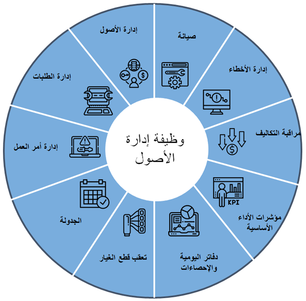

تعد إدارة الأصول ملحقاً إضافياً لـ Dynamics 365 Supply Chain Management من شأنه توفير أدوات متقدمة لإدارة الأصول المادية، بما في ذلك المهام ومهام الصيانة.Asset Management is an add-in for Dynamics 365 Supply Chain Management that provides advanced tools for managing your physical assets, including tasks and maintenance jobs. 

وتتمثل فوائد إدارة الأصول في أنها تقوم بما يلي:The benefits of Asset Management are that it:

- تتكامل بسلاسة مع وحدات نمطية متعددة في Dynamics 365 Finance وDynamics 365 Supply Chain Management.Integrates seamlessly with several modules in Dynamics 365 Finance and Dynamics 365 Supply Chain Management. 
- تمكّنك من إدارة وتنفيذ المهام المتعلقة بإدارة العديد من أنواع المعدات في شركتك وصيانتها بكفاءة، على سبيل المثال، الآلات ومعدات الإنتاج والمركبات.Enables you to efficiently manage and carry out tasks that are related to managing and servicing many types of equipment in your company, for example, machines, production equipment, and vehicles. 
- تسمح لك بالتخطيط للصيانة وتعقب الاستخدام وأوامر العمل للصيانة الوقائية مقابل الصيانة التفاعلية.Allows you to plan for maintenance and track usage and work orders for preventative versus reactive maintenance.
- تقلل من تكاليف الصيانة مع إطالة عمر أصولك، مما يقلل في النهاية من وقت التوقف عن العمل ويزيد من أداء أصولك.Reduces maintenance costs while extending the life of your assets and ultimately reducing downtime and increasing performance of your assets.
- تدعم الحلول عبر العديد من الصناعات.Supports solutions across numerous industries.
 
## وظيفة إدارة الأصولAsset Management functionality
 
توفر إدارة الأصول وظائف إدارة الأصول الشاملة، بداية من القدرة على تعقب الأصول ومواقعها المادية، وتخطيط الصيانة، والأوامر والجدولة، وإدارة الأعطال، وإعداد التقارير، وضوابط التكلفة.Asset Management delivers end-to-end asset management functionality, beginning with the ability to track assets and their physical locations, maintenance planning, orders and scheduling, fault management, reporting, and cost controls. 

