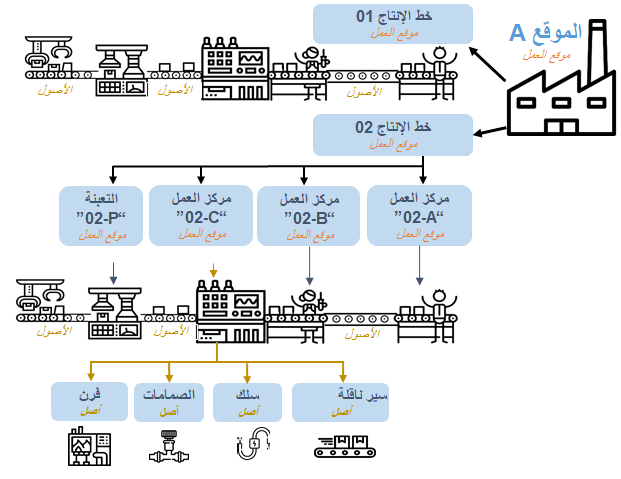
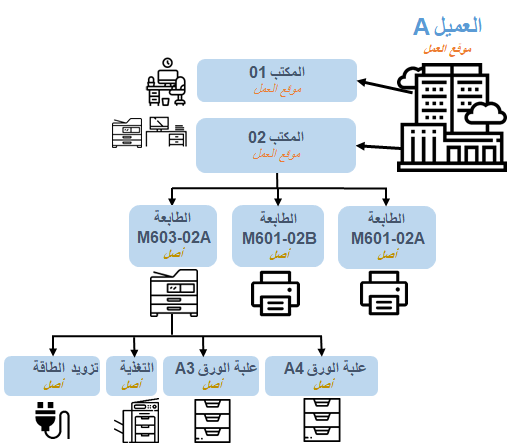

تصف الأقسام التالية المكونات الرئيسية لإدارة الأصول. 

## مواقع العمل
تُستخدم مواقع العمل لتعقب الأصول الفعلية ومواقعها. يمكن أن تتضمن أمثلة المواقع المصانع والمستودعات والساحات ومباني المكاتب. 

- ويتم ترتيبها بشكل هرمي، ويمكن أن تحتوي المواقع على مواقع فرعية. 
- لا يمكن تغيير بنية مواقع العمل بعد إنشائها. بمعنى آخر، لا يمكن نقل المواقع. 
- تعتمد كيفية إنشاء التدرج الهرمي لمواقع العمل علي البنية التنظيمية للشركة وإعداداتها التفضيلية.

يُعد الشكل التالي مثالاً على موقع عمل يستند إلى موقع.

 
ويتضمن هذا المثال شركة "مزرعة مونسون للمخللات والمعلبات". هذه العينة هي مصنع صلصة (بعنوان الموقع أ) وهو موقع عمل يتم فيه استخدام الأصول المثبتة في موقع العمل هذا لإعداد الصلصة. 

ينشئ خط الإنتاج 01، وهو موقع عمل آخر، تسميات للحاويات ويرفقها بالحاويات باستخدام الماكينات (الأصول). 

خط الإنتاج 02، موقع العمل، هو مكان إعداد الصلصة في مراكز العمل المتنوعة. وهذه المراكز أيضاً هي مواقع عمل تستخدم الأصول التالية:

- مركز العمل 02-أ يحضر مكونات الصلصة.
- مركز العمل 02-ب يخلط المكونات ويضيف التوابل معاً.
- يتم طهي الصلصة في مركز عمل موقع العمل 02-ط. 
- مكان التعبئة 02-ت هو المكان الذي يتم فيه تعبئة الحاويات التي تمت تسميتها ليتم تسليمها.

تلخص القائمة التالية مواقع العمل:
 
- مواقع العمل هي الأماكن التي يتم فيها "تثبيت" الأصول أو وضعها.
- يمكن إنشاء مواقع العمل بشكل هرمي لتشمل المواقع الفرعية.
- ويمكن أن يكون للمواقع الفرعية مواقع فرعية.
- الأصول هي المعدات المستخدمة مثل الحزام الناقل، وماكينات طهي الصلصة، وما إلى ذلك.

يوضح المثال التالي موقع عمل يستند إلى العميل.

 
يوضح هذا المثال موقع عمل حيث يكون مكتب الشركة هو العميل أ. وضمن العميل أ، تمثل المكاتب المواقع. في هذا المثال، يمكن أن يكون المكتب 01 والمكتب 02 مكتباً أو منطقة عمل. يعد المكتب 02 منطقة عمل تتضمن الطابعات والأصول المثبتة. 

## الأصول
الأصول هي المعدات والماكينات الفعلية، مثل الأحزمة الناقلة والرافعات الشوكية والأجزاء والأدوات المستخدمة لدعم الأصول المادية وصيانتها. تصف القائمة التالية المعلومات الأساسية حول الأصول:

- يمكن تنظيم الأصول في هيكل هرمي أو يمكن تنظيمها بواسطة مواقع العمل.
- يمكن تثبيت الأصول في مواقع العمل، وإذا لزم الأمر، يمكن نقلها أو تثبيتها على مواقع عمل أخرى. باستخدام المثال من الصورة السابقة، توجد الطابعة M601-02A، وهي أحد الأصول، في موقع عمل الشركة أ وفي المكتب 02 ويمكن نقلها إلى موقع مختلف، مثل الشركة أ ثم نقلها إلى المكتب 01.
- يمكن أن تحتوي الأصول على أصول فرعية، مثل قطع غيار الأصل. 
- تكاليف الأصول تتبع دائماً موقع الأصل.
    - إذا قمت بتثبيت أصل على موقع عمل جديد، فسيستخدم الأصل تلقائياً الأبعاد المالية المرتبطة بموقع العمل الجديد. 
    - تضمن هذه العملية ارتباط تكاليف الأصول دائماً بموقع العمل الذي تم تثبيت الأصل عليه حالياً. 
    - تساعد هذه المعالجة التلقائية للأبعاد المالية على ضمان التعقب الكامل للتكاليف عندما تقوم شركتك بالتحكم في المشروع وإعداد التقارير حول مواقع العمل.

