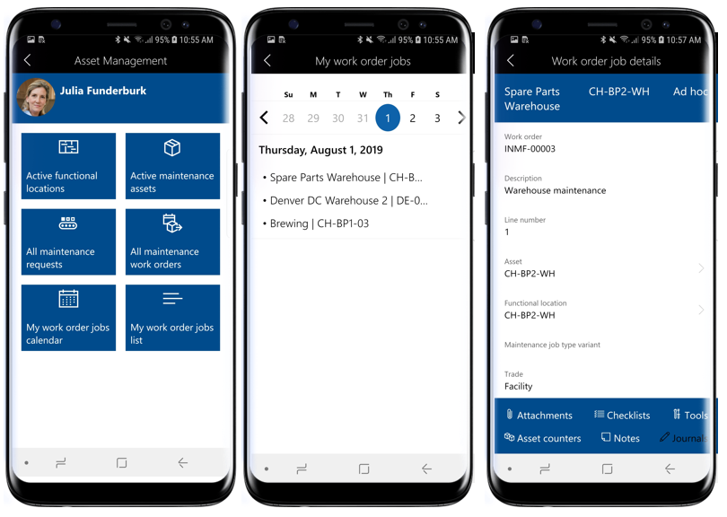
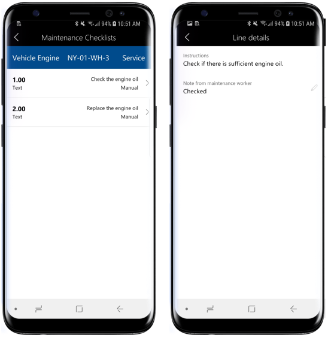
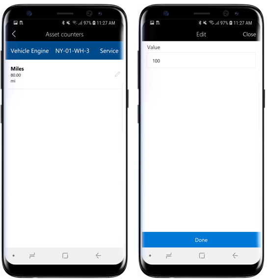
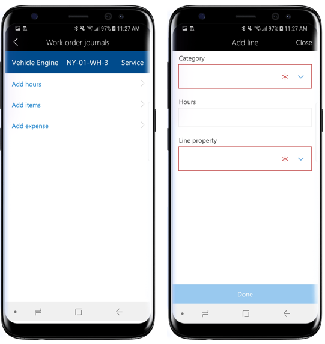
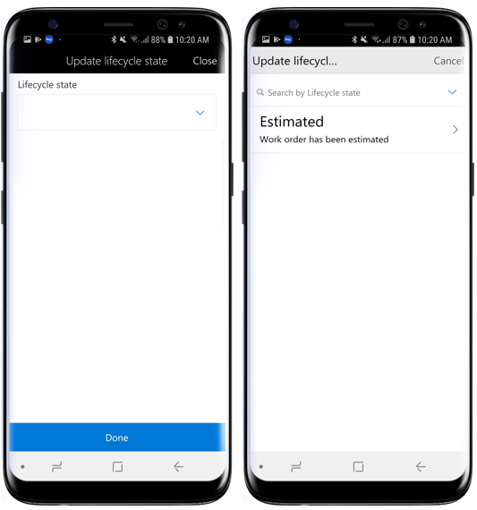
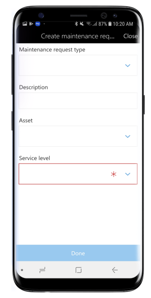

تتضمن هذه الوحدة العديد من المهام التي يمكنك إجراؤها باستخدام مساحة العمل المحمولة لإدارة الأصول.This unit includes several tasks that you can perform by using the Asset management mobile workspace.
ستتعرّف على المزيد حول كيفية أداء هذه المهام في وحدات لاحقة في مسار التعليم هذا.You will learn much more about how to perform these tasks in later modules in this learning path.

## عرض مهام أمر العمل المعينة في طريقة عرض التقويمView assigned work order jobs in calendar view
اتبع الخطوات التالية لعرض مهام أمر العمل المعينة في طريقة عرض التقويم:Follow these steps to view assigned work order jobs in calendar view:

1.  على جهازك المحمول، افتح مساحة عمل إدارة الأصول.On your mobile device, open the Asset Management workspace.
2.  حدد **تقويم مهام أمر العمل الخاص بي**.Select **My work order jobs calendar**.
3.  حدد التاريخ الذي ترغب في عرض مهام أمر العمل له.Select the date that you want to view work order jobs for. في القائمة، سترى معرّف الأصل ومعرّف موقع العمل لكل مهمة أمر عمل.In the list, you'll see the asset ID and functional location ID for each work order job.
4.  حدد مهمة أمر عمل في القائمة لعرض تفاصيل المهمة مثل الأصل ومواقع العمل وارتباطات التنقل الأخرى لعرض **المرفقات** و **قوائم الاختيار** و **الأدوات** و **عدادات الأصول** و **الملاحظات** و **دفاتر اليومية**.Select a work order job in the list to see job details such as asset and functional locations and other navigation links to view **Attachments**, **Checklists**, **Tools**, **Asset counters**, **Notes**, and **Journals**.

    
 
## إنشاء مهمة أمر عملCreate a work order job
اتبع الخطوات التالية لإنشاء مهمة أمر عمل:Follow these steps to create a work order job:

1.  على جهازك المحمول، افتح مساحة عمل إدارة الأصول.On your mobile device, open the Asset Management workspace.
2.  حدد **جميع أوامر عمل الصيانة**.Select **All maintenance work orders**.
3.  حدد أمر العمل الذي ترغب في إنشاء مهمة أمر عمل جديدة له.Select the work order for which you want to create a new work order job.
4.  حدد الزر **إضافة سطر**.Select the **Add line** button.
5.  حدد **الأصل** الذي ترغب في إنشاء مهمة أمر عمل له.Select the **Asset** for which you want to create a work order job.
6.  حدد **نوع مهمة الصيانة > متغير نوع مهمة الصيانة > التجارة**.Select **Maintenance job type > Maintenance job type variant > Trade**.
7.  حدد **تم**.Select **Done**.

## إضافة مرفق إلى مهمة أمر العملAdd an attachment to a work order job
اتبع الخطوات التالية لإضافة مرفق إلى مهمة أمر عمل:Follow these steps to add an attachment to a work order job:

1.  على جهازك المحمول، افتح مساحة عمل إدارة الأصول.On your mobile device, open the Asset Management workspace.
2.  حدد **جميع أوامر عمل الصيانة**.Select **All maintenance work orders**.
3.  حدد أمر العمل ثم مهمة أمر العمل التي تريد إضافة مرفق لها.Select the work order and then the work order job for which you want to add an attachment.
    > [!NOTE]
    > يمكنك أيضاً تحديد **تقويم مهام أمر العمل الخاص بي** أو قائمة مهام **أمر العمل الخاصة بي** في الصفحة الرئيسية للانتقال إلى صفحة **تفاصيل مهمة أمر العمل**.You can also select **My work order jobs calendar** or **My work order** jobs list on the home page to go to the **Work order job details** page.
4.  حدد **المرفقات** في صفحة **تفاصيل مهمة أمر العمل**.Select **Attachments** on the **Work order job details** page.
5.  ستشاهد المرفقات الموجودة في مهمة أمر العمل.You will see existing attachments on the work order job. حدد **إضافة مرفق**.Select **Add attachment**.
6.  أدخل **الاسم** **والملاحظات** المحددة للمرفق.Enter the **Name** and specific **Notes** for the attachment.
7.  حدد **اختيار صورة** لتحديد صورة من معرض الجهاز المحمول أو **التقاط صورة** لالتقاط صورة لإضافتها كمرفق.Select **Choose image** to select a photo from your mobile gallery or **Take photo** to take a photo to add as an attachment.
8.  حدد **تم**.Select **Done**.

     

## عرض قائمة فحص الصيانة في مهمة أمر العملView a maintenance checklist on a work order job
اتبع الخطوات التالية لعرض قائمة فحص الصيانة في مهمة أمر العمل:Follow these steps to view a maintenance checklist on a work order job:

1.  على جهازك المحمول، افتح مساحة عمل إدارة الأصول.On your mobile device, open the Asset Management workspace.
2.  حدد **جميع أوامر عمل الصيانة**.Select **All maintenance work orders**.
3.  حدد أمر العمل ثم مهمة أمر العمل التي تريد عرض قوائم فحص الصيانة لها.Select the work order and then the work order job for which you want to view maintenance checklists.
    > [!NOTE]
    > يمكنك أيضاً تحديد **تقويم مهام أمر العمل الخاص بي** أو قائمة **مهام أمر العمل الخاصة بي** في الصفحة الرئيسية للانتقال إلى صفحة **تفاصيل مهمة أمر العمل**.You can also select **My work order jobs calendar** or **My work order jobs** list on the home page to go to the **Work order job details** page.
4.  حدد **قوائم الاختيار** في صفحة **تفاصيل مهمة أمر العمل**.Select **Checklists** on the **Work order job details** page.
5.  سترى بعد ذلك قائمة بأسطر قائمة الاختيار ذات الصلة بمهمة أمر العمل.You will then see a list of checklist lines that are related to the work order job. حدد سطر قائمة الاختيار لعرض **التعليمات** وإضافة **ملاحظات**.Select a checklist line to view the **Instructions** and add **Notes**.
6.  حدد الزر "رجوع" للعودة إلى الصفحة السابقة.Select the back button to return to the previous page.

    

## عرض عدادات الأصول وتحديثها في مهمة أمر العملView and update asset counters on a work order job
اتبع الخطوات التالية لعرض عدادات الأصول وتحديثها في مهمة أمر العمل:Follow these steps to view and update asset counters on a work order job: 

1.  على جهازك المحمول، افتح مساحة عمل إدارة الأصول.On your mobile device, open the Asset Management workspace.
2.  حدد **جميع أوامر عمل الصيانة**.Select **All maintenance work orders**.
3.  حدد أمر العمل ثم مهمة أمر العمل التي تريد عرض عدادات الأصول لها.Select the work order and then the work order job for which you want to view asset counters.
    > [!NOTE]
    > يمكنك أيضاً تحديد **تقويم مهام أمر العمل الخاص بي** أو قائمة **مهام أمر العمل الخاصة بي** في الصفحة الرئيسية للانتقال إلى صفحة **تفاصيل مهمة أمر العمل**.You can also select **My work order jobs calendar** or **My work order jobs** list on the home page to go to the **Work order job details** page.
4.  حدد **عدادات الأصول** في صفحة **تفاصيل مهمة أمر العمل**.Select **Asset counters** on the **Work order job details** page.
5.  سترى قائمة عدادات الأصول ذات الصلة بمهمة أمر العمل.You will see a list of asset counters that are related to the work order job. حدد أيقونة القلم الرصاص في سطر عداد الأصول لتحديث قيمه العداد.Select the pencil icon on an asset counter line to update the counter value.
6.  أدخل قيمة عداد جديدة، ثم حدد **تم**.Enter a new counter value and select **Done**.
 
    

## تسجيل الاستهلاك في مهمة أمر العملRegister consumption on a work order job
اتبع الخطوات التالية لتسجيل الاستهلاك في مهمة أمر العمل:Follow these steps to register consumption on a work order job:

1.  على جهازك المحمول، افتح مساحة عمل إدارة الأصول.On your mobile device, open the Asset Management workspace.
2.  حدد **جميع أوامر عمل الصيانة**.Select **All maintenance work orders**.
3.  حدد أمر العمل ثم مهمة أمر العمل التي تريد إضافة تسجيلات الاستهلاك لها.Select the work order and then the work order job for which you want to add consumption registrations.
    > [!NOTE]
    > يمكنك أيضاً تحديد **تقويم مهام أمر العمل الخاص بي** أو قائمة **مهام أمر العمل الخاصة بي** في الصفحة الرئيسية للانتقال إلى صفحة **تفاصيل مهمة أمر العمل**.You can also select **My work order jobs calendar** or **My work order jobs** list on the home page to go to the **Work order job details** page.
4.  حدد **دفاتر اليومية** في صفحة **تفاصيل مهمة أمر العمل**.Select **Journals** on the **Work order job details** page.
5.  حدد **إضافة ساعات** لإنشاء تسجيلات ساعات العمل.Select **Add hours** to create work hour registrations.
6.  حدد **الفئة** من البحث.Select the **Category** from the lookup.
7.  في الحقل **الساعات**، أدخل عدد ساعات العمل التي تم قضاؤها في مهمة أمر العمل.In the **Hours** field, enter the number of work hours spent on the work order job.
8.  حدد **خاصية السطر المناسبة**.Select the appropriate **Line property**.
9.  حدد **تم**.Select **Done**.
10. حدد **إضافة أصناف** لإنشاء تسجيلات الأصناف.Select **Add items** to create item registrations.
11. حدد **رقم الصنف** من البحث.Select the **Item number** from the lookup.
12. حدد **الموقع** من البحث.Select the **Site** from the lookup.
13. أدخل **كمية** الأصناف التي تم استهلاكها.Enter the **Quantity** of items consumed.
14. حدد **تم**.Select **Done**.
15. حدد **إضافة مصروفات** لإنشاء تسجيلات المصروفات.Select **Add expense** to create expense registrations.
16. حدد **الفئة** من البحث.Select the **Category** from the lookup.
17. أدخل **الكمية** لتسجيل المصروفات.Enter the **Quantity** for the expense registration.
18. حدد **عملة المبيعات** من البحث.Select the **Sales currency** from the lookup.
19. أدخل **سعر التكلفة** لتسجيل المصروفات.Enter the **Cost price** for the expense registration.
20. حدد **تم**.Select **Done**.

     

## تحديث حالة دورة الحياة في أمر العملUpdate the lifecycle state on a work order
اتبع الخطوات التالية لتحديث حالة دورة الحياة في أمر العمل:Follow these steps to update the lifecycle state on a work order:

1.  على جهازك المحمول، افتح مساحة عمل إدارة الأصول.On your mobile device, open the Asset Management workspace.
2.  حدد **جميع أوامر عمل الصيانة**.Select **All maintenance work orders**.
3.  حدد أمر العمل الذي ترغب في تحديث حالة دورة الحياة له.Select the work order for which you want to update the lifecycle state.
4.  حدد الزر **تحديث الحالة** في أسفل الشاشة.Select the **Update state** button at the bottom of the screen.
5.  حدد حالة دورة حياة جديدة من القائمة.Select a new lifecycle state from the list.
6.  حدد **تم**.Select **Done**.

     

## إنشاء طلب صيانة باستخدام جهاز محمولCreate a maintenance request using a mobile device
اتبع الخطوات التالية لإنشاء طلب صيانة:Follow these steps to create a maintenance request:

1.  على جهازك المحمول، افتح مساحة عمل إدارة الأصول.On your mobile device, open the Asset Management workspace.
2.  حدد **جميع طلبات الصيانة**.Select **All maintenance requests**.
3.  حدد **الإجراءات** الموجودة أسفل الشاشة ثم حدد **إنشاء طلب صيانة**.Select **Actions** at the bottom of the screen and then select **Create maintenance request**.
4.  إذا تم تمكين تسلسل رقمي لطلبات الصيانة في إدارة الأصول، فسيتم إخفاء الحقل **طلب صيانة** لأنه يتم إكماله تلقائياً.If a number sequence is enabled for maintenance requests in Asset Management, the **Maintenance request** field is hidden because it is automatically completed. إذا كان الحقل **طلب صيانة** مرئياً، فأدخل معرّف طلب الصيانة.If the **Maintenance request** field is visible, enter a maintenance request ID.
5.  حدد **نوع طلب الصيانة**.Select a **Maintenance request type**.
6.  أدخل **وصفاً** لطلب الصيانة.Enter a **Description** for the maintenance request.
7.  حدد **الأصل** الذي تريد إنشاء الطلب له.Select the **Asset** that you want to create the request for.
8.  حدد **مستوى الخدمة** الخاص بطلب الصيانة.Select the **Service level** for the maintenance request.
9.  حدد **تم**.Select **Done**.

    
 
## إضافة مرفق إلى طلب صيانةAdd an attachment to a maintenance request
اتبع الخطوات التالية لإضافة مرفق إلى طلب صيانة:Follow these steps to add an attachment to a maintenance request:

1.  على جهازك المحمول، افتح مساحة عمل إدارة الأصول.On your mobile device, open the Asset Management workspace.
2.  حدد **جميع طلبات الصيانة**.Select **All maintenance requests**.
3.  حدد طلب الصيانة الذي ترغب في إضافة مرفق له.Select the maintenance request that you want to add an attachment to.
4.  حدد **المرفقات** أسفل الشاشة.Select **Attachments** at the bottom of the screen.
5.  حدد **إضافة مرفقات**.Select **Add attachments**.
6.  أدخل **الاسم** **والملاحظات** للمرفق.Enter a **Name** and **Notes** for the attachment.
7.  حدد **اختيار صورة** لتحديد صورة من معرض الجهاز المحمول أو **التقاط صورة** لالتقاط صورة.Select **Choose image** to select a photo from the mobile gallery or **Take photo** to take a photo.
8.  حدد **تم**.Select **Done**.

    
 
