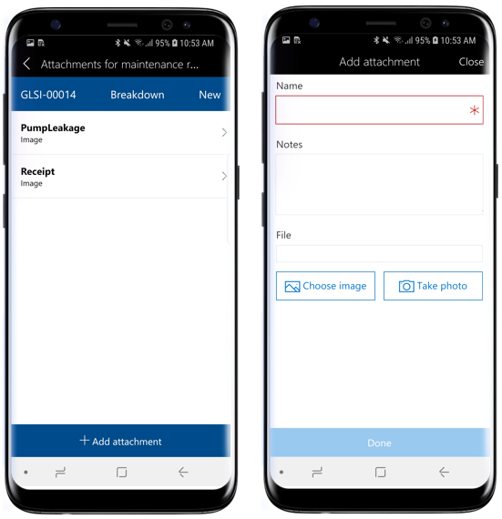

تتضمن هذه الوحدة العديد من المهام التي يمكنك إجراؤها باستخدام مساحة العمل المحمولة لإدارة الأصول.
ستتعرّف على المزيد حول كيفية أداء هذه المهام في وحدات لاحقة في مسار التعليم هذا.

## عرض مهام أمر العمل المعينة في طريقة عرض التقويم
اتبع الخطوات التالية لعرض مهام أمر العمل المعينة في طريقة عرض التقويم:

1.  على جهازك المحمول، افتح مساحة عمل إدارة الأصول.
2.  حدد **تقويم مهام أمر العمل الخاص بي**.
3.  حدد التاريخ الذي ترغب في عرض مهام أمر العمل له. في القائمة، سترى معرّف الأصل ومعرّف موقع العمل لكل مهمة أمر عمل.
4.  حدد مهمة أمر عمل في القائمة لعرض تفاصيل المهمة مثل الأصل ومواقع العمل وارتباطات التنقل الأخرى لعرض **المرفقات** و **قوائم الاختيار** و **الأدوات** و **عدادات الأصول** و **الملاحظات** و **دفاتر اليومية**.

    
 
## إنشاء مهمة أمر عمل
اتبع الخطوات التالية لإنشاء مهمة أمر عمل:

1.  على جهازك المحمول، افتح مساحة عمل إدارة الأصول.
2.  حدد **جميع أوامر عمل الصيانة**.
3.  حدد أمر العمل الذي ترغب في إنشاء مهمة أمر عمل جديدة له.
4.  حدد الزر **إضافة سطر**.
5.  حدد **الأصل** الذي ترغب في إنشاء مهمة أمر عمل له.
6.  حدد **نوع مهمة الصيانة > متغير نوع مهمة الصيانة > التجارة**.
7.  حدد **تم**.

## إضافة مرفق إلى مهمة أمر العمل
اتبع الخطوات التالية لإضافة مرفق إلى مهمة أمر عمل:

1.  على جهازك المحمول، افتح مساحة عمل إدارة الأصول.
2.  حدد **جميع أوامر عمل الصيانة**.
3.  حدد أمر العمل ثم مهمة أمر العمل التي تريد إضافة مرفق لها.
    > [!NOTE]
    > يمكنك أيضاً تحديد **تقويم مهام أمر العمل الخاص بي** أو قائمة مهام **أمر العمل الخاصة بي** في الصفحة الرئيسية للانتقال إلى صفحة **تفاصيل مهمة أمر العمل**.
4.  حدد **المرفقات** في صفحة **تفاصيل مهمة أمر العمل**.
5.  ستشاهد المرفقات الموجودة في مهمة أمر العمل. حدد **إضافة مرفق**.
6.  أدخل **الاسم** **والملاحظات** المحددة للمرفق.
7.  حدد **اختيار صورة** لتحديد صورة من معرض الجهاز المحمول أو **التقاط صورة** لالتقاط صورة لإضافتها كمرفق.
8.  حدد **تم**.

     

## عرض قائمة فحص الصيانة في مهمة أمر العمل
اتبع الخطوات التالية لعرض قائمة فحص الصيانة في مهمة أمر العمل:

1.  على جهازك المحمول، افتح مساحة عمل إدارة الأصول.
2.  حدد **جميع أوامر عمل الصيانة**.
3.  حدد أمر العمل ثم مهمة أمر العمل التي تريد عرض قوائم فحص الصيانة لها.
    > [!NOTE]
    > يمكنك أيضاً تحديد **تقويم مهام أمر العمل الخاص بي** أو قائمة **مهام أمر العمل الخاصة بي** في الصفحة الرئيسية للانتقال إلى صفحة **تفاصيل مهمة أمر العمل**.
4.  حدد **قوائم الاختيار** في صفحة **تفاصيل مهمة أمر العمل**.
5.  سترى بعد ذلك قائمة بأسطر قائمة الاختيار ذات الصلة بمهمة أمر العمل. حدد سطر قائمة الاختيار لعرض **التعليمات** وإضافة **ملاحظات**.
6.  حدد الزر "رجوع" للعودة إلى الصفحة السابقة.

    

## عرض عدادات الأصول وتحديثها في مهمة أمر العمل
اتبع الخطوات التالية لعرض عدادات الأصول وتحديثها في مهمة أمر العمل: 

1.  على جهازك المحمول، افتح مساحة عمل إدارة الأصول.
2.  حدد **جميع أوامر عمل الصيانة**.
3.  حدد أمر العمل ثم مهمة أمر العمل التي تريد عرض عدادات الأصول لها.
    > [!NOTE]
    > يمكنك أيضاً تحديد **تقويم مهام أمر العمل الخاص بي** أو قائمة **مهام أمر العمل الخاصة بي** في الصفحة الرئيسية للانتقال إلى صفحة **تفاصيل مهمة أمر العمل**.
4.  حدد **عدادات الأصول** في صفحة **تفاصيل مهمة أمر العمل**.
5.  سترى قائمة عدادات الأصول ذات الصلة بمهمة أمر العمل. حدد أيقونة القلم الرصاص في سطر عداد الأصول لتحديث قيمه العداد.
6.  أدخل قيمة عداد جديدة، ثم حدد **تم**.
 
    

## تسجيل الاستهلاك في مهمة أمر العمل
اتبع الخطوات التالية لتسجيل الاستهلاك في مهمة أمر العمل:

1.  على جهازك المحمول، افتح مساحة عمل إدارة الأصول.
2.  حدد **جميع أوامر عمل الصيانة**.
3.  حدد أمر العمل ثم مهمة أمر العمل التي تريد إضافة تسجيلات الاستهلاك لها.
    > [!NOTE]
    > يمكنك أيضاً تحديد **تقويم مهام أمر العمل الخاص بي** أو قائمة **مهام أمر العمل الخاصة بي** في الصفحة الرئيسية للانتقال إلى صفحة **تفاصيل مهمة أمر العمل**.
4.  حدد **دفاتر اليومية** في صفحة **تفاصيل مهمة أمر العمل**.
5.  حدد **إضافة ساعات** لإنشاء تسجيلات ساعات العمل.
6.  حدد **الفئة** من البحث.
7.  في الحقل **الساعات**، أدخل عدد ساعات العمل التي تم قضاؤها في مهمة أمر العمل.
8.  حدد **خاصية السطر المناسبة**.
9.  حدد **تم**.
10. حدد **إضافة أصناف** لإنشاء تسجيلات الأصناف.
11. حدد **رقم الصنف** من البحث.
12. حدد **الموقع** من البحث.
13. أدخل **كمية** الأصناف التي تم استهلاكها.
14. حدد **تم**.
15. حدد **إضافة مصروفات** لإنشاء تسجيلات المصروفات.
16. حدد **الفئة** من البحث.
17. أدخل **الكمية** لتسجيل المصروفات.
18. حدد **عملة المبيعات** من البحث.
19. أدخل **سعر التكلفة** لتسجيل المصروفات.
20. حدد **تم**.

     

## تحديث حالة دورة الحياة في أمر العمل
اتبع الخطوات التالية لتحديث حالة دورة الحياة في أمر العمل:

1.  على جهازك المحمول، افتح مساحة عمل إدارة الأصول.
2.  حدد **جميع أوامر عمل الصيانة**.
3.  حدد أمر العمل الذي ترغب في تحديث حالة دورة الحياة له.
4.  حدد الزر **تحديث الحالة** في أسفل الشاشة.
5.  حدد حالة دورة حياة جديدة من القائمة.
6.  حدد **تم**.

     

## إنشاء طلب صيانة باستخدام جهاز محمول
اتبع الخطوات التالية لإنشاء طلب صيانة:

1.  على جهازك المحمول، افتح مساحة عمل إدارة الأصول.
2.  حدد **جميع طلبات الصيانة**.
3.  حدد **الإجراءات** الموجودة أسفل الشاشة ثم حدد **إنشاء طلب صيانة**.
4.  إذا تم تمكين تسلسل رقمي لطلبات الصيانة في إدارة الأصول، فسيتم إخفاء الحقل **طلب صيانة** لأنه يتم إكماله تلقائياً. إذا كان الحقل **طلب صيانة** مرئياً، فأدخل معرّف طلب الصيانة.
5.  حدد **نوع طلب الصيانة**.
6.  أدخل **وصفاً** لطلب الصيانة.
7.  حدد **الأصل** الذي تريد إنشاء الطلب له.
8.  حدد **مستوى الخدمة** الخاص بطلب الصيانة.
9.  حدد **تم**.

    
 
## إضافة مرفق إلى طلب صيانة
اتبع الخطوات التالية لإضافة مرفق إلى طلب صيانة:

1.  على جهازك المحمول، افتح مساحة عمل إدارة الأصول.
2.  حدد **جميع طلبات الصيانة**.
3.  حدد طلب الصيانة الذي ترغب في إضافة مرفق له.
4.  حدد **المرفقات** أسفل الشاشة.
5.  حدد **إضافة مرفقات**.
6.  أدخل **الاسم** **والملاحظات** للمرفق.
7.  حدد **اختيار صورة** لتحديد صورة من معرض الجهاز المحمول أو **التقاط صورة** لالتقاط صورة.
8.  حدد **تم**.

    
 
