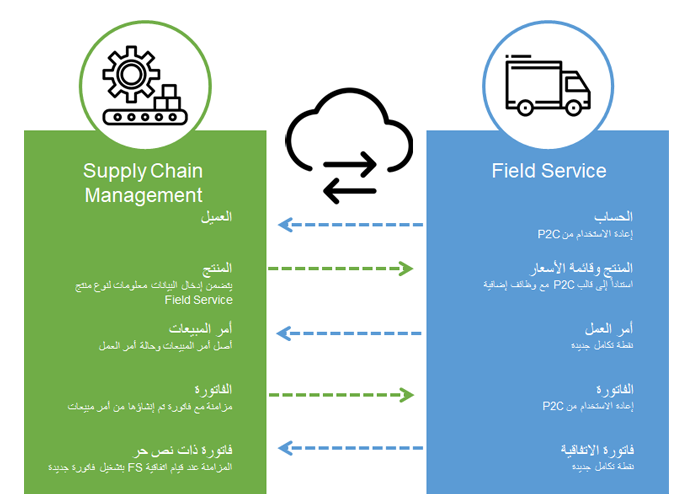
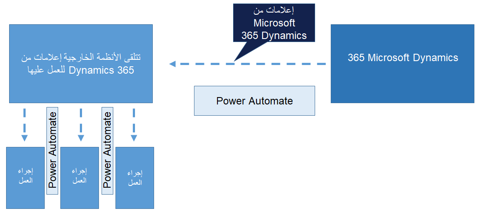

تقدم هذه الوحدة نظرة عامة حول عمليات التكامل المتوفرة مع إدارة الأصول.

## تكامل Dynamics 365 Field Service مع إدارة الأصول

يعمل Supply Chain Management على تسهيل مزامنة تدفقات عمليات دورة الحياة مع Dynamics 365 Field Service. يتم تكوين عمليات التكامل باستخدام قوالب مكامل البيانات الموسعة وMicrosoft Dataverse. يمكن للمؤسسات الاستفادة من الإمكانات المجمّعة لإدارة الأصول وField Service وإدارة كل من الأصول الداخلية والخارجية. ويعتمد تكامل Field Service على وظيفة "العميل المتوقع إلى النقد" الحالية.

يمكن استخدام القوالب القياسية لإنشاء مشاريع تكامل مخصصة، حيث يمكن تعيين حقول وكيانات قياسية ومخصصة إضافية لتعديل التكامل وتلبية احتياجات العمل الخاصة.

تركز عملية التكامل الأولي بين Field Service وSupply Chain Management على تمكين فوترة أوامر العمل والاتفاقيات الموجودة في Field Service في Supply Chain Management. يبدأ التدفق المدعوم في Field Service، حيث تتم مزامنة المعلومات من أوامر العمل مع Supply Chain Management كأوامر مبيعات. في Supply Chain Management، تتم فوترة أوامر المبيعات لإنشاء مستندات فاتورة، كما هو موضح في الرسم التخطيطي.

توفر الوظائف الإضافية للفنيين الميدانيين نتيجة تحليلات لمعلومات المخزون من Supply Chain Management، مما يسمح لهم بتحديث مستويات المخزون وإجراء عمليات نقل المواد. ويمكن للشركات التي تقوم بتثبيت البضائع المبيعة أو صيانتها الاستفادة من التحكم والرؤية بشكل أفضل لعملية المبيعات والخدمة الكاملة بالتكامل من المشاريع.

يتمتع كل من Supply Chain Management وField Service بنقاط التكامل التالية:

- أوامر عمل Field Service مع ارتباطات إلى مشاريع Supply Chain Management. يمكنك تطبيق رقم المشروع على أمر المبيعات للسماح بالفوترة من المشروع.
- مشاريع Supply Chain Management المتصلة بأوامر عمل Field Service.
- معلومات المستودع
- معلومات المخزون المتاح
- عمليات نقل المخزون
- تعديلات المخزون

## تنفيذ أحداث الأعمال لإدارة الأصول

توفر ‏‫أحداث الأعمال‬ إطار عمل يسمح للأنظمة الخارجية بتلقي الإعلامات من Supply Chain Management. وباستخدام هذه الوظيفة، يمكن للأنظمة تنفيذ إجراءات العمل استجابةً لأحداث الأعمال عند تشغيل إجراءات العمل.

لمزيد من المعلومات حول أحداث الأعمال، راجع الوحدة النمطية [استهلاك أحداث الأعمال في تطبيقات التمويل والعمليات](/training/modules/business-events-finance-operations/?azure-portal=true).

يتيح استخدام وظائف أحداث الأعمال مع إدارة الأصول للمستخدمين إمكانية الوصول إلى مستندات الأعمال من خلال الاستفادة من Microsoft Power Automate والتطبيقات المنطقية. ويتم تضمين مشغلات لطلبات الصيانة وتغييرات حالة أمر العمل في إطار عمل ‏‫أحداث الأعمال.

تشمل أحداث الأعمال المدعومة:

- تم إنشاء طلب الصيانة.
- تم تغيير خاصية الأصل.
- تم إنشاء أمر عمل الصيانة لطلب الصيانة.
- تم الإبلاغ عن اكتمال أمر عمل الصيانة.
- تمت جدولة أمر عمل الصيانة.
