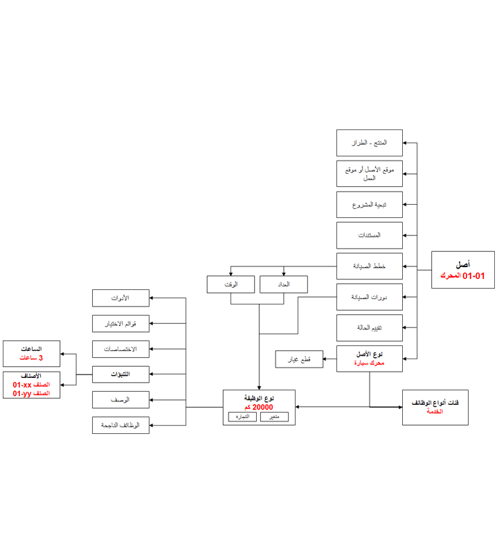
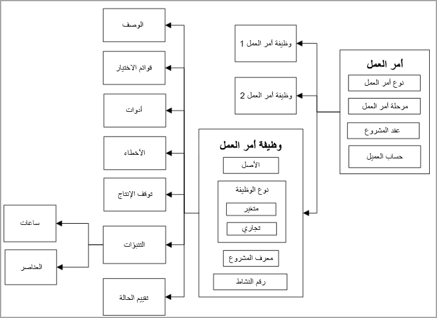
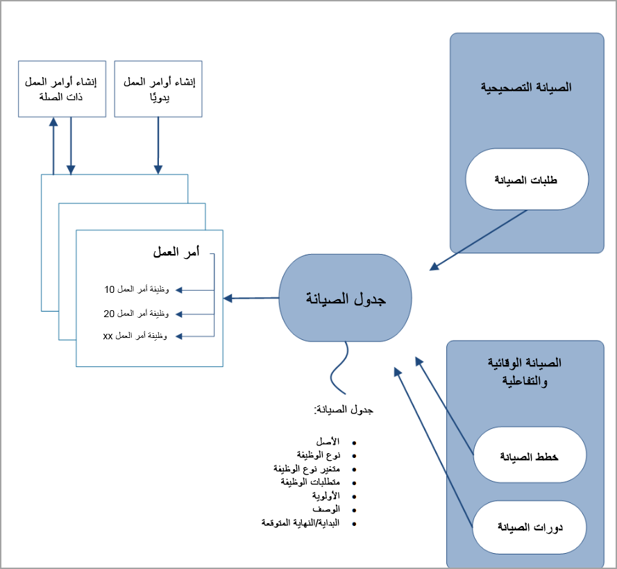
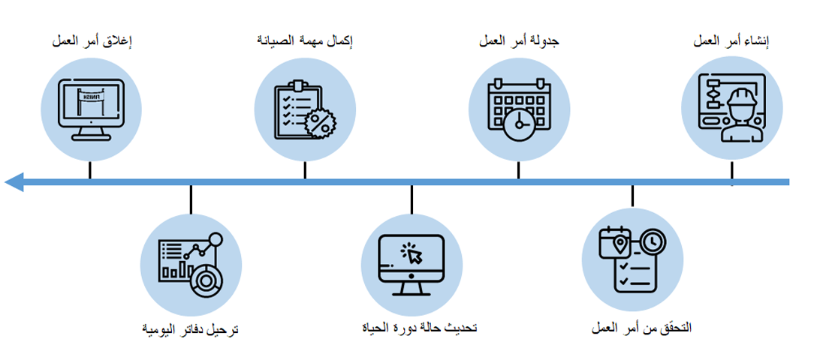

توضح هذه الوحدة الأصول وأوامر العمل في إدارة الأصول. تعد الأصول وأوامر العمل، إلى جانب مواقع العمل، هي مكونات مركزية لإدارة الأصول.

## الأصول
تصف القائمة التالية الأصول:

- الأصل عبارة عن آلة أو جزء من الآلة يتطلب صيانة وخدمة مستمرة. 
- يمكن تنظيم الأصول في هيكل هرمي أو يمكن تنظيمها بواسطة مواقع العمل. 
- يمكن تخطيط مهام الصيانة على جميع المستويات في هيكل الأصل.
- يحتوي كل أصل على معلومات المنتج والمواصفات وخطط الصيانة، الموثقة بالتفصيل في إدارة الأصول.

يعرض الرسم التوضيحي التالي نظرة عامة على أحد الأصول والمعلومات وأنواع الوظائف المرتبطة به. يميز النص الأحمر في الشكل مثالاً للأصل لإظهار التوريث والتبعيات.

## أوامر العمل
أمر العمل هو مهمة أو وظيفة يمكن جدولتها أو تعيينها في أحد الأصول. 

على سبيل المثال، يمكن استخدام أمر عمل لجدولة الصيانة على الجهاز. بالإضافة إلى ذلك، يمكن إنشاء أمر عمل لعمليات الفحص والصيانة التصحيحية والصيانة الوقائية. 

- يحتوي كل أمر عمل على نوع أمر عمل، مثل الصيانة الوقائية أو الصيانة التصحيحية أو الفحص. 
- يمكن أن يحتوي أمر العمل على مهمة واحدة أو أكثر من مهام أمر العمل. 
- تحدد كل مهمة في أمر العمل ما يتعين تنفيذه على أحد الأصول ونوع المهمة ذات الصلة. تتضمن أمثلة أنواع المهام ذات الصلة عمليات فحص السلامة والخدمة عند الوصول إلى المسافة المقطوعة بالأميال أو ساعات الخدمة المحددة. 
- يمكن أن يتضمن أمر العمل مهام أوامر العمل لأصول متعددة.
- يمكن أن يكون أمر العمل مرتبطاً بأمر عمل آخر ويمكن أن تحتوي أنواع المهام على المهام التالية التي تنشئ أمر عمل. بشكل عام، لا توجد تبعيات بين أوامر العمل. يمكن تغيير حالات دورة حياة أمر العمل وجدولتها بشكل مستقل بعضها عن بعض.
- يمكن إنشاء أوامر العمل بعدة طرق، بما في ذلك يدوياً. 

يبين الرسم التوضيحي التالي نظرة عامة على البيانات الأساسية والعملية في أمر عمل.
 

يوفر الرسم التوضيحي التالي مراجعة لإنشاء أوامر العمل، سواء تم إنشاء أمر العمل يدوياً أو تلقائياً. بشكل عام، يتم إنشاء طلبات الصيانة من أجل الصيانة التصحيحية أو صيانة الأعطال التي تكون مطلوبة بسبب فشل المعدات. تُستخدم خطط ودورات الصيانة للصيانة الوقائية والتفاعلية، على سبيل المثال عندما تأخذ سيارتك إلى ورشة إصلاح للصيانة الوقائية. للحفاظ على عمل سيارتك بسلاسة، عليك إدخالها لتغيير الزيت بانتظام، بينما تتطلب منك الصيانة التصحيحية إصلاح إطار سيارتك عندما يصبح فارغاً.

 
## تدفق أمر العمل 
يمكن إنشاء أوامر العمل تلقائياً أو يدوياً. تصف السيناريوهات التالية كيف يمكنك إنشاء أمر عمل تلقائي أو يدوي.

- إنشاء أمر عمل تلقائي:
    - يمكن إنشاء أوامر العمل تلقائياً عن طريق تعيين تسلسلات الصيانة ودورات الصيانة إلى **إنشاء تلقائي**. 
    - ومن خلال إنشاء جداول الصيانة المستندة إلى تسلسلات الصيانة أو الطلبات أو دورات الصيانة، يمكن إنشاء أوامر العمل تلقائياً. 
- إنشاء أمر عمل يدوي:
    - قم بإنشاء أمر عمل يدوي في صفحة **جميع أوامر العمل**. 
    - قم بإنشاء أمر عمل ذي صلة.
    - استخدم صفحة قائمة **صفحه قائمه جميع الطلبات**.

يوفر الرسم التوضيحي التالي مراجعة عالية المستوى لتدفق عمليات أوامر العمل.
 

بعد إنشاء أمر العمل، سيستمر سير العملية الخاص بأمر العمل كما يلي:

- **التحقق من أمر العمل** - عند الضرورة، قم بتحرير المعلومات المرتبطة بأمر العمل أو الأصل أو تحديثها. ويمكن أن تتضمن هذه التحديثات ما يلي:
    - التنبؤات
    - الأدوات
    - الملاحظات
    - الأخطاء 
- **جدولة أمر العمل** – تتوفر ثلاثة أنواع من الموارد في جدولة أمر العمل:
    - الموارد البشرية
    - الأجهزة
    - الأدوات
- **تحديث حالة دورة الحياة** – تعني الحالة **المجدولة** أنه قد تم إكمال تخطيط الموارد. وتعني الحالة **قيد المعالجة** أن مهمة الصيانة جاهزة للتنفيذ.
- **إكمال مهمة الصيانة** – يمكن أن يكون تدفق العمليات هذا قائمة تحقق أو توقف إنتاج أو تقييم حالة أو أخطاء.
- **ترحيل دفاتر اليومية** – الاستهلاك في صورة ساعات أو أصناف. 
- **إغلاق أمر العمل** – عندما تكون حالة دورة حياة أمر العمل هي **تم الإنهاء**، يتم إكمال مهمة الصيانة وترحيل دفاتر اليومية. عندما تكون حالة دورة حياة أمر العمل هي **منتهية**، يتم إغلاق أمر العمل.

