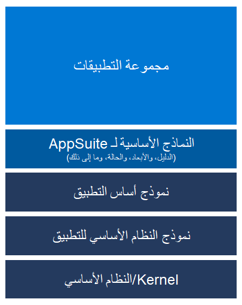
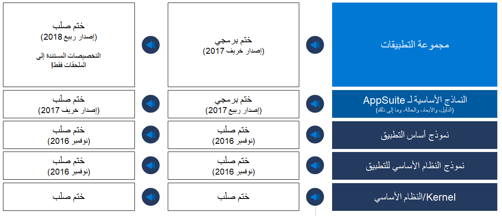

يمكنك تخصيص تطبيق ما باستخدام الملحقات. يُمكّنك الملحق من إضافة وظائف إلى عناصر النموذج الحالية ورمز المصدر. مع الملحقات، يمكنك:

- إنشاء عناصر نموذج جديدة.
- توسيع عناصر النموذج الموجودة.
- توسيع رمز المصدر باستخدام ملحقات الفئة.
- تخصيص منطق الأعمال. تشمل طرق تخصيص منطق الأعمال:
    - إنشاء معالجات الأحداث للاستجابة لأحداث إطار العمل، مثل أحداث البيانات.
    - تكوين معالجات الأحداث للرد على مفوضي الأحداث الذين تم تحديدهم بواسطة التطبيق.
    - إنشاء وظائف إضافية جديدة.

## تقسيم النموذج
تطوير الرمز المعياري هو القوة الدافعة وراء تقسيم النموذج. يوفر تقسيم المكدس إلى نماذج متعددة العديد من الفوائد، بما في ذلك وقت التجميع الأسرع والتمييز الأكبر بين الملكية الفكرية للشركاء (IPs) في الإنتاج. النماذج الرئيسية الثلاثة هي: **النظام الأساسي للتطبيق، أساس التطبيق**، و **مجموعة التطبيق**.

**النظام الأساسي للتطبيق** هو النموذج الأقل ويحتوي على عناصر المستوى الأقل التي تتصل بـ kernel. **خادم كائنات التطبيق (AOS)** يمكن بدء تشغيله باستخدام **النظام الأساسي للتطبيق** فقط. 

**أساس التطبيق** يوجد أعلى **النظام الأساسي للتطبيق** ويحتوي على وظائف إطار العمل المشتركة بين جميع التطبيقات. 

وأخيراً، توجد **مجموعة التطبيق** أعلى **أساس التطبيق** وتحتوي على العناصر الخاصة بالتطبيق. **النظام الأساسي للتطبيق** لا يعتمد على أي نماذج أخرى. يتضمن هذا تعييناً مباشراً للنموذج إلى تجميع.

يسمح التطوير في المكدس المعياري بإجراء تغييرات في **مجموعة التطبيق** وتجميعها دون لمس بقية المكدس. يجب تجميع النماذج التي تحتوي على تغييرات جديدة فقط، مما يقلل بشكل كبير من وقت الترجمة. 

يمكنك إنشاء نموذج يحتوي فقط على عناصر نموذج جديدة أو كود جديد أو ملحقات. يتم تجميع هذا النموذج في التجميع المنفصل الخاص به. يمكن تجميع هذه التجميعات، جنباً إلى جنب مع بيانات التعريف ذات الصلة وعناصر وقت التشغيل، (كملف حزمة قابلة للتوزيع) وتوزيعها في وضع الحماية أو بيئة الإنتاج. لبدء التطوير باستخدام الملحقات، تحتاج إلى إنشاء نموذج يتم دمجه في التجميع الخاص به ويمكن توزيعه كحزمة منفصلة. 

اتبع الخطوات التالية لإنشاء نموذج جديد: 

1.  في **Visual Studio**، انتقل إلى **قائمة Dynamics 365**، وحدد **إدارة النماذج > نموذج جديد**. 
2.  في معالج **إنشاء النموذج**، أدخل معلومات النموذج، بما في ذلك اسم النموذج وناشر النموذج. حدد طبقة، وأدخل وصف النموذج، ثم أدخل اسم العرض. 
3.  بعد الانتهاء من تحديد تفاصيل النموذج، حدد **التالي**. 
4.  في صفحة **تحديد الحزمة**، حدد **إنشاء حزمة جديدة**. هذا التحديد مهم لأنه يحدد أنك ستنشئ الحزمة الخاصة بك التي يتم دمجها في التجميع الخاص بها. هذه الخطوة هي لتوسيع التطبيق. 
5.  حدد **التالي**. 
6.  حدد النماذج المُشار إليها. هذه الخطوة مهمة أيضاً. تأكد من أنك تشير إلى نماذج أي كائنات تريد توسيعها. يمكنك تعديل النماذج المرجعية الخاصة بك في أي وقت. 
7.  بعد قيامك بتحديد النماذج للرجوع إليها، حدد **التالي**. 
8.  تحقق من المعلومات الواردة في صفحة **الملخص**، ثم حدد خانتي الاختيار **إنشاء مشروع جديد** و **اجعل هذا النموذج الافتراضي الخاص بي للمشاريع الجديدة**.
9.  حدد **إنهاء**. 
