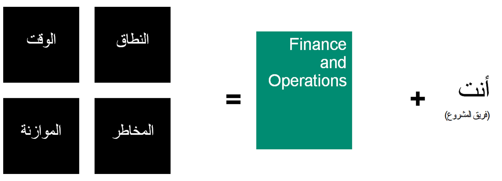

يتمثل الهدف الرئيسي للفرق المشاركة في مشروع تنفيذ Finance and Operations في تلبية احتياجات أعمال العميل ضمن الإطار الزمني والموازنة المقررة أثناء إدارة جميع المخاطر التي تظهر على مدار الرحلة. 

يتطلب المشروع الناجح الجودة في التخطيط والتصميم والتسليم. لبلوغ أفضل مستوى من الجودة، ستحتاج إلى مراعاة عناصر مثلث إدارة المشروع، وهي: النطاق والموازنة والوقت. 

ونقترح أيضاً المخاطر المضمنة في مشروعك. سيساعد وجود إدارة المخاطر في مشروعك في التخفيف من المشكلات أو المخاطر التي قد تؤثر على مشروعك إذا لم تكن تخطط بشكل استباقي، أو إذا لم تكن مستعداً لظروف غير متوقعة، مثل:

-   نطاق متحرك (على سبيل المثال، تتم إضافة عمليات البيع بالتجزئة في اللحظة الأخيرة أثناء التنفيذ).
-   مهام غير متوقعة تؤثر على الإطار الزمني (على سبيل المثال، هناك حاجة إلى بيئة جديدة، ويستغرق شراؤها أسابيع). 
-   مشكلات غير متوقعة قد تؤثر بشدة على الموازنة المتوقعة (على سبيل المثال، الاكتشاف المتأخر لمشكلات الأداء الرئيسية). 

في تصعيدات العملاء، كان من الممكن تحديد معظم المشكلات على أنها مخاطر في وقت سابق والتخفيف من حدتها قبل البدء الفوري. 

**ادرس مشروعك الحالي، وفكر في البيانات التالية:**

-  حالة مشروعك فيما يتعلق بمثلث المشروع (النطاق / الوقت / الموازنة) 

    

-  المدى الذي بلغته بشأن اكتشاف خطة للتخفيف من المخاطر الرئيسية وإنشائها عند التخطيط والتصميم وتقديم الحل 
 
## برنامج نجاح عميل FastTrack

بالنسبة لأي مشروع Finance and Operations، تقدم Microsoft خدمة برنامج FastTrack، حيث تحصل على التوجيه والتقييم من مهندسي حلول Microsoft FastTrack، الذين من شأنهم مساعدتك في تحقيق الهدف الرئيسي لمشروعك، وهو "البدء الفوري"، وبالتالي تعظيم فرصة نجاح تنفيذ Finance and Operations لديك. يمكنك معرفة المزيد حول برنامج FastTrack في [برنامج نجاح عميل FastTrack للوحدة النمطية Finance and Operations](https://docs.microsoft.com/learn/modules/fasttrack-customer-success-program/?azure-portal=true). 
