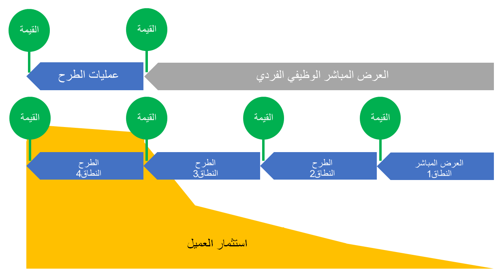
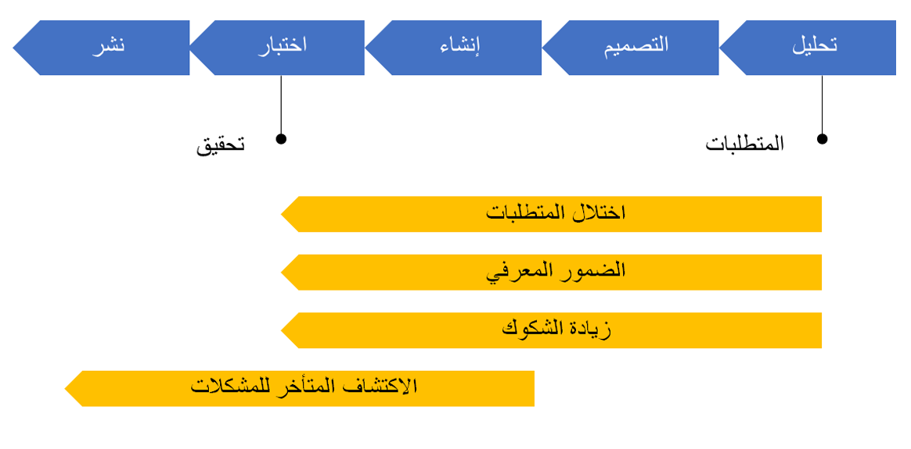
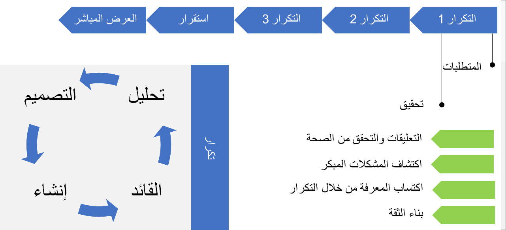

الشيء الأول والأكثر أهمية لكل مشروع هو التخطيط. ومن الطرق الرائعة للتخطيط، بدء رسم المراحل، ومن تلك النقطة، تتم إضافة المخططات الزمنية والأنشطة والموارد والتسليمات وما إلى ذلك. هناك منهجيات يمكنها مساعدتك في تصميم كافة عناصر المشروع هذه بطريقة مرئية ويمكن فهمها وسهلة المتابعة لكل الفريق. 

المنهجية هي تقنية رسمية لها إجراءات مهيكلة بطريقة منظمة وشاملة. يعد التسلسل الصحيح للمهام والتأكد من أن كل الموارد والبيانات الاصطناعية المطلوبة مُدارة بشكل صحيح خلال دورة حياة مشروعك أمراً ضرورياً لتنفيذ ناجح.

خلال تنفيذ Finance and Operations، يزداد استثمار العميل بمرور الوقت، بغض النظر عن النموذج أو المنهجية المستخدمة. ولكن تقليل الوقت المخصص للاستخدام وتقديم القيمة للعميل يعد هدفاً. يمكنك التخطيط لاختيار عرض مباشر واحد وبدء عملياتك المباشرة مع كافة الوظائف في آن واحد. والخيار الآخر هو تحرير الوظائف إلى الإنتاج داخل عمليات طرح متعددة (عمليات عرض مباشر متعددة). 

  

## المنهجيات التكرارية ومنهجيات الشلال 
من المهم تحديد المنهجية الصحيحة لمشروع تنفيذ Finance and Operations الخاص بك وفقاً لحل الأعمال ومراعاة الوقت اللازم لتقديم القيمة. هنا نقدم المنهجيات الأكثر استخداماً في هذه التطبيقات. 

### منهجية الشلال 
منهجية الشلال هي نهج تسلسلي. ينقسم المشروع إلى عدة مراحل حيث يتم الانتقال من المرحلة السابقة إلى المرحلة التالية حتى يتم الانتهاء من المشروع. ويتم توثيق كل مرحلة بدقة بالتسليمات والمراجعات والموافقات الواضحة. لا تبدأ عادةً المرحلة التالية في منهجية الشلال حتى تنتهي المرحلة السابقة. على سبيل المثال، إذا أردتَ تنفيذ تطبيقات Finance and Operations، فسيتعيّن تحديد جميع المتطلبات المتعلقة بكل تكامل قبل أن يبدأ المطوّرون في التطوير.

بشكل عام، تنطوي هذه المشاريع على مخططات زمنية طويلة وربما عدة أشهر من أنشطة الإنشاء والتصميم. وقد تواجه اختلالاً في المتطلبات وضموراً معرفياً وزيادة الشكوك بشأن المراحل التالية. علاوة على ذلك، من الشائع أكثر أن يتم اكتشاف المشاكل في وقت متأخر بعد تنفيذ التطوير والاختبار، ويمكن أن تسقط في عدة دورات اختبار ويتم تمديد المخططات الزمنية، مما يؤدي إلى تأخير المشروع. 

 
ينبغي مراعاة اتباع منهجية الشلال عندما يكون المشروع بسيطاً والمتطلبات معروفة ومحددة بوضوح ولا يهدف النطاق الكامل للمشروع إلى التغيير ويتم تنفيذ المشروع دفعة واحدة.

### ‏‫المنهجية التكرارية
تركز المنهجية التكرارية على الملاحظات المستمرة لتغيير وإضافة التسليمات إلى المشروع. خلافاً لمنهجية الشلال، يمكن للمراحل التكرارية الرجوع إلى بعضها البعض. مما يعني أنه يمكن العمل على تنفيذ مراحل مختلفة في وقت واحد. 

على سبيل المثال، إذا تم تحديد المتطلبات المتعلقة بتكامل واحد، فإنه يمكن للمطوّرين البدء في العمل على هذا التكامل حتى لو كانت عمليات التكامل الأخرى لا تزال في مرحلة تجميع المتطلبات. عادة ما يتم تقسيم المشاريع التكرارية إلى دورات متكررة، والتي لها مدة محددة (أسبوع واحد أو أسبوعان عادة). تحتوي هذه الدورات المتكررة على قائمة التسليمات المقرر الانتهاء منها أثناء الدورة المتكررة.

يكون النهج التكراري مفيداً عندما تكون المتطلبات غير واضحة عند بدء المشروع، وتكون التسليمات أو المتطلبات الإضافية متوقعة على مدار دورة حياة التطبيق أو إذا لم يكن المشروع بحاجة إلى الإصدار بالكامل مرة واحدة. ويكون جيداً أيضاً للمشاريع التي تعتمد على المستخدم، خاصةً إذا كان فريق المشروع مكرساً بالكامل للمشروع. ونظراً لأن النهج التكراري يتضمن العديد من صناع القرار الذين يعملون على أجزاء مختلفة من المشروع في نفس الوقت، فقد يكون الاتصال والتنسيق للمشروع أمراً صعباً. لذلك، من المفيد أن يكون فريق المشروع على اتصال منتظم.

في كل دورة متكررة، يمكنك الحصول على التعليقات والتحقق من الصحة، ويمكنك الكشف مبكراً عن أي مشكلة محتملة، وتكتسب المزيد من المعرفة من خلال التكرار وإنشاء تطورات بمزيد من الثقة. 

بسبب الطبيعة التكرارية لهذه الطريقة،يمكن أن يكون تتبعها معقداً. وكثيراً ما تتم إعادة ترتيب أولويات العمل عندما تتجاوز التسليمات الدورة المتكررة الأصلية أو إذا كانت هناك حاجة إلى إضافة دورات متكررة جديدة لاحقاً. 

المخاطر الأخرى التي تنطوي عليها هذه المنهجية هي وجود المزيد من الأنشطة الموازية والحاجة إلى المزيد من موارد العملاء، وكونها معطلة بصورة أكبر للمؤسسة من خلال مواجهة تحديات إدارة التغيير. قد ينتقل النطاق من تكرار إلى آخر.  

من المهم عند التخطيط لاستخدام المنهجية المناسبة، وفقاً لمراحل المشروع ووقته وجودته وميزانيته. 

