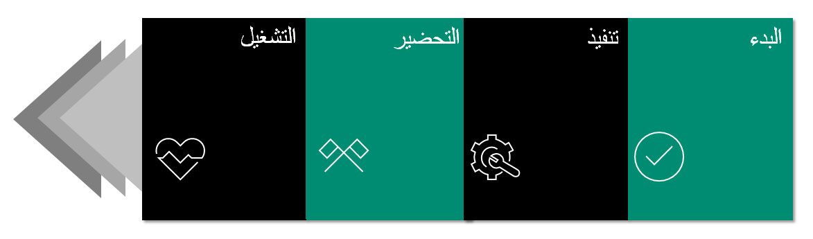

تعرض الأقسام التالية رحلة التنفيذ على مستوى عالٍ. لا تعد هذه المنهجية إلزامية، ولكنها محاولة لتوضيح المراحل الرئيسية، بغض النظر عن المنهجية التي سيواجهها المشروع. ومع ذلك، فإننا نشجعك على إدخال منهجيتك الخاصة في مشاريعك.
 
يمر كل مشروع تنفيذ في Dynamics 365 بأربع مراحل تنفيذ، وهي: 

-   **البدء** – تشير هذه المرحلة إلى إعداد مشروع تنفيذ لديك من خلال مشروع Lifecycle Services‎ الجديد عن طريق إكمال أداة إعداد Lifecycle Services. توفر الأداة معلومات قيمة لبدء مشروعك، ويتم تقديم إرشادات أساسية، فضلاً عن تحديد نطاق المشروع، وتساعدك في تعيين تكوين Lifecycle Services الأولي لديك. راجع [مساحة عمل مشروع تنفيذ Lifecycle Services](/dynamics365/fin-ops-core/fin-ops/imp-lifecycle/onboard/?azure-portal=true#lcs-implementation-project-workspace).
-   **التنفيذ** – إنها المرحلة التي تقوم فيها بتصميم الحل وإنشائه واختباره.
-   **الإعداد** – في هذه المرحلة تستعد للبدء الفوري. تقوم بتسليم قائمة التحقق الخاصة بالبدء الفوري لتلقي تقييم جاهزية البدء الفوري من FastTrack Solution Architect.  
-   **التشغيل** – يتصف الحل بأنه فوري، ويركز فريق المشروع على صيانة بيئة التشغيل وخدمتها، أو عمليات الطرح المحتملة التالية.

 

تتوفر لديك أيضا منهجية Lifecycle Services في مدخل Lifecycle Services، مع مراحل مثل التحليل والتصميم والتطوير والاختبار والطرح. يمكنك تعديل هذه المنهجية، أو إضافة المراحل أو إزالتها.  
ستساعدك هذه المراحل في تعقب كل نشاط أثناء المشروع. تصف مراحل دورة حياة التنفيذ المقدمة في هذه الوحدة رحلة المشروع على مستوى أعلى، والتي ستتضمن مراحل منهجية Lifecycle Services أو أي منهجية أخرى تستخدمها. على سبيل المثال، ستكون مرحلة الطرح جزءاً من مرحلة التشغيل. 

يعتمد برنامج FastTrack على هذه المنهجية لجدولة ورش العمل المقابلة، وفقاً للمرحلة التي وصل إليها مشروعك. 

