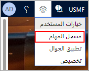

## قبل البدء
 يفترض هذا التمرين أن لديك بالفعل عملية توزيع تطبيقات Finance and Operations عاملة. 

لتحقيق أقصى استفادة من هذا التمرين والتمارين الأخرى الواردة في هذه الوحدة، نوصي بأن يتوفر لديك بيانات النماذج القياسية في تطبيقات Finance and Operations المثبتة عبر Lifecycle services. 

في هذا التمرين، ستقوم بما يلي:

- إنشاء تسجيل باستخدام مسجل المهام.
- حفظ التسجيل.
- تحرير التسجيل.

### إنشاء تسجيل
1.  فتح تطبيقات Finance and Operations وتسجيل الدخول. من الجيد تحديث المستعرض قبل كل تسجيل جديد. يؤدي ذلك إلى إنشاء جلسة مستخدم جديدة وإعادة تشغيل مسجل المهام، ما يوفر تجربة تسجيل أكثر استقراراً.
2.  حدد الشركة التي تود استخدامها في أثناء التسجيل. إذا كانت هذه هي المرة الأولى التي تستخدم فيها مسجل المهام، فيمكنك المتابعة لأن هذا التمرين ينشئ نموذجاً للتسجيل بناءً على عملية أعمال إدارة الأسطول (توجد هذه العملية في بيئة التطوير). وسوف تحتاج إلى تحميل البيانات التجريبية للأسطول لمتابعة ذلك.
3.  انتقل إلى **الوحدات النمطية > إدارة الأسطول > الإعداد > إعداد الأسطول**.
4.  قم بتحميل بيانات العرض التوضيحي، من خلال الانتقال إلى علامة التبويب **إعداد البيانات**.
5. ضمن **إنشاء عملاء النماذج ومبالغ الإيجار والسيارة**، حدد زر **إنشاء**. سوف ترى "يرجى الانتظار. نعالج طلبك" بينما يتم إعداد البيانات، وتستغرق نحو 2 - 3 دقائق.
6. وعند إكمال ذلك، سوف يظهر مربع مكتوب فيه **بيانات النماذج التي تم إنشاؤها**.
7. حدد **إغلاق**.
8.  انتقل إلى **لوحة المعلومات** عن طريق تحديد **Finance and Operations** في شريط الانتقال.
9.  انتقل إلى **الإعدادات > مسجل المهام**. 

    

8.  يفتح جزء **مسجل المهام**. يمكنك تحديد "**X**" في أعلى الزاوية اليمنى لإغلاق جزء **مسجل المهام** قبل بدء تسجيل جديد. يمكن إعادة فتح الجزء باتباع الخطوات السابقة.
9.  حدد **إنشاء تسجيل جديد**.
10. أدخل اسماً للتسجيل وحدد **بدء**. يبدأ التسجيل لحظة تحديد **بدء**. بالنسبة إلى مثال "الأسطول" في هذا التمرين، ستستخدم الاسم "إنشاء عميل إيجار جديد".
11. في أثناء التسجيل، سيؤدي تحديد "**X**" في أعلى الزاوية اليمنى إلى إخفاء الجزء دون إيقاف التسجيل. يمكن إعادة فتح الجزء عن طريق تحديد زر القائمة **مسجل المهام** الذي يظهر أعلى الشاشة. تظهر هذه الأيقونة عندما يكون التسجيل قيد التقدم فقط.
12. يدخل **مسجل المهام** إلى **وضع التسجيل**. يعرض الجزء الآن المعلومات وعناصر التحكم المتعلقة بعملية التسجيل. 
13. في جزء **مسجل المهام**، حدد **بدء المهمة**.
14. عيِّن **الاسم** إلى "إنشاء عميل إيجار جديد". اترك حقل **عام** فارغاً.
15. حدد **موافق**. 
16. تمت إضافة المهمة إلى **قائمة الخطوات**. 
17. انتقل إلى **لوحة المعلومات > إدارة الأصول > إدارة الحجز**.
18. انتقل إلى **جميع العملاء** ضمن علامة التبويب **ملخص**.
19. في جزء الإجراء، حدد **جديد**.
20. أدخل الاسم الأول والأخير للعميل.

### حفظ التسجيل
1.  حدد **حفظ**.
2.  في جزء **مسجل المهام**، حدد **إنهاء المهمة**. 
3.  لحفظ التسجيل في الكمبيوتر الشخصي لديك، حدد **حفظ إلى الكمبيوتر الشخصي هذا**. اختر موقعاً واحفظ الملف.
4.  لحفظ التسجيل في Lifecycle Services، حدد **حفظ في Lifecycle Services**. لاحظ أنه يجب توفير مكتبة BPM في مشروع LCS.
5.  لحفظ التسجيل كمستند Word، حدد **تصدير كمستند Word**.
6.  للحفظ كتسجيل مطوِّر، حدد **حفظ كتسجيل مطوِّر**.
7.  حدد **رجوع إلى القائمة الرئيسية**.

### تحرير التسجيل
1.  حدد **تحرير التسجيل**.
2.  حدد **فتح من الكمبيوتر الشخصي هذا** وحدد **استعراض** لتحميل تسجيل من الموقع الذي قمت بحفظ الملف فيه. امتداد هذا الملف ينتهي بـ (.axtr).
3.  حدد **بدء** ويبدأ مسجل المهام في التسجيل في وضع الصيانة.
4.  هنا يمكنك إدراج وحذف ونقل الخطوات مع مهمة.
5.  حدد **انتهاء التحرير** لإنهاء التحرير.
6.  لحفظ التسجيل في الكمبيوتر الشخصي لديك، حدد **حفظ إلى الكمبيوتر الشخصي هذا**. حدد موقعاً واحفظ الملف.
7.  حدد **رجوع إلى القائمة الرئيسية**.

