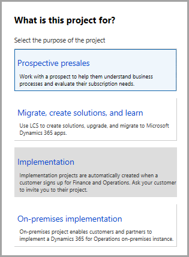
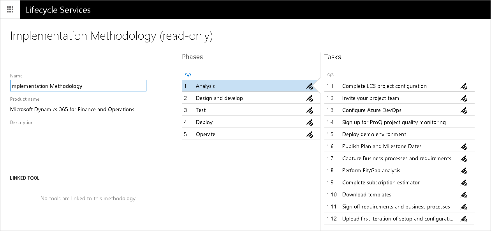
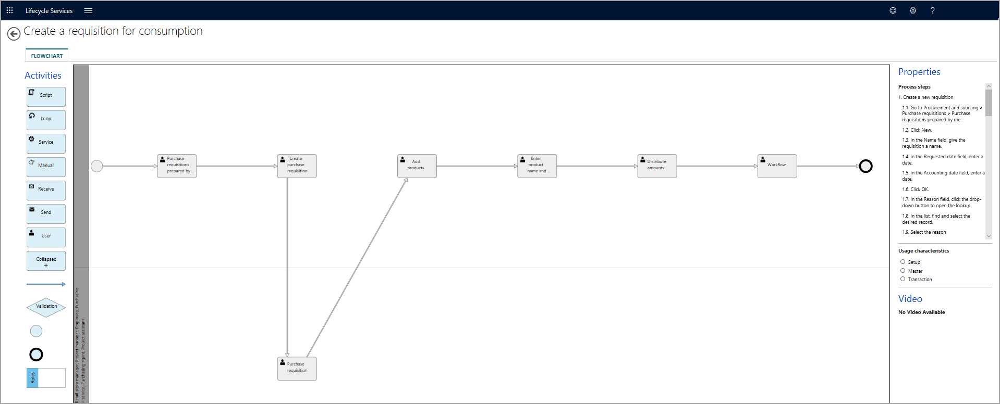
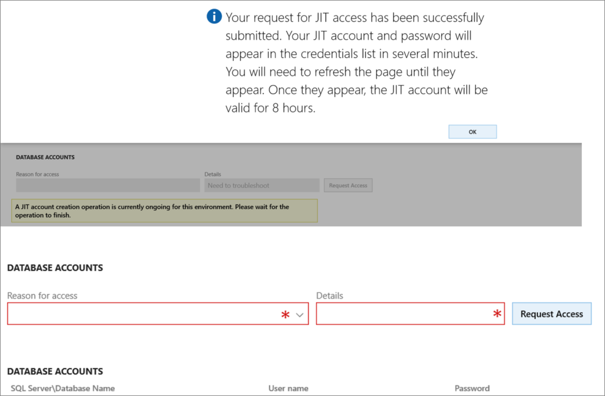
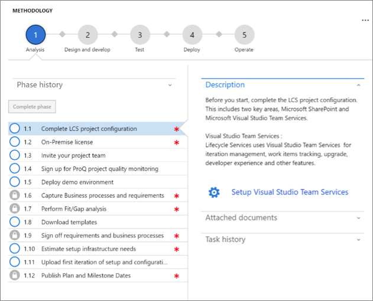

إن Lifecycles Services ‏(LCS) هو المستودع المركزي لمعظم الأدوات التي تستخدمها لإعداد وتوزيع مشروع لتطبيقات Finance and Operations. إن LCS هي مساحة عمل تعاونية مستندة إلى مجموعة حيث يتم تخزين جميع المعلومات الأساسية حول المشروع. يمكن أن تتضمن هذه المعلومات معلومات حول مراحل المشروع ومستودع جماعي يسمى مكتبة الأصول. يمكن إتاحة كل هذه المعلومات لأعضاء المشروع.

توفر مساحة عمل المشروع LCS منهجاً مفصلاً يعرض كل مرحلة من مراحل المشروع، وتوفر أحداث رئيسية عالية المستوى يتم استخدامها لتتبع التسليمات وأهداف المشروع.

مع تقدم المشروع، يمكن نشر البيئات من داخل LCS. تسمح أدوات نشر المشروع بنشر بيئات ذات أحجام مختلفة والتحكم فيها من داخل المشروع.

يسمح التحكم الموحد في البيئات المستندة إلى المجموعة داخل LCS بمراقبة البيئات المنتشرة من داخل LCS والتحكم فيها. يوفر LCS أدوات مدركة للبيئة للبحث عن المشكلات التي قد تحدث داخل البيئة، والبحث عن مشكلات قاعدة المعرفة مع الإصلاحات المعروفة، وتطبيق الإصلاحات على البيئات بطريقة خاضعة للرقابة.

## أنواع مشاريع LCS 
يتم إجراء التنفيذ من قِبل العميل والشريك. اعتماداً على الدور، لديك أنواع مختلفة من طرق العرض لمشروع LCS، لكن الوظيفة تظل كما هي. 

فيما يلي نظرة عامة على الاختلافات. 

مشروع LCS للشريك:  

- تم تمكين جميع الخدمات فيه. 
- حلول LCS 
- منهجية مفتوحة 
- التجارب التي يقودها الشركاء
- أحضر اشتراكك الخاص. 

مشروع LCS للعميل: 

- تم إنشاؤه كجزء من العرض
- إضاءة الميزة المستندة إلى العرض 
- اشتراك Microsoft
- لا يمكن حذفه (من واجهة المستخدم (UI))

## الأدوات المتوفرة في LCS

دعنا نتعرف على الأدوات المتوفرة في LCS. تساعدك هذه الأدوات في إدارة دورة حياة تنفيذ تطبيقات Finance and Operations. توضح القائمة التالية الأدوات المتوفرة في LCS ووصفاً للمراحل التي تنطبق عليها كل أداة.

- **المشاريع** - المشاريع هي المنظم الرئيسي لتجربتك في LCS وتتيح لك دعوة زملائك وشركائك وعملائك للتعاون معك، كما أنها تتيح لك تعقب التقدم.
 
    

عندما يتم تحديد متطلبات المشروع المطلوبة في منهجية LCS، فإنها ستساعد أعضاء الفريق على فهم النتائج المتوقعة في مراحل مختلفة من التنفيذ. يجب أن تحتوي كل مرحلة على معلم قبل أن تنتقل إلى المرحلة التالية، ويجب قياس إنجازها من خلال المخرجات التي أدت إلى المرحلة.

- **المنهجيات** - توفر المنهجيات أداة يمكنك استخدامها لضمان مشاريع تنفيذ أكثر قابلية للتكرار ويمكن التنبؤ بها. يمكنك استخدام إحدى منهجياتنا أو إنشاء منهجيتك الخاصة. باستخدام منهجية، يمكنك بسهولة تتبع التقدم المحرز الخاص بك والإبلاغ عنه.

المنهجية هي تحليل منهجي للأساليب المطبقة لتحقيق هدف واحد أو أكثر. هناك العديد من المنهجيات المتوفرة في LCS والتي يمكنك الاستفادة منها، مثل التنفيذ السحابي والمحلي، والترقية إلى أحدث إصدارات تطبيقات Finance and Operations.

يمكنك إنشاء المنهجيات الخاصة بك واستخدامها في مشروع في LCS لتبسيط المهام والأنشطة طوال دورة حياة التنفيذ. يجب تحسين المنهجية على مدار الدورة للتأكد من أنها تتكيف مع أي تغييرات في بيئة Finance and Operations.

تشتمل المنهجية على أدوات مختلفة، مثل تدفقات العمل المرحلية، ومهام سير العمل الفردية، وإجراءات العملية، والقوالب، والعينات، والمساعدات، والتعليمات، والمسؤولية، والمساءلة، والسلطة، والمخاطر، والقضايا، وجميعها يتم تنفيذها لتقديم المنتج أو الخدمة.

باستخدام منهجية تغطي جميع الأهداف المهمة لمرحلة التنفيذ، يكتسب فريقك الكفاءة ويعمل بشكل أكثر ذكاءً ويمكنه بناء بيئة من التحسين المستمر للعملية.

كما أنها توفر توقعات واضحة وتزيد من احتمالية واحتمال تنفيذ ناجح لتطبيقات Finance and Operations.

- **معاينة إدارة الميزات** - تُستخدم المعاينات لأغراض التطوير والاختبار فقط. يتم تمكين المعاينات العامة افتراضياً للمستخدمين الذين يرغبون في تقييمها.
 
    
- **مستخدمو المؤسسة** - يمكن للمستخدمين الوصول إلى المعلومات الخاصة بالمؤسسة مثل مكتبات عمليات الأعمال والمنهجيات. لا يمتلك مستخدمو المؤسسة حق الوصول إلى مشاريع محددة حتى تتم دعوتهم للانضمام إليها.

- **إدارة الحلول** - هذه مجموعة من الأدوات المختلفة، مثل حزم البرامج القابلة للنشر، والشعارات، والتقارير المخصصة، التي يمكن تطبيقها على مشروع جديد، لذا عندما يتم نشر البيئة، ستتضمن جميع البيانات الاصطناعية.

- **مكتبة الأصول المشتركة**: هذا هو مستودع الحزم والنسخ الاحتياطية لقاعدة البيانات التي يمكن تطبيقها على بيئة منشورة مثل تطبيق ذكاء Cortana، وحزمة البرامج القابلة للنشر، ونموذج تقرير Power BI.
 
    
- **إدارة الحوادث** - باستخدام هذه الأداة، يمكنك عرض جميع الحوادث وتصديرها لمشروع LCS المحدد.

- **قم بإعداد خدمات الفرق في Visual Studio** - الاتصال بـ **Azure DevOps** (المعروف سابقاً باسم Visual Studio Team Services أو Visual Studio Codespace) لمشروع خدمة دورة الحياة. يتيح ذلك لبيئة التطوير الاتصال بمستودع مركزي للتعليمات البرمجية وحزم البرامج القابلة للنشر، وإنشاء حوادث للفريق أو إرسال حادث إلى فريق دعم Microsoft. 

- **أداة تكوين عمليات الأعمال** - تتيح لك أداة تكوين عمليات الأعمال (BPM) إنشاء تدفقات العملية القياسية وعرضها وتعديلها. باستخدام BPM، يمكنك تحقيق الأهداف التالية:

    - توحيد تدفقات العمليات.
    - قم بمواءمة عمليات أعمالك مع العمليات المتوافقة مع معايير الصناعة، كما هو موضح من قِبل مركز الإنتاجية والجودة الأمريكي (APQC).
    - حدد التوافق والفجوات بين متطلبات المستخدم والوظيفة الافتراضية التي توفرها منتجات Microsoft Dynamics.
 
    بعض عمليات الأعمال لها رسم تخطيطي مطابق. يمكنك أيضاً استخدام مسجل المهام وحفظ النتيجة في LCS، وسيتم إنشاء الرسم التخطيطي تلقائياً، كما هو موضح أدناه.
 
    
 
- **البيئات المستضافة على الشبكة السحابية** - البيئات المستضافة على الشبكة السحابية هي أداة يمكنك استخدامها لنشر بيئات Microsoft Dynamics على Microsoft Azure. عند استخدام البيئات المستضافة على الشبكة السحابية، يجب عليك تحديد نوع البيئة المراد نشرها، مثل العرض التوضيحي أو المطور/الاختبار أو بيئة الإنتاج.
 
- **الدعم** - يساعدك الدعم من خلال الشبكة السحابية على إدارة حوادث الدعم. 
- **الإبلاغ عن انقطاع الإنتاج** - هذه الميزة متاحة لجميع العملاء الذين قاموا بشراء تطبيقات Finance and Operations وحصلوا على مشاريع تنفيذ مع نشر بيئة إنتاج في LCS. 

    
 
توفر ميزة الإبلاغ عن انقطاع الإنتاج قناة سريعة وفعالة لتصعيد المشكلات إلى دعم Microsoft إذا تدهورت الخدمات في بيئة الإنتاج أو أصبحت غير متوفرة. تسمح للمستخدمين بالإبلاغ عن تدهور الخدمة أو مشكلات الأداء في بيئة الإنتاج.

- **مدير البيانات والتكوين** - يتيح لك مدير التكوين والبيانات (معاينة) نسخ التكوين من مثيل إلى آخر. يمكنك النسخ من وإلى البيئات التي تفي بالمعايير التالية: تتم إدارتها كجزء من مشروع LCS وتقوم بتشغيل إطار عمل استيراد البيانات (DIXF).
- **ترقية الرموز** - يقوم تحليل التخصيص بالتحقق من صحة ملفات النماذج مقابل أفضل الممارسات ويقدم تقريراً عن المجالات المحتملة للتحسين.
- **بحث عن المشاكل** - يساعدك البحث عن المشاكل في العثور على الحلول والإصلاحات الحالية للمشكلات المعروفة في منتجات Microsoft Dynamics. يمكنك معرفة المشكلات التي تم إصلاحها، والمشكلات التي تظل مفتوحة، والمشكلات التي تم حلها باعتبار أنه "لن يتم إصلاحها".
هناك نوعان من المراقبة لعرض صحة البيئة من خلال LCS عبر التوافر والمراقبة الصحية:

  - **مراقبة البيئة** - تساعد بيانات قياس تتبع الاستخدام في إنشاء طريقة عرض لوحة العمل التي تُظهر ما كان يفعله هذا المستخدم والمستخدمون الآخرون عند الإبلاغ عن المشكلة. يمنحك معلومات حول الحالة التي تشمل حمل المستخدم، وحمل النشاط، وSQL، واستخدام الخادم، وما إلى ذلك عبر نطاق زمني قابل للتكوين.
  - **عمليات تشخيص أداء النظام الكاملة**: مراقبة بيئات تطبيقات Finance and Operations المنشورة من أجل الرسائل، حالة الوظائف، طرق عرض التقارير. كما تجمع إحصاءات مندوبين المحصلين من تطبيقات Finance and Operations لتحليل تفاصيل الأداء.

- **خدمة الترجمة** - استخدم Dynamics Translation Service لترجمة الحلول الخاصة بك أو إضافة لغة جديدة لمنتجات Dynamics المدعومة.
- **الردود على طلبات تقديم العروض (RFP)** - تساعد صفحة الردود على طلبات تقديم العروض (RFP) الشركاء في الرد على طلبات الاقتراحات (RFPs). 
- **تحليل عمليات الترقية** - يساعدك تحليل عمليات الترقية في التخطيط للترقية إلى أحدث إصدار من تطبيقات Finance and Operations عن طريق تحليل البيانات الاصطناعية للرموز من Microsoft Dynamics AX ‏4.0، أو Dynamics AX ‏2009، أو Dynamics AX ‏2012، أو حتى الإصدارات الأقدم.
- **أصناف العمل** -  يعرض هذا جميع الحوادث كصنف عمل Azure DevOps متصل بمشروع LCS.
- **Azure DevOps** - Azure DevOps معروف ايضاً باسم VSTS. يجب عليك إنشاء مشروع مساحة الرموز في Visual Studio، ثم في LCS انقر على **إعداد خدمات الفرق في Visual Studio Team Services** لتوصيل وتفويض LCS للاتصال بمشروع Visual Studio. يعد هذا ضرورياً لإنشاء أصناف العمل والسماح لبيئة التطوير بالاتصال بمستودع مركزي للرمز وحزم البرامج القابلة للنشر. كما أنه ينشئ حوادث للفريق أو يرسل حادثة إلى فريق دعم Microsoft.
- **مقدّر الاشتراك‬** – توفير تقدير تلقائي للاشتراك المطلوب لمثيل Finance and Operations في المجموعة. يستخدم مقدر الاشتراك تفاصيل ترخيص المستخدم وعدد الحركات لاستنتاج احتياجات الاشتراك. على الرغم من أنه يمكن أن يكون لديك تقديرات متعددة، إلا أنه يجب عليك وضع علامة على تقدير واحد كـ **نشط**. إنها معلومات أساسية لتحديد مواصفات بيئة الإنتاج الصحيحة بواسطة Microsoft. 
- **وصول JIT (في الوقت المناسب)** – سيسمح وصول JIT إلى قاعدة بيانات وضع الحماية للمستخدم بالحصول على وصول مؤقت إلى قاعدة البيانات، مما يعني أن أمامه حوالي ثماني ساعات للوصول باستخدام مستخدم وكلمة مرور ديناميكيين. هذا للحد من الوصول إلى قاعدة البيانات، واستخدامها فقط للأغراض الرئيسية مثل Finance and Operations واستكشاف المشكلات وإصلاحها في Management Reporter، أو ضبط الأداء لـ Finance and Operations، أو أو استكشاف المشكلات وإصلاحها وضبط مخزن الكيانات. 
 
    

- **تحديث الإعدادات** – يستطيع العملاء إعداد نافذة صيانة في صفحة **تحديث الإعدادات في إعدادات المشروع** في LCS، لمواكبة إصدار بيئة الإنتاج. يمكنهم تخطيط الوتيرة بناءً على التقويم الذي نشرته Microsoft لإصدارات إصدار واحد. 
- **أداه إعداد المشروع** - هي أداة خطوة بخطوة لتكوين إعدادات LCS الرئيسية اللازمة لبدء مشروع LCS الخاص بك. بمجرد إكماله، ستتمكن من نشر بيئات التطوير وبيئة الحماية الخاصة بك. 

## مكتبة SharePoint
يجب عليك استخدام LCS لنشر وتحديث مثيل Dynamics 365 Finance + Operations (محلي). بعد شراء ترخيص خادم ومستخدم من خلال تدفق الترخيص المجمع أو تدفق قائمة أسعار Dynamics، راجع[Finance + Operations (محلي)](/dynamics365/fin-ops-core/fin-ops/get-started/purchase-on-premises/?azure-portal=true)، لإنشاء حساب Azure AD أو استخدام حساب Azure AD الحالي، ثم أكمل كل خطوات التسجيل. ستتم إعادة توجيهك إلى LCS، حيث سيتم توفير مشروع تنفيذ محلي لك.
 

يحتوي المشروع المحلي على جميع الأدوات التي تحتاجها لتنفيذ حل محلي وصيانته وتشغيله. فيما يلي بعض الأدوات المتوفرة في المشروع المحلي:

- **المنهجية** – توفر المنهجية المحلية أفضل الممارسات التي ستساعد العملاء على تنفيذ وإدارة المشاريع المحلية.
- **مصمم عمليات الأعمال** – مصمم عمليات الأعمال (BPM) يُستخدم لالتقاط المتطلبات وإجراء تحليل فجوة الملائمة.
- **البيئات المستضافة على السحابة** – تُستخدم البيئات المستضافة على السحابة لنشر هياكل المطورين وبناء الهياكل، وإكمال إدارة دورة حياة تطبيقات (ALM) للحلول المحلية.
- **ترقية الرمز** – ستساعدك هذه الأدوات في ترقية التعليمات البرمجية إلى إصدار أحدث.
- **البحث عن المشكلات** – ابحث عن قاعدة المعارف المنشورة ذات الصلة بقضايا التطبيق والنظام الأساسي.
- **التعريب والترجمة** – تعريب الأصول وترجمتها.
- **الدعم** – ملف وتعقب حوادث الدعم.
- **مستخدمو المشروع** – قم بتعيين مستخدمين لمشروع.
- **إعدادات المشروع** – تحرير الإعدادات على مستوى المشروع ، مثل الموصلات واسم المشروع ومستخدمي المؤسسة ورقم الترخيص.
- **مكتبة الأصول** – مكتبة الأصول هي مكتبة لمختلف الأصول، مثل الحزم.
- **مكتبة SharePoint على الإنترنت** – الاتصال بمكتبة SharePoint عبر الإنترنت.

لبدء التنفيذ المحلي، يجب عليك اتباع الخطوات الواردة في المنهجية لإعداد المشروع بشكل صحيح، ونشر بيئة المطور وبناء البيئات، ثم نشر بيئة الحماية وبيئات الإنتاج. لمساعدتك في عمليات النشر، تم تخصيص فتحتين بيئيتين مسبقاً للمشروع المحلي. إحدى الفتحات مخصصة لبيئة وضع الحماية، والفتحة الأخرى مخصصة لبيئة الإنتاج. سيتم استخدام هذه الفتحات أثناء تدفق الخدمة للمساعدة في ضمان اختبار الحزم في بيئة وضع الحماية قبل تطبيقها في بيئة الإنتاج.
