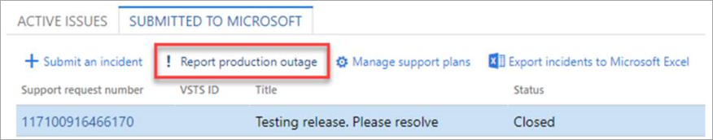

إن Lifecycles Services ‏(LCS) هو المستودع المركزي لمعظم الأدوات التي تستخدمها لإعداد وتوزيع مشروع لتطبيقات Finance and Operations.Lifecycles Services (LCS) is the central repository for most of the tools that you use to prepare and deploy a project for Finance and Operations apps. إن LCS هي مساحة عمل تعاونية مستندة إلى مجموعة حيث يتم تخزين جميع المعلومات الأساسية حول المشروع.LCS is a cloud-based collaboration workspace where all the key information about a project is stored. يمكن أن تتضمن هذه المعلومات معلومات حول مراحل المشروع ومستودع جماعي يسمى مكتبة الأصول.This information can include information about project phases and a collective repository named the Asset library. يمكن إتاحة كل هذه المعلومات لأعضاء المشروع.All this information can be made available to project members.

توفر مساحة عمل المشروع LCS منهجاً مفصلاً يعرض كل مرحلة من مراحل المشروع، وتوفر أحداث رئيسية عالية المستوى يتم استخدامها لتتبع التسليمات وأهداف المشروع.The LCS Project workspace provides an outlined methodology showing each phase of your project and provides high-level milestones that are used to track deliverables and project goals.

مع تقدم المشروع، يمكن نشر البيئات من داخل LCS.As the project progresses, environments can be deployed from within LCS. تسمح أدوات نشر المشروع بنشر بيئات ذات أحجام مختلفة والتحكم فيها من داخل المشروع.The project deployment tools allow environments of different sizes to be deployed and controlled from within the project.

يسمح التحكم الموحد في البيئات المستندة إلى المجموعة داخل LCS بمراقبة البيئات المنتشرة من داخل LCS والتحكم فيها.The unified control of cloud-based environments within LCS allows environments deployed from within LCS to be monitored and controlled. يوفر LCS أدوات مدركة للبيئة للبحث عن المشكلات التي قد تحدث داخل البيئة، والبحث عن مشكلات قاعدة المعرفة مع الإصلاحات المعروفة، وتطبيق الإصلاحات على البيئات بطريقة خاضعة للرقابة.LCS provides environment-aware tools to search for issues that may be occurring within the environment, search for knowledge base issues with known fixes, and apply the fixes to the environments in a controlled manner.

## أنواع مشاريع LCSTypes of LCS projects 
يتم إجراء التنفيذ من قِبل العميل والشريك.The implementation is performed by the Customer and the Partner. اعتماداً على الدور، لديك أنواع مختلفة من طرق العرض لمشروع LCS، لكن الوظيفة تظل كما هي.Depending on the role, you have different types of views of the LCS project, but the functionality remains the same. 

فيما يلي نظرة عامة على الاختلافات.Below is an overview of the differences. 

مشروع LCS للشريك:Partner LCS project:  

- تم تمكين جميع الخدمات فيه.They have all services enabled. 
- حلول LCSLCS solutions 
- منهجية مفتوحةOpen methodology 
- التجارب التي يقودها الشركاءPartner-led trials
- أحضر اشتراكك الخاص.Bring your own subscription. 

مشروع LCS للعميل:Customer LCS project: 

- تم إنشاؤه كجزء من العرضCreated as part of the offer
- إضاءة الميزة المستندة إلى العرضOffer-based feature light-up 
- اشتراك MicrosoftMicrosoft subscription
- لا يمكن حذفه (من واجهة المستخدم (UI))Cannot be deleted (from User interface (UI))

## الأدوات المتوفرة في LCSTools that are provided in LCS

دعنا نتعرف على الأدوات المتوفرة في LCS.Let’s get familiar with tools available in LCS. تساعدك هذه الأدوات في إدارة دورة حياة تنفيذ تطبيقات Finance and Operations.These tools assist you to manage the lifecycle of a Finance and Operations apps implementation. توضح القائمة التالية الأدوات المتوفرة في LCS ووصفاً للمراحل التي تنطبق عليها كل أداة.The following list highlights the tools that are provided in LCS and a description of the phases that each tool applies to.

- **المشاريع** - المشاريع هي المنظم الرئيسي لتجربتك في LCS وتتيح لك دعوة زملائك وشركائك وعملائك للتعاون معك، كما أنها تتيح لك تعقب التقدم.**Projects** - Projects are the key organizer for your experience in LCS and let you invite your colleagues, partners, and customers to collaborate with you, and they also let you track progress.
 
    

عندما يتم تحديد متطلبات المشروع المطلوبة في منهجية LCS، فإنها ستساعد أعضاء الفريق على فهم النتائج المتوقعة في مراحل مختلفة من التنفيذ.When the required project requirements are defined in LCS methodology, it will help team members to understand expected deliverables at different phases of implementation. يجب أن تحتوي كل مرحلة على معلم قبل أن تنتقل إلى المرحلة التالية، ويجب قياس إنجازها من خلال المخرجات التي أدت إلى المرحلة.Every phase must have a milestone before it moves to the next phase, and its achievement should be measured by the deliverables that resulted in the phase.

- **المنهجيات** - توفر المنهجيات أداة يمكنك استخدامها لضمان مشاريع تنفيذ أكثر قابلية للتكرار ويمكن التنبؤ بها.**Methodologies** - Methodologies provide a tool that you can use to ensure more repeatable, predictable implementation projects. يمكنك استخدام إحدى منهجياتنا أو إنشاء منهجيتك الخاصة.You can use one of our methodologies or create your own. باستخدام منهجية، يمكنك بسهولة تتبع التقدم المحرز الخاص بك والإبلاغ عنه.By using a methodology, you can easily track and report on your progress.

المنهجية هي تحليل منهجي للأساليب المطبقة لتحقيق هدف واحد أو أكثر.A methodology is a systematic analysis of methods applied to achieve one or many goals. هناك العديد من المنهجيات المتوفرة في LCS والتي يمكنك الاستفادة منها، مثل التنفيذ السحابي والمحلي، والترقية إلى أحدث إصدارات تطبيقات Finance and Operations.There are many methodologies available in LCS that you can benefit from, such as cloud and on-premises implementation, and upgrade to the latest release versions of Finance and Operations apps.

يمكنك إنشاء المنهجيات الخاصة بك واستخدامها في مشروع في LCS لتبسيط المهام والأنشطة طوال دورة حياة التنفيذ.You can create your own methodologies and use them in a project in LCS to streamline the tasks and activities throughout the implementation life cycle. يجب تحسين المنهجية على مدار الدورة للتأكد من أنها تتكيف مع أي تغييرات في بيئة Finance and Operations.A methodology should be refined over the course of the cycle to ensure that it adapts to any changes in the Finance and Operations environment.

تشتمل المنهجية على أدوات مختلفة، مثل تدفقات العمل المرحلية، ومهام سير العمل الفردية، وإجراءات العملية، والقوالب، والعينات، والمساعدات، والتعليمات، والمسؤولية، والمساءلة، والسلطة، والمخاطر، والقضايا، وجميعها يتم تنفيذها لتقديم المنتج أو الخدمة.A methodology comprises various tools, such as phased workflows, individual process workflows, process procedures, templates, samples, aids, instructions, responsibility, accountability, authority, risks, and issues, all carried out to deliver the product or service.

باستخدام منهجية تغطي جميع الأهداف المهمة لمرحلة التنفيذ، يكتسب فريقك الكفاءة ويعمل بشكل أكثر ذكاءً ويمكنه بناء بيئة من التحسين المستمر للعملية.By using a methodology that covers all the important goals of the implementation phase, your team gains efficiency, works smarter, and can build an environment of continuous process improvement.

كما أنها توفر توقعات واضحة وتزيد من احتمالية واحتمال تنفيذ ناجح لتطبيقات Finance and Operations.It also provides clear expectations and increases the probability and likelihood of a successful implementation of Finance and Operations apps.

- **معاينة إدارة الميزات** - تُستخدم المعاينات لأغراض التطوير والاختبار فقط.**Preview feature management** - Previews are intended to be used for development and testing purposes only. يتم تمكين المعاينات العامة افتراضياً للمستخدمين الذين يرغبون في تقييمها.Public previews are enabled by default for users who want to evaluate them.
 
    
- **مستخدمو المؤسسة** - يمكن للمستخدمين الوصول إلى المعلومات الخاصة بالمؤسسة مثل مكتبات عمليات الأعمال والمنهجيات.**Organization users** - Users can access organization-specific information such as business process libraries and methodologies. لا يمتلك مستخدمو المؤسسة حق الوصول إلى مشاريع محددة حتى تتم دعوتهم للانضمام إليها.Organization users do not have access to specific projects until they have been invited to join them.

- **إدارة الحلول** - هذه مجموعة من الأدوات المختلفة، مثل حزم البرامج القابلة للنشر، والشعارات، والتقارير المخصصة، التي يمكن تطبيقها على مشروع جديد، لذا عندما يتم نشر البيئة، ستتضمن جميع البيانات الاصطناعية.**Solution management** - This is a collection of different artifacts, such as deployable software packages, logos, and custom reports, that can be applied to a new project, so when the environment will be deployed it will include all the artifacts.

- **مكتبة الأصول المشتركة**: هذا هو مستودع الحزم والنسخ الاحتياطية لقاعدة البيانات التي يمكن تطبيقها على بيئة منشورة مثل تطبيق ذكاء Cortana، وحزمة البرامج القابلة للنشر، ونموذج تقرير Power BI.**Shared asset library**: This is a repository of packages and database backups that can be applied to a deployed environment such as Cortana intelligence application, Software deployable package, and Power BI report model.
 
    
- **إدارة الحوادث** - باستخدام هذه الأداة، يمكنك عرض جميع الحوادث وتصديرها لمشروع LCS المحدد.**Manage incidents** - By using this tool you can view and export all incidents for a selected LCS project.

- **قم بإعداد خدمات الفرق في Visual Studio** - الاتصال بـ **Azure DevOps** (المعروف سابقاً باسم Visual Studio Team Services أو Visual Studio Codespace) لمشروع خدمة دورة الحياة.**Set up Visual Studio Team Services** - Connects **Azure DevOps** (formerly known as Visual Studio Team Services, or Visual Studio Codespace) to a lifecycle service project. يتيح ذلك لبيئة التطوير الاتصال بمستودع مركزي للتعليمات البرمجية وحزم البرامج القابلة للنشر، وإنشاء حوادث للفريق أو إرسال حادث إلى فريق دعم Microsoft.This allows a development environment to connect to a central repository for code and software deployable packages, and creates incidents for the team or submits an incident to the Microsoft support team. 

- **أداة تكوين عمليات الأعمال** - تتيح لك أداة تكوين عمليات الأعمال (BPM) إنشاء تدفقات العملية القياسية وعرضها وتعديلها.**Business process modeler** - Business process modeler (BPM) lets you create, view, and modify standard process flows. باستخدام BPM، يمكنك تحقيق الأهداف التالية:By using BPM, you can achieve the following goals:

    - توحيد تدفقات العمليات.Standardize process flows.
    - قم بمواءمة عمليات أعمالك مع العمليات المتوافقة مع معايير الصناعة، كما هو موضح من قِبل مركز الإنتاجية والجودة الأمريكي (APQC).Align your business processes with industry-standard processes, as described by the American Productivity & Quality Center (APQC).
    - حدد التوافق والفجوات بين متطلبات المستخدم والوظيفة الافتراضية التي توفرها منتجات Microsoft Dynamics.Identify fit and gaps between user requirements and the default functionality that Microsoft Dynamics products provide.
 
    بعض عمليات الأعمال لها رسم تخطيطي مطابق.Some of the business processes have a corresponding diagram. يمكنك أيضاً استخدام مسجل المهام وحفظ النتيجة في LCS، وسيتم إنشاء الرسم التخطيطي تلقائياً، كما هو موضح أدناه.You also can use Task recorder and save the result to LCS, and the diagram will automatically be created, as shown below.
 
    
 
- **البيئات المستضافة على الشبكة السحابية** - البيئات المستضافة على الشبكة السحابية هي أداة يمكنك استخدامها لنشر بيئات Microsoft Dynamics على Microsoft Azure.**Cloud-hosted environments** - Cloud-hosted environments is a tool that you can use to deploy Microsoft Dynamics environments on Microsoft Azure. عند استخدام البيئات المستضافة على الشبكة السحابية، يجب عليك تحديد نوع البيئة المراد نشرها، مثل العرض التوضيحي أو المطور/الاختبار أو بيئة الإنتاج.When you use cloud-hosted environments, you must select the type of environment to deploy, such as a demo, developer/test, or production environment.
 
- **الدعم** - يساعدك الدعم من خلال الشبكة السحابية على إدارة حوادث الدعم.**Support** - Cloud-powered support helps you manage support incidents. 
- **الإبلاغ عن انقطاع الإنتاج** - هذه الميزة متاحة لجميع العملاء الذين قاموا بشراء تطبيقات Finance and Operations وحصلوا على مشاريع تنفيذ مع نشر بيئة إنتاج في LCS.**Report production outage** - This feature is available to all customers who have purchased Finance and Operations apps and have implementation projects with a production environment deployed in LCS. 

    
 
توفر ميزة الإبلاغ عن انقطاع الإنتاج قناة سريعة وفعالة لتصعيد المشكلات إلى دعم Microsoft إذا تدهورت الخدمات في بيئة الإنتاج أو أصبحت غير متوفرة.The Report production outage feature provides a quick and effective channel to escalate issues to Microsoft Support if the services in a production environment are degraded or become unavailable. تسمح للمستخدمين بالإبلاغ عن تدهور الخدمة أو مشكلات الأداء في بيئة الإنتاج.It allows users to report service degradation or performance issues in the production environment.

- **مدير البيانات والتكوين** - يتيح لك مدير التكوين والبيانات (معاينة) نسخ التكوين من مثيل إلى آخر.**Configuration and data manager** - Configuration and data manager (preview) lets you copy a configuration from one instance to another. يمكنك النسخ من وإلى البيئات التي تفي بالمعايير التالية: تتم إدارتها كجزء من مشروع LCS وتقوم بتشغيل إطار عمل استيراد البيانات (DIXF).You can copy from and to environments that meet the following criteria: they are managed as part of an LCS project and they run the Data Import Export Framework (DIXF).
- **ترقية الرموز** - يقوم تحليل التخصيص بالتحقق من صحة ملفات النماذج مقابل أفضل الممارسات ويقدم تقريراً عن المجالات المحتملة للتحسين.**Code upgrade** - Customization analysis validates model files against best practices and provides a report of potential areas for improvement.
- **بحث عن المشاكل** - يساعدك البحث عن المشاكل في العثور على الحلول والإصلاحات الحالية للمشكلات المعروفة في منتجات Microsoft Dynamics.**Issue search** - Issue search helps you find existing solutions and workarounds for known issues in Microsoft Dynamics products. يمكنك معرفة المشكلات التي تم إصلاحها، والمشكلات التي تظل مفتوحة، والمشكلات التي تم حلها باعتبار أنه "لن يتم إصلاحها".You can see which issues have been fixed, which issues remain open, and which issues have been resolved as “won’t fix".
هناك نوعان من المراقبة لعرض صحة البيئة من خلال LCS عبر التوافر والمراقبة الصحية:There are two types of monitoring to view the health of an environment through LCS via availability and health monitoring:

  - **مراقبة البيئة** - تساعد بيانات قياس تتبع الاستخدام في إنشاء طريقة عرض لوحة العمل التي تُظهر ما كان يفعله هذا المستخدم والمستخدمون الآخرون عند الإبلاغ عن المشكلة.**Environment monitoring** - Telemetry data helps build a storyboard view that shows what that user and other users were doing when the issue was reported. يمنحك معلومات حول الحالة التي تشمل حمل المستخدم، وحمل النشاط، وSQL، واستخدام الخادم، وما إلى ذلك عبر نطاق زمني قابل للتكوين.It gives you information about the state spanning user load, activity load, SQL, server utilization, and so on spread across a configurable time scale.
  - **عمليات تشخيص أداء النظام الكاملة**: مراقبة بيئات تطبيقات Finance and Operations المنشورة من أجل الرسائل، حالة الوظائف، طرق عرض التقارير.**Full system diagnostics**: Monitors the deployed Finance and Operations apps environments for messages, status of jobs, report views. كما تجمع إحصاءات مندوبين المحصلين من تطبيقات Finance and Operations لتحليل تفاصيل الأداء.It also collects statistics of the collectors agents from Finance and Operations apps to analyze performance detail.

- **خدمة الترجمة** - استخدم Dynamics Translation Service لترجمة الحلول الخاصة بك أو إضافة لغة جديدة لمنتجات Dynamics المدعومة.**Translation service** - Use Dynamics Translation Service to translate your solutions or add a new language for supported Dynamics products.
- **الردود على طلبات تقديم العروض (RFP)** - تساعد صفحة الردود على طلبات تقديم العروض (RFP) الشركاء في الرد على طلبات الاقتراحات (RFPs).**RFP responses** - The RFP responses page helps partners respond to requests for proposals (RFPs). 
- **تحليل عمليات الترقية** - يساعدك تحليل عمليات الترقية في التخطيط للترقية إلى أحدث إصدار من تطبيقات Finance and Operations عن طريق تحليل البيانات الاصطناعية للرموز من Microsoft Dynamics AX ‏4.0، أو Dynamics AX ‏2009، أو Dynamics AX ‏2012، أو حتى الإصدارات الأقدم.**Upgrade analysis** - Upgrade analysis helps you plan your upgrade to the latest version of Finance and Operations apps by analyzing code artifacts from Microsoft Dynamics AX 4.0, Dynamics AX 2009, Dynamics AX 2012, or even earlier versions.
- **أصناف العمل** -  يعرض هذا جميع الحوادث كصنف عمل Azure DevOps متصل بمشروع LCS.**Work items** -  This shows all incidents as work item Azure DevOps that is connected to an LCS project
- **Azure DevOps** - Azure DevOps معروف ايضاً باسم VSTS.**Azure DevOps** - Azure DevOps is also known as VSTS. يجب عليك إنشاء مشروع مساحة الرموز في Visual Studio، ثم في LCS انقر على **إعداد خدمات الفرق في Visual Studio Team Services** لتوصيل وتفويض LCS للاتصال بمشروع Visual Studio.You must create a Visual Studio Codespace project, then in LCS click **Set up Visual Studio Team Services** to connect and authorize the LCS to connect to your Visual Studio project. يعد هذا ضرورياً لإنشاء أصناف العمل والسماح لبيئة التطوير بالاتصال بمستودع مركزي للرمز وحزم البرامج القابلة للنشر.This is necessary to create work items and to allow a development environment to connect to a central repository for code and software deployable packages. كما أنه ينشئ حوادث للفريق أو يرسل حادثة إلى فريق دعم Microsoft.It also creates incidents for the team, or submits an incident to the Microsoft support team.
- **مقدّر الاشتراك‬** – توفير تقدير تلقائي للاشتراك المطلوب لمثيل Finance and Operations في المجموعة.**Subscription Estimator** – Provides an automated estimate of the subscription that is required for your Finance and Operations instance in the cloud. يستخدم مقدر الاشتراك تفاصيل ترخيص المستخدم وعدد الحركات لاستنتاج احتياجات الاشتراك.Subscription estimator uses the user license details and transaction count to infer the subscription needs. على الرغم من أنه يمكن أن يكون لديك تقديرات متعددة، إلا أنه يجب عليك وضع علامة على تقدير واحد كـ **نشط**.Although you can have multiple estimates, you must mark one estimate as **Active**. إنها معلومات أساسية لتحديد مواصفات بيئة الإنتاج الصحيحة بواسطة Microsoft.It is key information to determine the right production environment specifications by Microsoft. 
- **وصول JIT (في الوقت المناسب)** – سيسمح وصول JIT إلى قاعدة بيانات وضع الحماية للمستخدم بالحصول على وصول مؤقت إلى قاعدة البيانات، مما يعني أن أمامه حوالي ثماني ساعات للوصول باستخدام مستخدم وكلمة مرور ديناميكيين.**JIT access (just in time)** – The JIT access to sandbox database will allow the user to get temporary access to the database, meaning that they have around eight hours to access with a dynamic user and password. هذا للحد من الوصول إلى قاعدة البيانات، واستخدامها فقط للأغراض الرئيسية مثل Finance and Operations واستكشاف المشكلات وإصلاحها في Management Reporter، أو ضبط الأداء لـ Finance and Operations، أو أو استكشاف المشكلات وإصلاحها وضبط مخزن الكيانات.This is to limit the access to the database, and use it only for main purposes such as Finance and Operations and Management Reporter troubleshooting, performance tuning for Finance and Operations, or troubleshooting and tuning an Entity Store. 
 
    

- **تحديث الإعدادات** – يستطيع العملاء إعداد نافذة صيانة في صفحة **تحديث الإعدادات في إعدادات المشروع** في LCS، لمواكبة إصدار بيئة الإنتاج.**Update settings** – Customers can set up a maintenance window in **Update settings at Project settings** page in LCS, to keep up to date the version of the Production environment. يمكنهم تخطيط الوتيرة بناءً على التقويم الذي نشرته Microsoft لإصدارات إصدار واحد.They can plan the cadence based on the calendar that Microsoft has published for One version releases. 
- **أداه إعداد المشروع** - هي أداة خطوة بخطوة لتكوين إعدادات LCS الرئيسية اللازمة لبدء مشروع LCS الخاص بك.**Project onboarding tool** - Is a step-by-step tool to configure the main LCS settings needed to kick off your LCS project. بمجرد إكماله، ستتمكن من نشر بيئات التطوير وبيئات وضع الحماية الخاصة بك.Once you complete it, you will be able to deploy your development and sandbox environments. 
