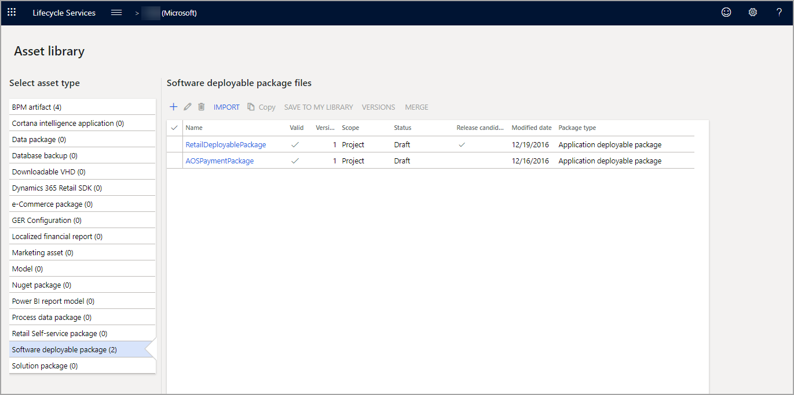
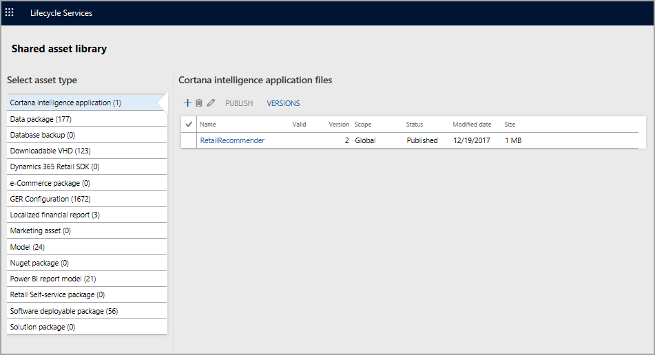

مكتبة الأصول هي إطار عمل البيانات الذي يربط كل شيء معاً في مشروع Lifecycle Services (LCS) لتطبيقات Finance and Operations.  فهي تخزّن أنواعاً مختلفة من الأصول على مستوى المشروع أو المؤسسة.  يمكن نشر الأصول من خلال البيئات.  

تتوفر مكتبة أصول مشتركة ومكتبات أصول على مستوى المشروع في LCS لاستخدامك.

- **مكتبة الأصول المشتركة** - تُستخدم مكتبة الأصول المشتركة بواسطة Microsoft والشركاء لمشاركة الأصول عبر العديد من المستأجرين والمشروعات والبيئات في LCS. ويمكن لأي مستخدم يُسجّل الدخول إلى LCS الوصول إلى هذه المكتبة.

    للوصول إلى مكتبة الأصول المشتركة، قُم بتسجيل الدخول إلى LCS، ثم حدد الإطار المتجانب **مكتبة الأصول المشتركة**. 

- **مكتبة الأصول على مستوى المشروع** - تُستخدم مكتبة الأصول على مستوى المشروع لمشاركة الأصول عبر البيئات داخل مشروع في LCS. ويمكن لجميع المستخدمين ضمن المشروع الوصول إلى هذه المكتبة. 

    للوصول إلى مكتبة الأصول على مستوى المشروع، قُم بتسجيل الدخول إلى LCS، ثم افتح مشروعاً. يعد ذلك، في القائمة على شكل هامبرجر، حدد **مكتبة الأصول**.

يمكنك الوصول إلى مكتبة الأصول على مستوى المشروع عن طريق تسجيل الدخول إلى [https://lcs.dynamics.com/v2](https://lcs.dynamics.com/v2/?azure-portal=true). حدد مشروعاً ثم حدد الإطار المتجانب **مكتبة الأصول**. 
 
 
 

سيكون لكل مشروع في LCS مكتبة أصول منفصلة.  مكتبة الأصول هي إطار عمل البيانات الذي يضم أنواعاً مختلفة من الأصول، مثل حزم البيانات وتحديثات البرامج.  

سترى أيضاً الإطار المتجانب **مكتبة الأصول** على الجانب الأيمن عند تسجيل الدخول في البداية إلى LCS قبل تحديد مشروع.  ويمكن نقل الأصول بين بعض المشروعات ومكتبات الأصول ومكتبة الأصول الشخصية الخاصة بك. 
 
تحتوي مكتبة الأصول المشتركة على أصول مرئية للآخرين في مؤسستك.  بالإضافة إلى ذلك، تحتوي مكتبة الأصول هذه على تحديثات من Microsoft.  يمكن استيراد الأصول من مكتبة الأصول المشتركة الخاصة بك إلى مكتبة أصول مشروع ما.

  
وبالمثل، يمكن حفظ الأصول في مكتبة الأصول المشتركة الخاصة بك من مكتبة أصول مشروع ما.  

## أنواع الأصول
تُدعم مكتبة الأصول أنواعاً متعددة من الأصول. فيما يلي بعض أنواع الأصول التي يمكنك استخدامها بشكل متكرر:

- **الحزمة القابلة للنشر للبرنامج‬‬‏‫‏** - يمثل نوع الأصل هذا كافة الحزم المستخدمة لتحديث بيئة بأحدث مجموعة من التحديثات.
- **حزمة البيانات** - يخزّن نوع الأصل هذا الأصول المستخدمة للتكوين وإدارة البيانات.
- **تكوين GER** - يخزن نوع الأصل هذا كافة أصول التوطين والترجمة التي يتم تطبيقها على العميل.
- **Dynamics 365 Commerce SDK** - يخزن نوع الأصل هذا أحدث البرامج النصية لمجموعة تطوير برامج البيع بالتجزئة (SDK).

## الحزمة القابلة للنشر
الحزمة القابلة للنشر هي وحدة نشر يمكن تطبيقها على أي بيئة لتطبيقات Finance and Operations.  ويمكن أن تتكون من إصلاح عاجل ثنائي لمكون وقت تشغيل AOS، أو حزمة تطبيق تطبيقات Finance and Operations محدثة، أو حزمة تطبيق Dynamics 365 جديدة.  

يتم إنشاء حزمة قابلة للنشر مبدئياً في بيئة التطوير في Visual Studio.  ويمكن أيضاً إصدارها كتحديثات بواسطة Microsoft، والتي ستكون متاحة للتنزيل في LCS.  يمكن استخدام حزمة قابلة للنشر على حزمة واحدة أو أكثر في النظام.  ويمكن أن تحتوي كل حزمة أيضاً على نموذج واحد أو أكثر.  

في Visual Studio يمكنك تحديد نموذج واحد أو أكثر لحزمتك الأساسية في بداية عملية التصدير.  سيتم إنشاء ملف مضغوط يحتوي على جميع عناصر النموذج، والتعليمات البرمجية المجمعة، بالإضافة إلى بعض البرامج النصية التي تم إنشاؤها وDLLs.  

تسمح لك واجهة المستخدم في LCS بنشر هذه الحزم في البيئات الحالية.  يدعم LCS أيضاً النشر الآلي لحزم النظام الأساسي في البيئات الجديدة.

## نطاقات الأصول
يحتوي كل أصل تدعمه مكتبة الأصول على نطاقات متعددة. فيما يلي بعض نطاقات الأصول المدعومة:

- **أنا** - عندما يتم تحميل أحد الأصول، يتم تعيينه على نطاق **أنا**. يكون الأصل الذي يحتوي على نطاق **أنا** مرئياً فقط للشخص الذي قام بتحميل الأصل.
- **مشروع** – عند استيراد مشروع من النطاق **عمومي** إلى مشروع آخر، يتم تعيينه على النطاق **مشروع**.
- **مؤسسة** – عندما يجب مشاركة أحد الأصول مع عدة مستخدمين داخل مستأجر، يمكن لمسؤول المستأجر ترقية الأصل إلى النطاق **مؤسسة**.
- **عمومي** – يمكن لـ Microsoft فقط تحميل الأصول إلى النطاق **عمومي**. هذه الأصول متاحة للجمهور لجميع مشروعات LCS والمستخدمين.

## حالة الأصل
يكون لكل أصل إحدى الحالتين التاليتين: 

- **مسودة** – لا يزال من الممكن تحرير الأصل.
- **منشور** – يتم نشر الأصل في نطاق **مؤسسة** أو **عمومي**، ويتم استكمال عمليات التحرير.

 
