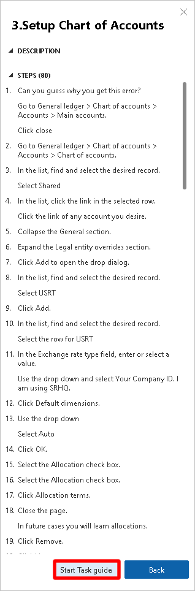

مسجل المهام هو أداة يمكنك استخدامها لتسجيل الإجراءات التي تتخذها في واجهة مستخدم المنتج (UI).  عند استخدام مسجل المهام، يتم التقاط جميع الأحداث التي تقوم بها في واجهة المستخدم التي يتم تنفيذها على الخادم، بما في ذلك إضافة القيم وتغيير الإعدادات وإزالة البيانات.

يأتي مسجل المهام مثبتاً مسبقاً مع تطبيقات التمويل والعمليات، ويمكنك البدء في تسجيل عمليات الأعمال مباشرةً بعد فتح عميل الويب.

يُطلق على الخطوات التي تقوم بتسجيلها بشكل جماعي "تسجيل المهام". يتم التقاط أي معلومات تقوم بإدخالها في تطبيقات التمويل والعمليات أثناء التسجيل وتضمينها في ملف التسجيل. إذا قررت مشاركة ملف التسجيل، فقد يتمكن الآخرون من رؤية المعلومات التي تم التقاطها.

يمكن استخدام تسجيلات المهام بعدة طرق.  يمكنك قراءة خطوات تسجيل المهام في جزء التعليمات في تطبيقات التمويل والعمليات، أو يمكنك اختيار تشغيل التسجيل كدليل مهام لكي يرشدك في واجهة المستخدم.  يُعد دليل المهام تجربة تفاعلية مضبوطة ومُوجهة من خلال خطوات عملية الأعمال.

يمكن حفظ تسجيلات المهام إلى ‏‫أداة تكوين عمليات الأعمال‬ (BPM) في Lifecycle Services.  سيتم إنشاء قائمة بالخطوات ومخطط انسيابي لعملية الأعمال من هذا التسجيل.

يمكن عرض تسجيلات المهام التي تم حفظها في مكتبة BPM في تطبيقات التمويل والعمليات كتعليمات.  كما يمكن أيضاً حفظ تسجيلات المهام كمستندات Microsoft Word أو كملف XML.  يسمح لك هذا بإنشاء أدلة تدريب أساسية بسهولة.

يمكن لمسجل المهام التقاط لقطات شاشة أثناء تسجيل عملية أعمال.  تُستخدم لقطات الشاشة هذه لإنشاء المستندات بعد إكمال التسجيل.  لتضمين لقطات شاشة في المستند الذي تم إنشاؤه، يجب تثبيت ملحقٍ.

## أدلة المهام

يمكنك الوصول إلى أدلة المهام من جزء التعليمات. من المهم ملاحظة أن أدلة المهام لن تظهر في الأصل في جزء المساعدة ما لم تكن متصلاً بالفعل بـ Lifecycle Services. عند تحديد دليل مهمة لأول مرة، سيعرض جزء التعليمات الإرشادات خطوة بخطوة للمهمة.

لبدء التجربة التفاعلية الموجهة، يمكنك تحديد **بدء دليل المهام** في الجزء السفلي من جزء "التعليمات". يتم فتح المؤشر ويشير إلى الإجراء الذي يجب عليك القيام به. اتبع الإرشادات التي تظهر في واجهة المستخدم، وأدخل البيانات حسب التوجيهات.

لاستخدام Lifecycle Services لتسجيلاتك، يجب عليك أولاً تخويل تطبيقات التمويل والعمليات للوصول إلى Lifecycle Services.

قبل الاتصال بمشروع Lifecycle Services، ستحتاج إلى التأكد من وجود مكتبة أداة تكوين عمليات الأعمال (BPM) في مشروع Lifecycle Services الذي تعمل معه.

بعد ذلك، يمكنك فتح تطبيقات التمويل والعمليات والانتقال إلى **إدارة النظام > إعداد > معلمات النظام**. حدد علامة التبويب **تعليمات** لتحديد مشروع Lifecycle Services للاتصال به كما هو موضح في الصورة التالية.

 

يمكنك تحديد مكتبات BPM ضمن المشروع المحدد لاسترداد تسجيلات المهام. هذا هو المكان الذي من المهم أن يكون لديك بالفعل فيه مكتبة BPM.  يمكنك تعيين ترتيب عرض مكتبات BPM.  يحدد هذا الترتيب الذي ستظهر به تسجيلات المهام من المكتبة في جزء التعليمات.

عند اكتمال هذه الخطوات، يمكنك فتح جزء التعليمات في تطبيقات التمويل والعمليات وتحديد علامة التبويب **أدلة المهمة**. سيتم عرض أدلة المهام التي تنطبق على الصفحة التي تقوم بتشغيلها حالياً في النظام.  إذا لم يتم العثور على دلائل مهام، يمكنك إدخال كلمات أساسية لتحسين البحث.

## جزء مسجل المهام

لفتح مسجل المهام، يمكنك تحديد رمز الترس في الزاوية العلوية اليمنى من تطبيقات التمويل والعمليات وتحديد **مسجل المهام**. ‎سيتم فتح جزء **مسجل المهام**.

 

لمعرفة المزيد حول كيفية استخدام مسجل المهام، انتقل إلى [موارد مسجل المهام](/dynamics365/fin-ops-core/dev-itpro/user-interface/task-recorder?azure-portal=true&toc=/dynamics365/supply-chain/toc.json).
