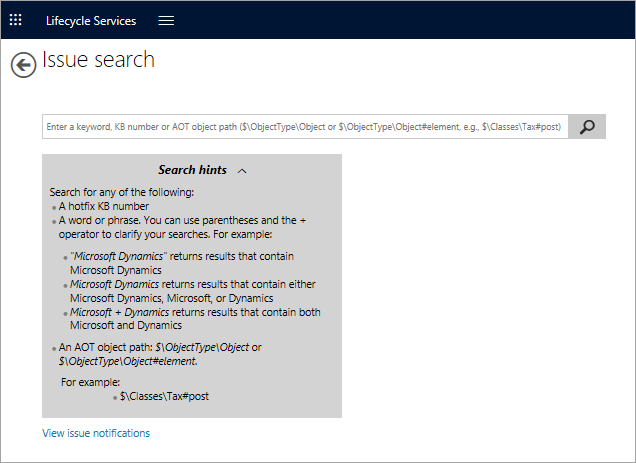
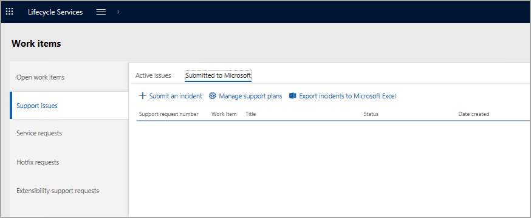

يساعدك البحث عن المشكلات في العثور على الحلول والحلول البديلة للمشكلات المعروفة في تطبيقات Finance and Operations. يمكنك استخدام البحث عن المشكلات للبحث عن مشكلات المنتج وتحديد ما إذا كان قد تم حل المشكلة أم أنها مازالت مفتوحة أم تم إيجاد حل بديل لها. 

يمكنك أيضاً إصدار بحث عن الميزات التنظيمية وتحديد ما إذا كانت الميزة متوفرة أو مخطط لها في إصدار مستقبلي. وأخيراً، يمكنك البحث عن المستندات التقنية والشهادات والتسجيلات التنظيمية لتطبيقات Finance and Operations.

للبحث عن مشاكل ضمن مشروع Lifecycle Services (LCS)، حدد الزر **قائمة** وحدد **البحث عن المشاكل**. سيؤدي ذلك إلى فتح صفحة **البحث عن المشاكل**.

## البحث عن المشاكل
عند إدخال معايير البحث، يمكنك إدخال كلمة أساسية أو مجموعة كلمات أساسية أو رقم قاعدة معارف Microsoft (KB). 

يمكنك أيضا استخدام علامة الدولار ($) للإشارة إلى مسار كائن شجره مكونات البرنامج (AOT) بهذا التنسيق: $\ObjectType\Object أو $\ObjectType\Object#element

ويتم أيضاً دعم ‏‫عوامل البحث القياسية مثل AND وOR.

ويمكن العثور على طلبات الدعم التي تم إدخالها لتطبيقات Finance and Operations في مشروع LCS، ويمكن إدارة هذه المشكلات من داخل Lifecycle Services. 

وعندما تتوفر قائمة مشكلات الدعم في النموذج، يمكن استكشاف تفاصيل المشكلة، ويمكن إرسال المشكلة إلى دعم Microsoft كتذكرة دعم إذا لزم الأمر ذلك. 

وسيسمح تحديد مشكلة الدعم بالوصول إلى Azure DevOps (المعروف أيضاً باسم Visual Studio Team Services أو VSTS) حيث يمكن تعيين التفاصيل الكاملة للمشكلة والبحث فيها.

 

تستخدم ميزة **الدعم** العديد من الأدوات لتمكين المستخدمين وفرق التنفيذ للتعاون بشأن المشكلات والحلول والاستجابات السريعة للإغلاق. وفي حالة توفر إصلاح عاجل بناءً على سياق البحث، يمكن للمستخدمين تنزيله.

إذا كانت المشكلة تتعلق بوظيفة المنتج الجاهز، ففي قائمة دعم LCS، يجب وضع علامة على المشكلة لإرسالها إلى Microsoft. يتعين تحديد خطة الدعم/اتفاقية مستوى الخدمة والعقد (على سبيل المثال، مميز مقابل غير مميز) في أثناء إرسال المشكلة.

يمكن إجراء أي تفاعل مع بيئة الإنتاج باستخدام مهندس خدمة Microsoft ويتعين تعقب أي اتصال مع مهندس خدمات Dynamics (DSE) وتنظيمه وإجراءه على نحو يكون مألوفاً للمستخدم. لذا، هناك حاجة لطلب خدمة بحيث يمكن للعميل والشركاء والمستشارين وفرق التنفيذ تقديم طلب لأي احتياجات خدمة في بيئة الإنتاج.

توفر أداة الدعم المعلومات التالية في علامات تبويب مختلفة:

- **إدارة الحوادث** - نافذة واحدة لعرض جميع حوادث الدعم التي تحدث مع Microsoft من مؤسستك عبر المشاريع. ويتم تصنيف هذه الحوادث على أنها رئيسية وغير رئيسية وتعتمد على اتفاقية الدعم الخاصة بك مع Microsoft.

- **عناصر العمل المفتوحة** - توفر قائمة بعناصر العمل المفتوحة حالياً.

    > [!NOTE]
    > بالنسبة لتطبيقات Finance and Operations يتم دعم أصناف العمل في LCS عبر Azure DevOps فقط. بعد تكوين تكامل Azure DevOps في مشروع LCS الخاص بك، ستحتاج إلى ربطه بمشروع Azure DevOps محدد. عند إنشاء عناصر العمل في مشروع Azure DevOps المرتبط، ستظهر أصناف العمل في مشروع LCS/عناصر العمل. يمكنك فتح أصناف العمل من LCS عن طريق تحديد ارتباط المعرف.

- **مشكلات الدعم** - يمكن لفريق المشروع أو مستخدمي الأعمال إرسال مشكلة من داخل تطبيقات Finance and Operations أو إنشاء مشكلة يدوياً في LCS. يمكن التحقق من المشكلات بواسطة فريق العميل أو الشريك ويمكن أيضاً رفعها إلى Microsoft.
تتوفر الخيارات التالية في علامة التبويب **مشكلات الدعم**.

    - **المشكلات النشطة** - في علامة التبويب هذه، يمكنك الإبلاغ عن المشكلات إما بصفتك مستخدم نهائي من عميل تطبيقات Finance and Operations أو كمطور في Azure DevOps.  يمكن رفع مشكلة نشطة إلى Microsoft، إذا لزم الأمر.

    
    - **تم الإرسال إلى Microsoft** - لا يلزم إنشاء مشكلة نشطة قبل رفعها إلى Microsoft. يمكن للمستخدمين الذين لديهم أذونات مناسبة في LCS إرسال مشكلة إلى Microsoft مباشرةً.

    

- **طلبات الخدمة** - تُرفع جميع طلبات الخدمة باستخدام مهندس خدمة Dynamics (DSE) لأي مشكلة تتعلق ببيئة الإنتاج.
- **طلبات دعم إمكانية التوسعة** - إذا اكتشفت تخصيصاً لا يمكن تنفيذه كامتداد، فيتعين عليك تسجيل طلب إلى Microsoft للتأكد من إضافة دعم الامتداد المناسب إلى المنتج للسيناريو الخاص بك.
- **طلبات الإصلاح العاجل** - عندما يواجه مستخدمو الأعمال مشكلة أثناء استخدام تطبيقات Finance and Operations، يمكنهم البحث لمعرفة ما إذا كانت Microsoft قد نشرت أي إصلاحات عاجلة تتعلق بنفس المشكلة. وفي هذه الحالة، يمكن لمستخدم الأعمال إرسال طلب للحصول على إصلاح عاجل، والذي سيكون متاحاً ضمن هذا القسم. يمكن لمسؤول النظام تعيين الطلب لفريق تكنولوجيا المعلومات للمزيد من التقييم.

## إرسال طلب دعم إلى Microsoft

لإرسال طلبات الدعم إلى Microsoft، اتبع الخطوات التالية:

1.  افتح حادثة جديدة. في Lifecycle Services، انتقل إلى المشروع الذي تريد تقديم حادث دعم له، ثم حدد الإطار المتجانب **الدعم**.
2.  في علامة التبويب **تم الإرسال إلى Microsoft**، حدد **إرسال حادثة**.
3.  حدد فئة مشكلة مثل Financial Application أو Commerce.
4.  حدد منطقة مشكلة، وهي الوحدة النمطية في تطبيقات Finance and Operations التي تحتوي على مشكلة تتعلق بوظيفة معينة. كلما زادت المعلومات التفصيلية التي يتم إرسالها إلى Microsoft، كان الحصول على الحل سريعاً.
5.  املأ أكبر قدر ممكن من التفاصيل في نافذة **وصف مشكلتك**. 
6.  أدخل معلومات الاتصال الأساسية. سوف يستخدم فريق دعم العملاء تفاصيل الاتصال هذه للاتصال بك بشأن الحالة.
7.  حدد عقد الدعم ومستوي الخطورة.
8.  حدد **إرسال**.

بعد تحديد **إرسال**، يتم إنشاء حادثة وإضافتها إلى قائمة **الحوادث**. ستتلقى بريداً إلكترونياً من مهندس دعم Microsoft المخصص لحالتك وسيتم تزويدك ببطاقة دعم.

عند إنشاء حادثة، سيعمل البحث عن المشكلات على إظهار أفضل 10 نتائج بحث عن "الحلول المحتملة للمشكلة" بناءً على اختيارك وإدخالك، وتحديث هذه النتائج ديناميكياً حيث يتم توفير مزيد من التفاصيل أثناء إنشاء حالة الدعم.

ويمكن أيضاً الوصول إلى البحث المستقل عن المشكلات من خلال القائمة المنسدلة إذا كنت بحاجة إلى البحث عن المزيد من الحلول.

