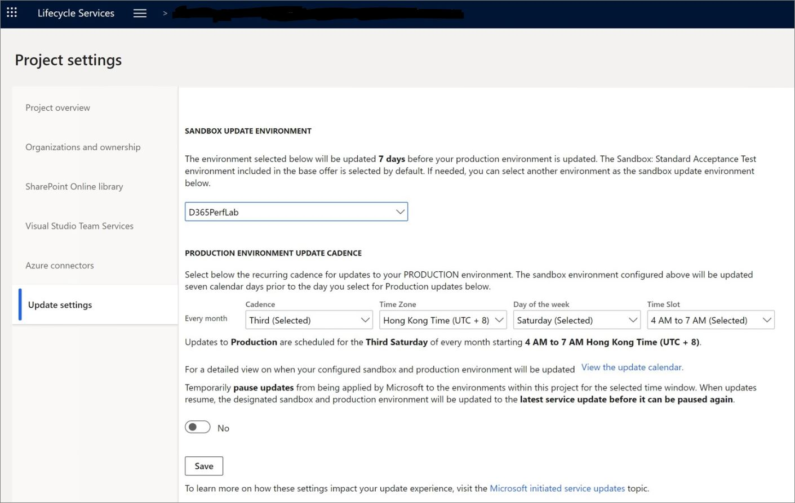

بدلاً من تطبيق تحديثات منفصلة لإصدار التطبيق وتحديث آخر لإصدار النظام الأساسي، سيتم تحديثهما في نفس الوقت لتحديثات عمليات النشر السحابية في Dynamics 365. تسمى هذه الميزة تحديث خدمة الإصدار الواحد. 

في LCS، يمكنك إدارة التحديثات المستمرة لمثيل تطبيقات Finance and Operations. يوجد [وتيره إصدار](https://docs.microsoft.com/dynamics365/fin-ops-core/fin-ops/get-started/public-preview-releases#release-cadence/?azure-portal=true) لهذه التحديثات يتم توفيرها بواسطة Microsoft. 

يمكن تطبيق التحديثات تلقائياً بواسطة Microsoft، أو تحديثها يدوياً بواسطة العميل، طالما أن الجدول يتوافق مع الإطار الزمني حيث تصدر Microsoft هذا الإصدار المحدد من [تحديث الخدمة](https://docs.microsoft.com/dynamics365/fin-ops-core/fin-ops/get-started/public-preview-releases/?azure-portal=true). 

يمكنك اختبار الميزات الجديدة مقدماً، باستخدام برنامج المعاينة للوصول المبكر (PEAP)، حيث يمكنك الحصول على آخر تحديث شهري متاح قبل حالة التثبيت مباشرة. يمكنك التسجيل في برنامج PEAP بالانضمام إلى برنامج Insider المتاح على [تجربة Dynamics 365](https://experience.dynamics.com/?azure-portal=true). بعد قبول طلبك، ستنضم إلى البرنامج وستتمكن من تمكين الميزات في الإصدار الأولي، قبل أن تصبح متاحة بشكل عام. 

يمكنك إدارة الميزات الجديدة من مساحة العمل **إدارة الميزات** في تطبيقات Finance and Operations. لمزيد من المعلومات حول كيفية استخدام مساحة عمل **إدارة الميزات**، راجع [نظرة عامة على إدارة الميزات](https://docs.microsoft.com/dynamics365/fin-ops-core/fin-ops/get-started/feature-management/feature-management-overview/?azure-portal=true).

## إعدادات التحديث المستمر
يمكن للعملاء تحديد نافذة الصيانة، بناءً على قيود أعمالهم. في LCS، استخدم الحقول الموجودة في قسم **وتيرة تحديث بيئة الإنتاج** في علامة التبويب **إعدادات التحديث** في صفحة **إعدادات المشروع**، كما هو موضح في الصورة التالية. يتوفر تقويم للتحديثات القادمة لمساعدتك في التخطيط. 

ويمكن للعملاء إيقاف التحديث مؤقتاً أو تأخيره أو إلغاء الاشتراك فيه باستخدام **إعدادات التحديث** في مشاريع LCS، لما يصل إلى ثلاثة تحديثات متتالية. 

وسيتلقون إعلامات بالتحديثات القادمة في LCS، قبل خمسة أيام، وفقاً لإعداداتهم. وإذا أرادوا التحديث يدوياً، فعليهم الانتقال إلى **تفاصيل البيئة**، ثم في القائمة **صيانة**، حدد **تطبيق التحديثات**. 

يمكن للعملاء التحقق من صحة التحديثات في بيئة الاختبار المعزولة، قبل تحديث الإنتاج، باستخدام [Regression Suite Automation Tool (RSAT)](https://docs.microsoft.com/dynamics365/fin-ops-core/dev-itpro/perf-test/rsat/rsat-overview/?azure-portal=true)، حيث يمكنك إنشاء حالات اختبار متعددة وتشغيلها تلقائياً للتحقق من تطبيق التحديثات بنجاح. 

لمزيد من المعلومات، راجع [نظرة عامة على تحديثات خدمة الإصدار الواحد](https://docs.microsoft.com/dynamics365/fin-ops-core/dev-itpro/lifecycle-services/oneversion-overview?toc=/dynamics365/commerce/toc.json/?azure-portal=true). 
