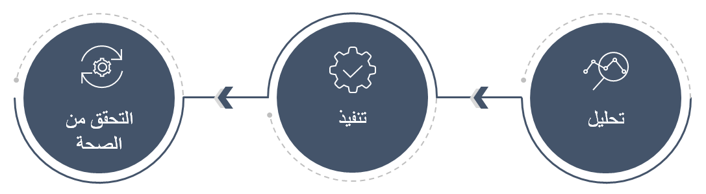

عند الترقية من Microsoft DynamicsAX2012 إلى تطبيقات Finance and Operations، تسمح لك تجربة الترقية بنقل الكود المخصّص، بما في ذلك البيانات. يتم دعم كل من Dynamics AX2012 R2 وR3 في تجربة الترقية. 

وتنقسم رحلة الترقية إلى ثلاث مراحل. 

 
- **التحليل** - خلال هذه المرحلة، يتم تقييم الترقية والتكاليف التقديرية وإنشاء خطة الترقية. والهدف من هذه المرحلة هو إنشاء خطة مشروع. 
- **التنفيذ** - يجب أن تتبع هذه المرحلة خطة المشروع التي تم إعدادها في مرحلة التحليل. 
- **التحقق من الصحة** - عند تشغيل مهام الترقية، ستنفّذ اختبار المستخدم، والاختبار المرحلي، ثم تنتقل إلى وضع العرض المباشر. 

