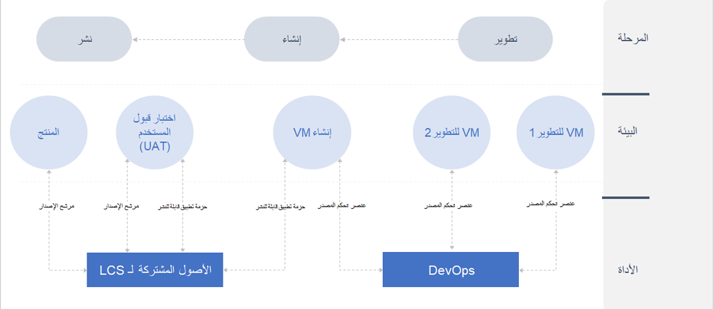
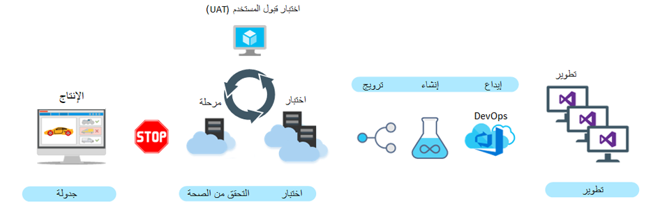

إدارة دورة حياة التطبيقات (ALM) هي إدارة برامج الكمبيوتر، والتي تشمل إدارة المتطلبات وهندسة البرامج وتطوير البرامج وصيانة البرامج وإدارة التغيير والتكامل المستمر وإدارة المشاريع والإدارة التي تم إصدارها.

يجب استخدام ALM للمساعدة في تبسيط عملية التطوير الخاصة بك. يسمح ALM بتحكم وتعاون أفضل، ويساعد في الحفاظ على اتساق نهجك ويبسط النشر. 

في Dynamics AX 2012، يعد ALM اختيارياً، جنباً إلى جنب مع التحكم في الإصدار والبنيات التلقائية. ويعتبر نشر Dynamics AX 2012 أيضاً يدوياً. وعلى العكس من ذلك، فإن ALM والتحكم في الإصدار والبنيات التلقائية إلزامية في تطبيقات التمويل والعمليات ويتم النشر تلقائياً باستخدام Lifecycle Services.

تدرس الأقسام التالية عن كثب كلاً من أدوات ALM الإلزامية هذه الآن. 

تختلف إدارة دورة حياة التطبيق عن Dynamics AX 2012 لأن المطورين الآن في مربع المطورين المخصص لهم ويستخدمون التحكم بالمصادر. 

ينطوي ALM على ثلاث مراحل: **تطوير** و **إنشاء** و **نشر**. 

في إطار مرحلة **تطوير**، سيعمل المطورون داخل بيئة المطور المعزولة الخاصة بهم باستخدام التحكم بالمصادر المُشغّل بواسطة Microsoft Azure DevOps لإدارة تعيين إصدار الكود. عندما يكون الكود جاهزاً، يمكنك نقل الكود إلى مرحلة الإنشاء. عند اكتمال الإنشاء وحل الأخطاء (حسب الحاجة)، يمكنك إنشاء **حزمة قابلة للنشر للتطبيق** ثم نشر الكود الخاص بك إلى اختبار قبول المستخدم (UAT) ضمن Lifecycle Services. عندما يتم اختبار الكود، يمكنك وضع علامة على الحزمة كمرشح إصدار للانتقال إلى الإنتاج. 

> [!NOTE]
> تتم إدارة بيئة التشغيل بالكامل بواسطة Microsoft. لذلك، بالنسبة لعمليات نشر خدمة تأجير البنية التحتية (IaaS)، فأنت بحاجة إلى إنشاء [طلب خدمة](/dynamics365/fin-ops-core/dev-itpro/lifecycle-services/submit-request-dynamics-service-engineering-team/?azure-portal=true) لكي تنقل Microsoft الكود إلى الإنتاج. 

> بالنسبة لعمليات نشر الخدمة الذاتية، فإنها عبارة عن [نشر مباشر](/dynamics365/fin-ops-core/dev-itpro/deployment/updateenvironment-newinfrastructure/?azure-portal=true) بدون تدخل Microsoft. 
 
للحصول على مزيد من المعلومات، راجع [تنفيذ إدارة دورة حياة التطبيق في تطبيقات التمويل والعمليات](/training/modules/application-lifecycle-finance-operations/?azure-portal=true).  
 

## Azure DevOps
لتطوي تطبيقات التمويل والعمليات، يكون التحكم بالمصادر إلزامياً لأن المطورين في مربع المطورين الخاص بهم. لذلك، من المهم أن تتم مشاركة الكود عبر مثيلات المطور وأن يتمكن المطورون دائماً من الحصول على أحدث كود. أيضاً، التحكم بالمصادر هو ما يسمح لك بإجراء التفرع والدمج للكود الخاص بك. ستقوم بتنفيذ أنشطة تفريع ودمج لنقل الكود الخاص بك بين البيئات المختلفة. 

تأمل مثال العملية التالي: 

1.  قد يكون لديك العديد من المطورين الذين يستخدمون مربعات المطورين لكتابة الكود. 
2.  عند انتهاء المطورين، سيقومون بإجراء *الحصول على الأحدث* باستخدام التحكم بالمصادر، وبعد ذلك سيقومون بتنفيذ إنشاء وحل الأخطاء. 
3.  عندما يتم إنشاء الكود الخاص بهم بنجاح، سيقوم المطورون بإجراء إيداع. 
4.  بعد إيداع الكود بالكامل، سيتم دمج الكود، وبعد ذلك سيتم إنشاؤه. 
5.  عند اكتمال الإنشاء، سيتم ترقية الكود إلى بيئة اختبار، حيث يمكنك إجراء اختبار النظام في بيئة UAT. 

    > [!NOTE]
    > يتم نقل الكود عبر حزمة قابلة للنشر يتم إنشاؤها بعد اكتمال الإنشاء. سيتم تطبيق الحزمة من خلال Lifecycle Services. 
6.  قد تكون لديك بيئة UAT يمكنك ترقية أو نشر الكود لها لإجراء مزيد من الاختبارات. 
7.  عندما يكون الكود جاهزاً، فستقوم بإنشاء طلب خدمة مع Microsoft بحيث يمكن نقل الكود إلى الإنتاج.

 
لمزيد من المعلومات، راجع [عمليات التحكم بالمصادر](/training/modules/explore-technical-architecture-finance-operations/4-source-control/?azure-portal=true).
