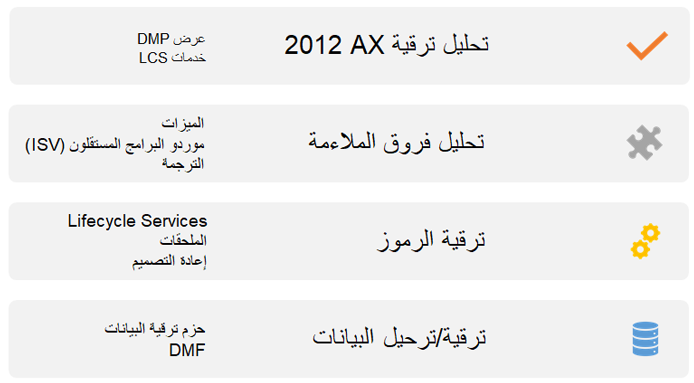

يُعد فهم عملية الترقية وأفضل الممارسات بشكل كامل قبل البدء في رحلة ترقية Dynamics AX ‏2012‎‏ إلى تطبيقات Finance and Operations أمراً مهماً لنجاح المشروع. 

وتتكون عملية الترقية من أربع مراحل: 

- تحليل عمليات الترقية Dynamics AX ‏2012
- ‏‫تحليل الفروق والملاءمة
- ترقية الكود
- ترقية/ترحيل البيانات

## تحليل عمليات الترقية Dynamics AX ‏2012
خلال مرحلة تحليل عمليات الترقية Dynamics AX‏ 2012، يجب أن تستخدم برنامج الترحيل Dynamics 365 المجاني من أجل التشغيل السريع لرحلتك من خلال عملية ما قبل المبيعات. ويمكنك استخدام Lifecycle Services لتشغيل تحليل الكود والبيانات بحيث يمكنك فهم مستوى الجهد المبذول لترحيل/ترقية البيانات والكود بشكل أفضل. 

## ‏‫تحليل الفروق والملاءمة
عندما يكون لديك فهم أفضل لاحتياجاتك ومستوى الجهد لترقية Dynamics 365، يمكنك إجراء تحليل الفروق والملاءمة. وخلال هذه المرحلة، ستضمن أنك تستخدم أحدث الميزات وستقوم بكشف الفروق التي ربما كانت لديك في الماضي ولكن يمكنك حلها باستخدام الميزات الجاهزة مع الحل الجديد.

أفضل الممارسات لتحليل الفروق والملاءمة:

- تحديد سيناريوهات الأعمال التي قمت بتخصيصها في Dynamics AX ‏2012 الذي أصبح الآن جزءاً من منتج Dynamics 365 الأساسي، ثم استخدامها في الميزة الأساسية. 
- تقييم تطبيقات Dynamics 365 المناسبة الأخرى، مثل مبيعات Microsoft Dynamics ‏365 أو Dynamics 365 Field Service، ثم الاستفادة من التطبيقات المتكاملة. للحصول على مزيد من المعلومات، راجع [القواعد الأساسية Microsoft Dynamics ‏365](/learn/paths/dynamics-365-fundamentals/?azure-portal=true). 
- تقييم الميزات المهملة. سيتم إهمال بعض الميزات. وتجب عليك مراجعة هذه التغييرات واقتراح حلول بديلة، والتي قد تكون عمليات تكامل أو حلولاً خارج تطبيقات Finance and Operations. للحصول على قائمة بالميزات المهملة، راجع [الميزات التي تمت إزالتها أو إهمالها](/dynamics365/fin-ops-core/dev-itpro/get-started/removed-deprecated-features-platform-updates/?azure-portal=true).
- وضع إعادة تصميم عمليات التكامل باستخدام تقنية المجموعة في الحسبان. 
- مراعاة تحديث المعلومات المهنية وإعداد تقارير عنها. 
- تقييم حلول ISV الخاصة بك وتحديد ما إذا كان من الممكن استبدال الحل بالوظائف الجاهزة، ثم التحقق من ميزات ISV المهملة. 

## ترقية الكود
بعد إجراء تحليل الفروق والملاءمة وفهم النطاق الكامل للمشروع، ستبدأ أنشطة ترقية الكود. ويمكن أن تساعدك الخدمات الموجودة داخل Lifecycle Services خلال أنشطة ترقية الكود. وستساعدك Lifecycle Services على نقل مخزن النماذج الخاص بك من Dynamics AX ‏2012 إلى إصدار متوافق لـ Dynamics 365. بعد ذلك، ستحتاج إلى العمل على تحويل عمليات التخصيص لديك إلى الملحقات أو إعادة تصميم بعض الأكواد الخاصة بك. 

أفضل الممارسات لإدارة الكود الخاص بالترقية:

- تحديد عمليات التخصيص غير المستخدمة. 
- التأكد من تجميع مخزن نماذج Dynamics AX ‏2012 قبل التحميل إلى Lifecycle Services لاستخدام أداة ترقية الكود. كما يجب بدء الترقية باستخدام أساس كود التشغيل الخاص بك. 
- توحيد الكود الخاص بك بحيث يمكنك المضي قدماً باستخدام إستراتيجية أساس كود واحد، إذا كان لديك طرح عمومي. وتكون الترقية أكثر سهولة باستخدام أساس كود واحد. 
- تأكد من وجود حلول ISV متوافقة على الإصدار الأحدث. 
- التخطيط لتجميد الكود في أثناء الترقية. ونوصي بتجميد الكود الخاص بك. وإذا تعذر عليك تجميد الكود الثابت، فيوصى بالتجميد المحدود لكود اللمس فقط من أجل إصلاحات الأخطاء المهمة. 
- العمل على تحديث الحل الخاص بك. التعرف على الحلول الحديثة والتطبيقات الجديدة التي يمكنك استخدامها مع الحل الخاص بك.
- التخطيط لدمج كود دلتا الخاص بك، ومن المحتمل تغيير طريقة التطوير الخاصة بك وإجراء التغييرات على الإصدار الجديد يدوياً، إذا تابعت التطوير في AX أثناء الترقية. 
- مراعاة احتمالية تقسيم ترقية الكود، إذا كان لديك أساس كود كبير. ويمكنك إنجاز هذه المهمة بإحدى طريقتين: الترقية استناداً إلى نوع الكائن (النماذج والتقارير والفئات) أو الترقية استناداً إلى منطقة العمل حسب الأولوية (المالية والتصنيع وما إلى ذلك). 

أفضل الممارسات للملحقات:

- تجب عليك مراجعة ISV والملحقات المفقودة من المنتج الأساسي. 
- يمكنك إرسال طلب ملحق إلى Microsoft للحصول على الملحقات المفقودة من المنتج الأساسي. ويجب عليك إرسال هذا الطلب في أقرب وقت ممكن لأنك قد تواجه أوقات إنتاج طويلة.
- واحرص دائماً على رفع الملحقات في مشروع العميل، وليس مشروع الشريك. 

## ترقية/ترحيل البيانات
تُعد عملية ترقية/ترحيل البيانات المرحلة الأخيرة في عملية الترقية. وستحتاج إلى تحديد ما إذا كنت ستقدم قاعدة بياناتك بالكامل باستخدام تجربة ترقية البيانات أو الانتقال عبر تجربة الترحيل. فإذا كنت تستخدم ترقية البيانات، ستقدم Microsoft حزمة قابلة للتوزيع تقوم بتشغيل عملية الترقية. وإذا حددت الانتقال عبر ترحيل البيانات، فستستخدم إدارة البيانات التي تكون جاهزة مع الحل.  

أفضل الممارسات والتقديرات لترقية البيانات

- تجنُب الترقية من أجل متطلبات إعداد التقارير. فقد يكون لديك متطلبات إعداد التقارير لعدد محدد من الفترات المالية، والتي يمكن أن تظل مستوفاة باستخدام مستودع البيانات أو تقنيات إعداد التقارير. ويجب عليك عدم إعادة توجيه قاعدة البيانات بالكامل لهذا السبب فقط.
- تقييم جودة بياناتك وحجمها وإجراء تنظيف البيانات. 
- مراعاة إزالة بياناتك أو أرشفتها في المصدر. 
- مراعاة ترقية البيانات لوقت تكوين مرحلي أصغر وقابل للإدارة. 
- التخطيط للحصول على بيئة Dynamics AX ‏2012 واحدة لتمارين الترقية باستخدام بيانات التشغيل. 
- التخطيط لتشغيل تحليل عمليات ترقية البيانات في Dynamics AX ‏2012 بشكل مسبق. 

أفضل الممارسات والتقديرات لترحيل البيانات:

- باختيار ترحيل البيانات، تتمتع بمزيد من المرونة في عمليات الطرح المرحلي أو إعادة التصميم. كما يمكن أن يكون لديك وقت تكوين مرحلي أصغر. 
- ومن الأسهل تنفيذ التغييرات في العناصر الأساسية للبيانات الرئيسية. 

