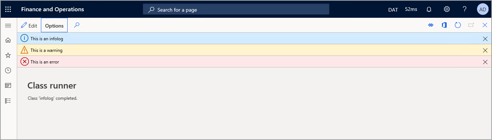

بينما تكون العبارات الشرطية رائعة لمعالجة تشغيل كتل الأكواد المختلفة، يتم استخدام معالجة الاستثناءات للتعامل مع الأخطاء.
يمكن استخدام العبارات مثل `throw`و `try...catch`و `finally`و `retry` لمعالجة الاستثناءات. الاستثناء هو طريقة للأكواد للابتعاد عن الأكواد القابلة للتشغيل عند حدوث خطأ. 

يمكن استخدام عبارة throw لإصدار استثناء أثناء الخطأ. يمكن لعبارة throw تحديد قيمة تعداد استثنائية، لكنها أفضل ممارسة لاستخدام أساليب الخطأ العامة أو المعلومات أو أساليب التحذير. يسمح لك هذا الأسلوب باستخدام تسمية لعرض المستخدم في سجل المعلومات، كما هو موضح في المثال التالي:
```xpp
throw error("This is an error.");
```
فيما يلي الشكل الذي تبدو عليه رسالة الخطأ والتحذير والمعلومات في واجهة المستخدم:



يمكن استدعاء الأساليب الثابتة في الفئة العمومية بدون البادئة `Global::` حتى يمكن أيضاً استدعاء الأسلوب `Global::error` كما هو موضح في المثال التالي:
```xpp
error("This is an error.");
```
يمكنك أيضاً استخدام عبارة `try...catch` لمعالجة بعض الأكواد في كتلة try، ثم استخدم كتلة catch لمعالجة الاستثناء إذا وقع. في المثال التالي، تعمل الكتلة `try` على تشغيل بعض الأكواد. في حالة حدوث استثناء رقمي، تصدر كتلة `catch` الأولى رسالة معلومات لعرضها: "تم العثور على رقم". تعالج الكتلة الثانية `catch` أية أخطاء أخرى قد يتم العثور عليها. يجب عليك فقط التقاط الاستثناءات التي تعرف أن الأكواد الخاصة بك داخل الكتلة `try` ستطرحها. يجب أن ترتفع كافة الاستثناءات الأخرى إلى إطار المكدس التالي.
```xpp
try
{
    //Run some code that might throw a numeric or other type of exception.
}
catch (Exception::Numeric)
{
    info('Found a Numeric exception.');
}
catch
{
    info('Caught an exception');
    retry;
}
finally
{
        // Executed no matter how the try block exits.
}
```
يمكن كتابة `retry` في كتلة catch للانتقال مرة أخرى إلى أول سطر من الكود ضمن كتلة try. يمكن استخدام هذا إذا كان من الممكن إصلاح المشكلة أثناء التطبيق عن طريق الكود في كتلة catch. بعد ذلك، سيتم تشغيل كتلة try مرة أخرى لإعطاءها فرصة ثانية لنجاح العملية. تأكد من أن إعادة المحاولة لا تتسبب في تكرار لا نهائي. يمكن إضافة عبارة `finally` إلى عبارة `try...catch`. يتم تشغيل العبارات في عبارة `finally` عندما يترك تنفيذ الكود الكتلة `try`. سيتم تنفيذ العبارات في الكتلة `finally` بغض النظر عن الطريقة التي يتم بها إنهاء الكتلة `try`.

إذا لم تتم معالجة الاستثناء، فسيتم تفكيك استدعاء الأسلوب الحالي وستتم معالجة الاستثناء أو عدم معالجته، في نطاق المستدعي.

## <a name="user-messages"></a>رسائل المستخدم

باستخدام واجهة API **للرسالة**، يمكنك الحصول على مزيد من التحكم في دورة حياة الرسالة، ويمكنك بشكل صريح إضافة الرسائل وإزالتها. يمكن استخدام هذا إذا كنت بحاجة إلى إزالة رسائل التحقق من الصحة في أوقات غير متقاطعة الحد، أو لعرض رسالة معلومات حول جانب معين من خبرة المستخدم التي ترتبط مباشرة بالتحقق من صحة البيانات. 

هيا نلقي النظر على مثال:

```xpp
messageId = Message::Add(MessageSeverity::Informational, "The customer is marked as inactive");
```

في هذا المثال، يمكن إلغاء تحديد الرسالة عند ظهور سجل جديد في الصفحة. 

بالإضافة إلى استخدام واجهة API **للرسالة()**، يمكنك استخدام الأسلوب `Message::AddAction()` بحيث يمكنك تضمين إجراء داخل رسالة سيتم إرسالها إلى شريط الرسائل. يدعم هذا الأسلوب إضافة إجراء مفرد مقترن بعرض أو عنصر قائمة إجراء، والذي يمكن تصوره كزر **ارتباط**. 

في المثال التالي، يتم تشغيل رسالة لمسؤول النظام لإعلامه بعدم تشغيل وظيفة المجموعة ثم يتم كشف إجراء للانتقال مباشرة إلى الصفحة **وظائف المجموعة**. 

```xpp
MenuItemMessageAction actionData = new MenuItemMessageAction();

actionData.MenuItemName("BatchJob");

str jsonData = FormJsonSerializer::serializeClass(actionData);

int64 messageId = Message::AddAction(MessageSeverity::Informational, "The Test batch job is not currently running", "Go to Batch jobs", MessageActionType::DisplayMenuItem, jsonData);
```

وفيما يلي الناتج:


## <a name="exceptions-inside-transactions"></a>استثناءات داخل الحركات 

في حالة طرح استثناء داخل إحدى الحركات، فسيتم إيقاف الحركة تلقائياً (تحدث العملية `ttsAbort`). ينطبق هذا على الاستثناءات التي يتم طرحها يدوياً والاستثناءات التي يتم طرحها بواسطة النظام.

عند طرح استثناء داخل كتلة transaction `ttsBegin - ttsCommit`، فلا يمكن لعبارة catch داخل كتلة transaction معالجة الاستثناء. بدلاً من ذلك، تعتبر عبارات catch الأعمق التي تقع خارج كتلة transaction هي أول عبارات catch التي سيتم اختبارها.


