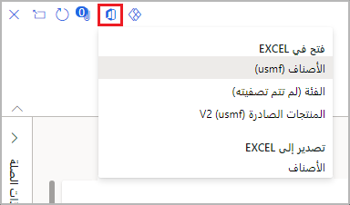
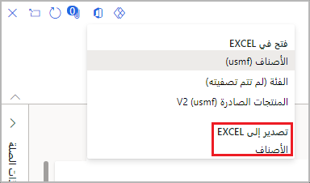
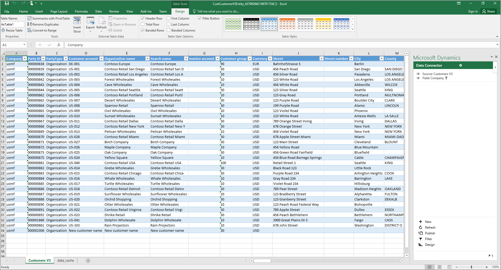

يمكنك استخدام تكامل Microsoft Office في تطبيقات المالية والعمليات لتصدير البيانات إلى Excel. بعد التعديل، إذا لزم الأمر، ستتمكن من إعادة نشره، ثم إنشاء مصنف Excel كقالب باستخدام مصمم المصنف.

توفر لك إمكانات تكامل  Microsoft Office بيئة إنتاجية تساعدك في إنجاز المهمة باستخدام منتجات Office.

تم العثور على خيارات **التصدير إلى Excel** والتجارب في قائمة **فتح في Microsoft Office**.

- تُعد خيارات **التصدير إلى Excel** عمليات تصدير ثابتة لبيانات الشبكة. يتوافق كل خيار مع شبكة مرئية. يتم وضع جميع بيانات الشبكة لعامل التصفية الحالي في مصنف.
- تستخدم تجارب **فتح في Excel** وظيفة Excel الإضافية لتسهيل التحديث والنشر.

 

## تصدير ثابت إلى Excel 

يوفر التصدير الثابت إلى Excel آلية سريعة لإحضار البيانات إلى شبكات على الصفحة. الآلية القياسية لتشغيل التصدير إلى Excel هي قائمة **فتح في Microsoft Office**. يتوفر أيضاً تصدير ثابت إلى Excel عبر قائمة مختصرة على الشبكة.

## خيار فتح في Excel الذي تم إنشاؤه 

تتم إضافة خيارات **فتح في Excel** التي تم إنشاؤها إلى الصفحات تلقائياً عندما يعثر النظام على كيانات البيانات التي لها نفس مصدر البيانات الجذر مثل الصفحة. سيحتوي المصنف الذي تم إنشاؤه على مصدر بيانات جدول واحد حيث يتم تحميل البيانات من هذا الكيان.
 
تم إدراج تجارب **فتح في Excel** في قائمة **فتح في Microsoft Office**. عندما يكون للكيان نفس مصدر البيانات الجذر كصفحة، تتم إضافته كخيار في قسم **فتح في Excel** في قائمة **فتح في Microsoft Office**. يشار إلى هذا كخيار تم إنشاؤه.

يتمتع تطبيق Excel بخبرة تصميم تتيح للمستخدمين إضافة الروابط وتحريرها إلى مصادر بيانات الكيانات والتسميات.

## فتح في Excel Online 

تم إنشاء تطبيق Excel باستخدام إطار عمل Apps for Office. يوفر إطار العمل هذا واجهة برمجة تطبيقات (API) الويب (API) المستندة إلى JavaScript والتي تمكن التطبيقات من الاتصال بتطبيقات Office. 

وتتمثل أكبر ميزة لهذا الإطار في أنه يمكن تشغيل التطبيقات في مثيلات Excel المحلية (Win32) وExcel Online (‏Microsoft 365) وExcel على Apple iPad. 

لتسهيل إدخال البيانات، يوفر تطبيق Excel عمليات البحث والمساعدة في البيانات. توفر حقول التاريخ منتقي التاريخ، وتوفر حقول التعداد (التعداد) قائمة تعداد، وتوفر العلاقات بحثاً عن العلاقة.

## فتح قالب في Excel 

تشبه خيارات القالب خيارات **فتح في Excel** التي تم إنشاؤها. تتم إضافتها تلقائياً إلى الصفحات عندما يعثر النظام على قوالب لها نفس مصدر البيانات الأول مثل مصدر البيانات الجذر في الصفحة. ويتم تخزين هذه القوالب في صفحة **قوالب المستندات**.

## وظيفة Excel Data Connector الإضافية 

يمكن لبرنامج Excel تغيير البيانات وتحليلها بسرعة. يتفاعل تطبيق Excel Data Connector مع مصنفات Excel وخدمات OData التي تم إنشاؤها لكيانات البيانات المكشوفة بشكل عام. تمكّن وظيفة Excel Data Connector الإضافية Excel من أن يصبح جزءاً سلساً من تجربة المستخدم. 

تم إنشاء وظيفة Excel Data Connector الإضافية باستخدام إطار عمل وظائف Office Web الإضافية. يتم تشغيل الوظيفة الإضافية في جزء المهام. وظائف Office Web الإضافية هي تطبيقات ويب يتم تشغيلها داخل نافذة مستعرض إنترنت مضمنة. يقع تطبيق Excel Data Connector في جزء مهام على الجانب الأيمن من المصنف. تستخدم الوظيفة الإضافية OAuth لتسهيل المصادقة.

تتوفر الميزات التالية في الوظيفة الإضافية للموصل:

- **العنوان الأساسي للوظيفة الإضافية** – عنوان الوظيفة الإضافية التي يتم توفيرها في إطار عمل وظائف Office Web الإضافية.
- **العنوان الثانوي للوظيفة الإضافية** – عنوان الوظيفة الإضافية التي توفرها الوظيفة الإضافية.
- **اسم المصدر** – تسمية الكيان الذي يوفر البيانات لجدول البيانات المحدد. يمكنك التمرير فوق التسمية لعرض الاسم المقابل.
- **اسم الحقل** – تسمية الحقل الذي يوفر بيانات لعمود جدول البيانات المحدد. يمكنك التمرير فوق التسمية لعرض الاسم المقابل والنوع.
- **زر التحديث** – قم بتحديث البيانات في المصنف.
- **زر النشر** – نشر تغييرات البيانات في المصنف.
- **زر التصميم** – افتح تجربة وقت التصميم.
- **شريط الحالة** – يوفر شريط الحالة تنبيهات معلومات موجزة ومؤقتة. تظهر المعلومات التي تظهر في شريط الحالة أيضاً في مربع الحوار **الرسائل**.
- **زر الخيارات** – لفتح مربع الحوار **خيارات**.
- **زر الرسائل** – افتح مربع الحوار **الرسائل**، الذي يعرض رسائل المعلومات والتحذيرات والأخطاء التي يقدمها البرنامج للمستخدم. يظهر الرقم أحيانا بجوار زر **الرسائل** لتوفير عدد التحذيرات أو الأخطاء التي قد يكون المستخدم مهتماً بها.
- **جدول بيانات Excel الذي يحتوي على البيانات** – يمكن استخدام عناصر التحكم في التصفية والفرز في رؤوس الأعمدة في هذه البيانات. يجب إزالة عوامل التصفية قبل نشر تغييرات البيانات.
- **قائمة وظائف Office Web الإضافية** – يوفر زر **قائمة وظائف Office Web الإضافية** العديد من الارتباطات القياسية. يتم استخدام أهم الارتباطات لإعادة تحميل الوظيفة الإضافية. عند إعادة تحميل الوظيفة الإضافية، تقوم بتحديث كافة البيانات الخاصة بالمصنف المضمن في الجداول المرتبطة بالوظيفة الإضافية.
 
عند النقر فوق خلية جدول، سيتم عرض أي بحث أو قائمة منسدلة تعداد أو منتقي التاريخ المرتبط بهذه الخلية داخل الوظيفة الإضافية، أسفل معلومات المصدر والحقل. يتم وضع أي قيمة تحددها داخل الوظيفة الإضافية في خلية الجدول المحددة حالياً.

لإضافة سجل، ابدأ الكتابة في صف أسفل الجدول مباشرةً، أو استخدم مفتاح **Tab** للابتعاد عن الخلية الأخيرة في الصف الأخير في الجدول. 

لحذف سجل، حدد الصف عن طريق تحديد تسمية الصف (1، و2، و3، وهكذا)، واحذف جميع الخلايا في هذا الصف.
 
لنشر التغييرات، حدد **نشر**. يعرض مربع الحوار **الرسائل** عدد السجلات التي تمت إضافتها وتحريرها وحذفها.
 

 
شاهد عرضًا توضيحيًا لوظيفة إضافية لموصل بيانات Excel في ملف الفيديو.

> [!VIDEO https://www.microsoft.com/videoplayer/embed/RWRoIf]
