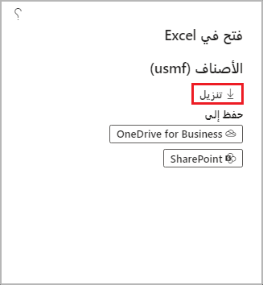

يمكنك استخدام تكامل Microsoft Office في تطبيقات Finance and Operations لتصدير البيانات إلى Excel.You can use Microsoft Office integration in Finance and Operations apps to export data into Excel. بعد التعديل، إذا لزم الأمر، ستتمكن من إعادة توزيعه، ثم إنشاء مصنف Excel كقالب باستخدام مصمم المصنف.After modification, if necessary, you will be able to publish it back, and then create an Excel workbook as a template by using the Workbook designer.

توفر لك إمكانات تكامل  Microsoft Office بيئة إنتاجية تساعدك في إنجاز المهمة باستخدام منتجات Office.Microsoft Office integration capabilities provide you with a productive environment that helps you get the job done by using Office products.

تم العثور على خيارات **التصدير إلى Excel** والتجارب في قائمة **فتح في Microsoft Office**.The **Export to Excel** options and experiences are found in the **Open in Microsoft Office** menu.

- تُعد خيارات **التصدير إلى Excel** عمليات تصدير ثابتة لبيانات الشبكة.The **Export to Excel** options are static exports of grid data. يتوافق كل خيار مع شبكة مرئية.Each one corresponds to a visible grid. يتم وضع جميع بيانات الشبكة لعامل التصفية الحالي في مصنف.All grid data for the current filter is placed into a workbook.
- تستخدم تجارب **فتح في Excel** وظيفة Excel الإضافية لتسهيل التحديث والنشر.The **Open in Excel** experiences use the Excel add-in to facilitate refresh and publish.

 

## تصدير ثابت إلى ExcelStatic Export to Excel 

يوفر التصدير الثابت إلى Excel آلية سريعة لإحضار البيانات إلى شبكات على الصفحة.Static Export to Excel provides a quick mechanism for getting data into grids on a page. الآلية القياسية لتشغيل التصدير إلى Excel هي قائمة **فتح في Microsoft Office**.The standard mechanism for triggering Export to Excel is the **Open in Microsoft Office** menu. يتوفر أيضاً تصدير ثابت إلى Excel عبر قائمة مختصرة على الشبكة.Static Export to Excel is also available via a shortcut menu on the grid.

## خيار فتح في Excel الذي تم إنشاؤهGenerated Open in Excel 

تتم إضافة خيارات **فتح في Excel** التي تم إنشاؤها إلى الصفحات تلقائياً عندما يعثر النظام على كيانات البيانات التي لها نفس مصدر البيانات الجذر مثل الصفحة.Generated **Open in Excel** options are automatically added to pages when the system finds data entities that have the same root data source as the page. سيحتوي المصنف الذي تم إنشاؤه على مصدر بيانات جدول واحد حيث يتم تحميل البيانات من هذا الكيان.The workbook that is generated will contain a single table data source where the data from that entity is loaded.
 
تم إدراج تجارب **فتح في Excel** في قائمة **فتح في Microsoft Office**.The **Open in Excel** experiences are listed on the **Open in Microsoft Office** menu. عندما يكون للكيان نفس مصدر البيانات الجذر كصفحة، تتم إضافته كخيار في قسم **فتح في Excel** في قائمة **فتح في Microsoft Office**.When an entity has the same root data source as a page, it's added as an option in the **Open in Excel** section of the **Open in Microsoft Office** menu. يشار إلى هذا كخيار تم إنشاؤه.This is referred to as a generated option.

يتمتع تطبيق Excel بخبرة تصميم تتيح للمستخدمين إضافة الروابط وتحريرها إلى مصادر بيانات الكيانات والتسميات.The Excel app has a design experience that lets users add and edit bindings to entity data sources and labels.

## فتح في Excel OnlineOpen in Excel Online 

تم إنشاء تطبيق Excel باستخدام إطار عمل Apps for Office.The Excel app is built by using the Apps for Office framework. يوفر إطار العمل هذا واجهة برمجة تطبيقات (API) الويب (API) المستندة إلى JavaScript والتي تمكن التطبيقات من الاتصال بتطبيقات Office.This framework provides a JavaScript-based web application programming interface (API) that enables apps to communicate with Office applications. 

أكبر ميزة لهذا الإطار هي أنه يمكن تشغيل التطبيقات في مثيلات Excel المحلية (Win32) وExcel Online (‏Microsoft 365) وExcel على Apple iPad.The biggest advantage of this framework is that apps can run in on-premises Excel instances (Win32), Excel Online (Microsoft 365), and Excel on the Apple iPad. 

لتسهيل إدخال البيانات، يوفر تطبيق Excel عمليات البحث والمساعدة في البيانات.To facilitate data entry, the Excel app provides lookups and data assistance. توفر حقول التاريخ منتقي التاريخ، وتوفر حقول التعداد (التعداد) قائمة تعداد، وتوفر العلاقات بحثاً عن العلاقة.Date fields provide a date picker, enumeration (enum) fields provide an enum list, and relationships provide a relationship lookup.

## فتح قالب في ExcelTemplate Open in Excel 

تشبه خيارات القالب خيارات **فتح في Excel** التي تم إنشاؤها.Template options resemble the generated **Open in Excel** options. تتم إضافتها تلقائياً إلى الصفحات عندما يعثر النظام على قوالب لها نفس مصدر البيانات الأول مثل مصدر البيانات الجذر في الصفحة.They are automatically added to pages when the system finds templates that have the same first data source as the root data source in the page. ويتم تخزين هذه القوالب في صفحة **قوالب المستندات**.These templates are stored in the **Document templates** page.

## وظيفة Excel Data Connector الإضافيةExcel Data Connector add-in 

يمكن لبرنامج Excel تغيير البيانات وتحليلها بسرعة.Excel can change and quickly analyze data. يتفاعل تطبيق Excel Data Connector مع مصنفات Excel وخدمات OData التي تم إنشاؤها لكيانات البيانات المكشوفة بشكل عام.The Excel Data Connector app interacts with Excel workbooks and OData services that are created for publicly exposed data entities. تمكّن وظيفة Excel Data Connector الإضافية Excel من أن يصبح جزءاً سلساً من تجربة المستخدم.The Excel Data Connector add-in enables Excel to become a seamless part of the user experience. 

تم إنشاء وظيفة Excel Data Connector الإضافية باستخدام إطار عمل وظائف Office Web الإضافية.The Excel Data Connector add-in is built by using the Office Web add-ins framework. يتم تشغيل الوظيفة الإضافية في جزء المهام.The add-in runs in a task pane. وظائف Office Web الإضافية هي تطبيقات ويب يتم تشغيلها داخل نافذة مستعرض إنترنت مضمنة.Office Web Add-ins are web applications that run inside an embedded internet browser window. يقع تطبيق Excel Data Connector في جزء مهام على الجانب الأيمن من المصنف.The Excel Data Connector app is located in a task pane on the right side of a workbook. تستخدم الوظيفة الإضافية OAuth لتسهيل المصادقة.The add-in uses OAuth to facilitate authentication.

تتوفر الميزات التالية في الوظيفة الإضافية للموصل:The following features are available in the connector add-in:

- **العنوان الأساسي للوظيفة الإضافية** – عنوان الوظيفة الإضافية التي يتم توفيرها في إطار عمل وظائف Office Web الإضافية.**Add-in primary title** – The title of the add-in that is provided to the Office Web Add-ins framework.
- **العنوان الثانوي للوظيفة الإضافية** – عنوان الوظيفة الإضافية التي توفرها الوظيفة الإضافية.**Add-in secondary title** – The title of the add-in that is provided by the add-in.
- **اسم المصدر** – تسمية الكيان الذي يوفر البيانات لجدول البيانات المحدد.**Source name** – The label of the entity that provides data for the selected data table. يمكنك التمرير فوق التسمية لعرض الاسم المقابل.You can hover over the label to view the corresponding name.
- **اسم الحقل** – تسمية الحقل الذي يوفر بيانات لعمود جدول البيانات المحدد.**Field name** – The label of the field that provides data for the selected data table column. يمكنك التمرير فوق التسمية لعرض الاسم المقابل والنوع.You can hover over the label to view the corresponding name and type.
- **زر التحديث** – قم بتحديث البيانات في المصنف.**Refresh button** – Refresh the data in the workbook.
- **زر النشر** – نشر تغييرات البيانات في المصنف.**Publish button** – Publish the data changes in the workbook.
- **زر التصميم** – افتح تجربة وقت التصميم.**Design button** – Open the design-time experience.
- **شريط الحالة** – يوفر شريط الحالة تنبيهات معلومات موجزة ومؤقتة.**Status bar** – The status bar provides brief, temporary information alerts. تظهر المعلومات التي تظهر في شريط الحالة أيضاً في مربع الحوار **الرسائل**.Information that appears in the status bar also appears in the **Messages** dialog box.
- **زر الخيارات** – لفتح مربع الحوار **خيارات**.**Options button** – Open the **Options** dialog box.
- **زر الرسائل** – افتح مربع الحوار **الرسائل**، الذي يعرض رسائل المعلومات والتحذيرات والأخطاء التي يقدمها البرنامج للمستخدم.**Messages button** – Open the **Messages** dialog box, which displays the information messages, warnings, and errors that the program provides to the user. يظهر الرقم أحيانا بجوار زر **الرسائل** لتوفير عدد التحذيرات أو الأخطاء التي قد يكون المستخدم مهتماً بها.A number sometimes appears next to the **Messages** button to provide a count of the warnings or errors that the user might be interested in.
- **جدول بيانات Excel الذي يحتوي على البيانات** – يمكن استخدام عناصر التحكم في التصفية والفرز في رؤوس الأعمدة في هذه البيانات.**Excel data table containing data** – The filter and sort controls in the column’s headers can be used on this data. يجب إزالة عوامل التصفية قبل نشر تغييرات البيانات.The filters must be removed before data changes are published.
- **قائمة وظائف Office Web الإضافية** – يوفر زر **قائمة وظائف Office Web الإضافية** العديد من الارتباطات القياسية.**Office Web Add-ins menu** – The **Office Web Add-ins menu** button provides several standard links. يتم استخدام أهم الارتباطات لإعادة تحميل الوظيفة الإضافية.The most important of the links is used to reload the add-in. عند إعادة تحميل الوظيفة الإضافية، تقوم بتحديث كافة البيانات الخاصة بالمصنف المضمن في الجداول المرتبطة بالوظيفة الإضافية.When the add-in is reloaded, it updates all the data for the workbook that is contained in tables that are associated with the add-in.
 
عند النقر فوق خلية جدول، سيتم عرض أي بحث أو قائمة منسدلة تعداد أو منتقي التاريخ المرتبط بهذه الخلية داخل الوظيفة الإضافية، أسفل معلومات المصدر والحقل.When you click in a table cell, any lookup, enumeration drop-down list, or date picker that is associated with that cell will be shown inside the add-in, underneath the source and field information. يتم وضع أي قيمة تحددها داخل الوظيفة الإضافية في خلية الجدول المحددة حالياً.Any value that you select inside the add-in is put into the currently selected table cell.

لإضافة سجل، ابدأ الكتابة في صف أسفل الجدول مباشرةً، أو استخدم مفتاح **Tab** للابتعاد عن الخلية الأخيرة في الصف الأخير في الجدول.To add a record, either start typing in a row directly below a table, or use the **Tab** key to tab away from the last cell of the last row in the table. 

لحذف سجل، حدد الصف عن طريق تحديد تسمية الصف (1، و2، و3، وهكذا)، واحذف جميع الخلايا في هذا الصف.To delete a record, select the row by selecting the row label (1, 2, 3, and so on), and delete all the cells in that row.
 
لنشر التغييرات، حدد **نشر**.To publish the changes, select **Publish**. يعرض مربع الحوار **الرسائل** عدد السجلات التي تمت إضافتها وتحريرها وحذفها.The **Messages** dialog box shows how many records were added, edited, and deleted.
 

 

