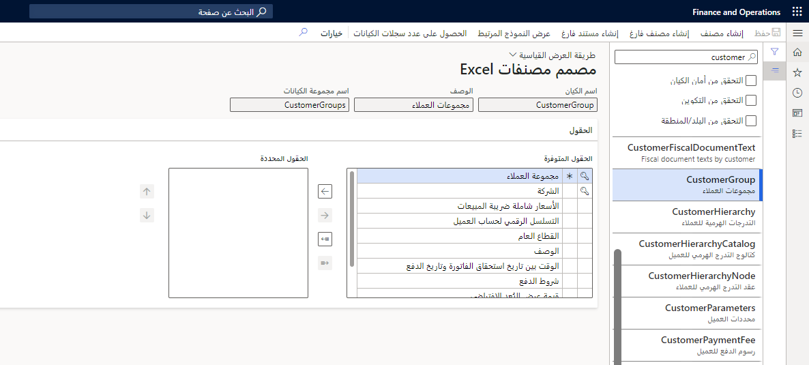
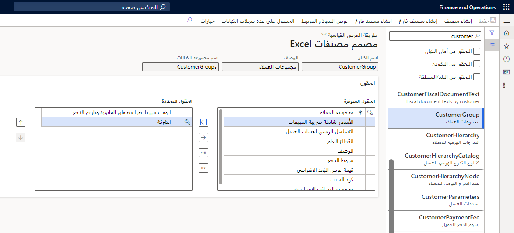
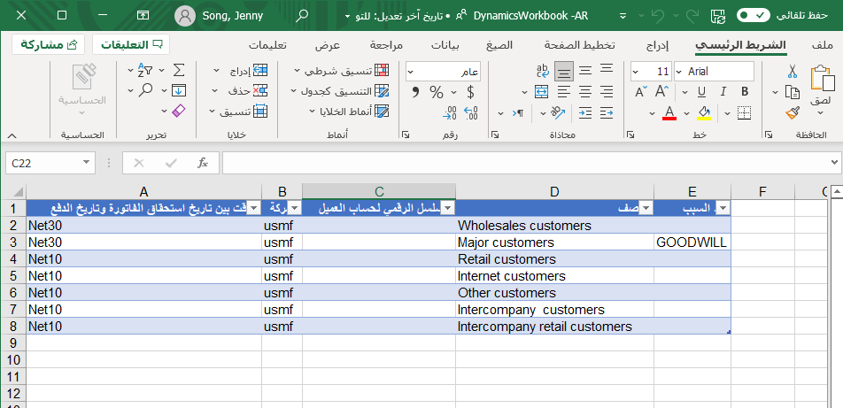

بالاضافه إلى استخدام الزر **تصميم** في وظيفة Excel الإضافية، يمكنك استخدام صفحة **مصمم مصنف Excel** لتصميم مصنف تصدير مخصص قابل للتحرير يحتوي على كيان ومجموعة من الحقول. لفتح صفحة **مصمم المصنف**، انتقل إلى **عام > عام >  تكامل Office > مصمم مصنف Excel**. 

يمكنك استخدام صفحة **مصمم مصنفات Excel** لتصميم مصنف تصدير مخصص قابل للتحرير يحتوي على كيان ومجموعة من الحقول. 

يمكن أن يحتوي قالب المصنف على مصادر بيانات متعددة. ويمكن أن يحتوي أيضاً على محتوي غير مقيد. تم إدراج تجارب **فتح في Excel** في قائمة **فتح في Microsoft Office**. توفر صفحة **مصمم مصنف Excel** طريقة سريعة للحصول على تجربة **فتح في Excel** تم إنشاؤها لكيان ما. كما يوفر آلية بمصنف فارغ يحتوي فقط على تطبيق Excel ومؤشر للخادم.

قبل أن تتمكن من نشر عمليات تحرير البيانات، يجب أن تكون جميع الحقول الرئيسية للكيان في جدول Excel. الحقول الرئيسية لها رمز مفتاح بجانبها. لإنشاء سجل أو تحديثه بنجاح، يجب أن يحتوي على جميع الحقول الإلزامية في جدول Excel. تحتوي الحقول الإلزامية على علامة النجمة (*) بجانبها.

لاسترداد المصنف الناتج، حدد **إنشاء مصنف** في شريط التطبيقات. حدد **عرض النموذج المرتبط** لعرض البيانات التي يعرضها الكيان. يتم تمكين هذا الزر فقط للكيانات التي تحتوي على قيمة **خاصية FormRef**.

الحقول الافتراضية التي ستتم إضافتها إلى المصنف هي الحقول الأساسية والإلزامية للكيان. إذا كان يجب توفير مجموعة مختلفة من الحقول افتراضياً، فيمكن عندئذٍ إضافة هذه الحقول إلى **مجموعة حقول التقارير التلقائية** في الكيان. 

عندما يتم تحديد علاقة بين كيانين، إذا تم عرض معرف كيان واحد على الكيان الآخر، فإن الحقول التي ستظهر في هذا البحث هي إما الحقول الرئيسية، أو الحقول الموجودة في **مجموعة حقول البحث التلقائي** إذا كانت فارغة. عمليات البحث عن العلاقات غير مدعومة حالياً، ولكن سيتم عرضها في النهاية في التطبيق بطريقة مشابهة لعمليات البحث عن التعداد. 
 

## إنشاء قالب باستخدام مصمم مصنف Excel
يوضح الإجراء التالي كيفية تصدير بيانات مجموعة العملاء.

1. في تطبيقات التمويل والعمليات، انتقل إلى **عام > عام > تكامل Office > مصمم مصنف Excel**.
2. عامل تصفية لـ **CustomerGroup** لتصدير معلومات مجموعة العملاء.
    
    > [!div class="mx-imgBorder"]
    > 

3. حدد السهم الأيمن لتحديد الحقول المطلوبة. انظر مثالاً في لقطة الشاشة التالية.
    
    > [!div class="mx-imgBorder"]
    > 

4. حدد **إنشاء مصنف** على شريط الأدوات بحيث يقوم تطبيق موصل بيانات Excel بإنشاء المصنف المطلوب.
5. حدد **تنزيل** وقم بحفظ الملف أو فتحه. يتم إنشاء المصنف باستخدام قائمة الحقول المطلوبة.

    > [!div class="mx-imgBorder"]
    > 
 
