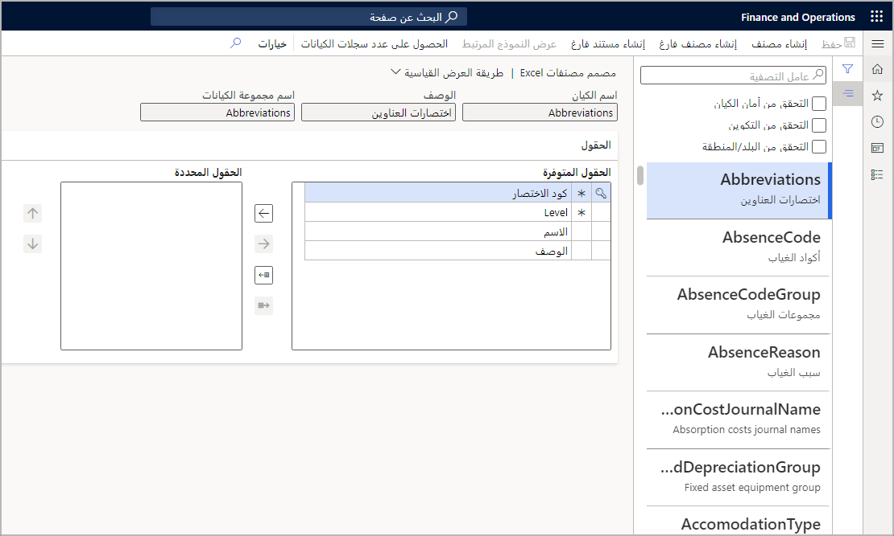

بالاضافه إلى استخدام الزر **تصميم** في وظيفة Excel الإضافية، يمكنك استخدام صفحة **مصمم مصنف Excel** لتصميم مصنف تصدير مخصص قابل للتحرير يحتوي على كيان ومجموعة من الحقول.In addition to using the **Design** button in the Excel add-in, you can use the **Excel workbook designer** page to design an editable custom export workbook that contains an entity and a set of fields. لفتح صفحة **مصمم المصنف**، انتقل إلى **عام > عام >  تكامل Office > مصمم مصنف Excel**.To open the **Workbook designer** page, go to **Common > Common > Office Integration > Excel workbook designer**. 

يمكن أن يحتوي قالب المصنف على مصادر بيانات متعددة.A workbook template can have multiple data sources. ويمكن أن يحتوي أيضاً على محتوي غير مقيد.It can also have unbound content. تم إدراج تجارب **فتح في Excel** في قائمة **فتح في Microsoft Office**.The **Open in Excel** experiences are listed on the **Open in Microsoft Office** menu. توفر صفحة **مصمم مصنف Excel** طريقة سريعة للحصول على تجربة **فتح في Excel** تم إنشاؤها لكيان ما.The **Excel workbook designer** page provides an easy way to get a generated **Open in Excel** experience for an entity. كما يوفر آلية بمصنف فارغ يحتوي فقط على تطبيق Excel ومؤشر للخادم.It also provides a mechanism with a blank workbook that contains just the Excel app and a pointer to the server.

قبل أن تتمكن من نشر عمليات تحرير البيانات، يجب أن تكون جميع الحقول الرئيسية للكيان في جدول Excel.Before you can publish data edits, all key fields of the entity must be in the Excel table. الحقول الرئيسية لها رمز مفتاح بجانبها.Key fields have a key symbol next to them. لإنشاء سجل أو تحديثه بنجاح، يجب أن يحتوي على جميع الحقول الإلزامية في جدول Excel.To successfully create or update a record, it must have all the mandatory fields in the Excel table. تحتوي الحقول الإلزامية على علامة النجمة (\*) بجانبها.Mandatory fields have an asterisk (\*) next to them.

لاسترداد المصنف الناتج، حدد **إنشاء مصنف** في شريط التطبيقات.To retrieve the resulting workbook, select **Create workbook** in the app bar. حدد **عرض النموذج المرتبط** لعرض البيانات التي يعرضها الكيان.Select **View related form** to see the data that the entity exposes. يتم تمكين هذا الزر فقط للكيانات التي تحتوي على قيمة **خاصية FormRef**.This button is only enabled for entities that have a **FormRef property** value.

الحقول الافتراضية التي ستتم إضافتها إلى المصنف هي الحقول الأساسية والإلزامية للكيان.The default fields that will be added into the workbook are the key and mandatory fields of the entity. إذا كان يجب توفير مجموعة مختلفة من الحقول افتراضياً، فيمكن عندئذٍ إضافة هذه الحقول إلى **مجموعة حقول التقارير التلقائية** في الكيان.If a different set of fields should be provided by default, then those fields can be added into the **AutoReport field group** on the entity. 

عندما يتم تحديد علاقة بين كيانين، إذا تم عرض معرف كيان واحد على الكيان الآخر، فإن الحقول التي ستظهر في هذا البحث هي إما الحقول الرئيسية، أو الحقول الموجودة في **مجموعة حقول البحث التلقائي** إذا كانت فارغة.When a relationship is defined between two entities, if the identifier for one entity is shown on the other entity, then the fields that will be shown in that lookup are either the key fields, or the fields in the **AutoLookup field group** if it is not empty. عمليات البحث عن العلاقات غير مدعومة حالياً، ولكن سيتم عرضها في النهاية في التطبيق بطريقة مشابهة لعمليات البحث عن التعداد.Relationship lookups are not currently supported, but they will eventually be displayed in the app in a similar way to the enumeration lookups. 
 

