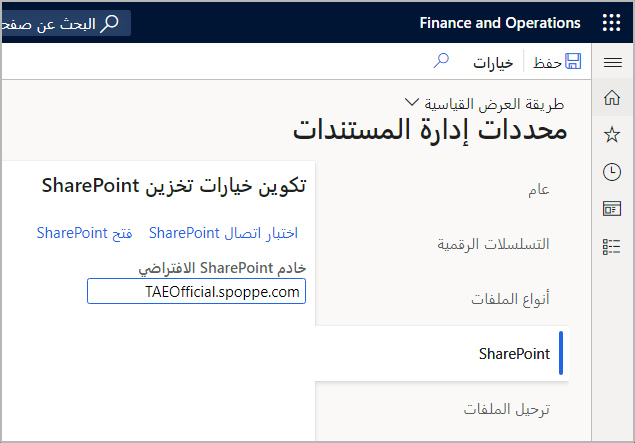

تدعم إدارة المستندات حفظ مرفقات السجلات في مخزن Azure Blob وفي SharePoint عبر الإنترنت. وحده تخزين قاعدة البيانات قديمة. تعادل مساحة تخزين Azure Blob التخزين في قاعدة البيانات لأنه لا يمكن الوصول إلى المستندات إلا من خلال التطبيق، كما أنها توفر فائدة إضافية تتمثل في توفير مساحة تخزين لا تؤثر سلباً على أداء قاعدة البيانات. 

التخزين الخاص بـ Azure Blob هو الافتراضي ويعمل على الفور. سيعمل تخزين SharePoint فوراً إذا كان لديك رخصة Microsoft 365 لأنه يقوم تلقائياً بالتعامل مع مستأجر SharePoint، كمستخدم على TenantA.onmicrosoft.com. يحصل مستأجر Microsoft 365/Azure AD على TenantA.sharepoint.com مثل موقع SharePoint. إذا تم إيقاف تشغيل إدارة المستندات بواسطة المستخدم، فقمّ بتشغيلها بتحديد **عام > الإعداد > خيارات المستخدم > التفضيلات > متنوعات** وإعداد **معالجة المستندات نشطة** إلى **نعم**. 

في أي صفحة تحتوي على بيانات، سيكون زر **إرفاق** متاحاً في الزاوية العلوية اليمنى. توفر صفة **المرفقات** طريقة عرض للمرفقات (المستندات) المرتبطة بالسجل الذي تم تحديده في الصفحة السابقة. يمكنك إضافة مرفقات جديدة إلى السجل عن طريق تحديد زر **جديد** (**+**) في شريط التطبيق. بالنسبة لأنواع مستندات **الملفات** و **الصور**، ستتم مطالبتك بتوفير الملف المقترن.

يتم توفير معاينة لأنواع الملفات المعتمدة في علامة التبويب السريعة **معاينة**. يتم دعم أنواع المستندات الأساسية، مثل صور PNG والملفات النصية، بشكل افتراضي. يجب أن تستخدم أنواع مستندات Office، مثل ملفات Microsoft Word، وExcel وPowerPoint، خادم Office Web Apps، والذي قد لا يكون متوفراً في تكوين OneBox.

تحتوي تجارب **فتح في Excel** المنشأة تلقائياً التي تم إنشاؤها للكيانات على ربط جدول واحد.

يمكن للمطور في فريقك المساعدة في تحقيق ما يلي باستخدام Visual Studio.

- يمكنك إيقاف آلية التصدير إلى Excel الثابتة لشبكة أو تغيير التسمية التي تظهر في قائمة **فتح في Microsoft Office**. 
- يتم تحديد قائمة الحقول التي تمت إضافتها إلى ربط الجدول هذا بواسطة مجموعة الحقول **تقرير تلقائي** في حالة احتواء ربط الجدول على حقول. وبخلاف ذلك، تتم إضافة الحقول الأساسية والإلزامية للكيان تلقائياً. يحدد ترتيب الحقول في مجموعة **تقرير تلقائي** ترتيب الحقول في ربط الجدول.
- يتم تحميل القوالب المسجلة كقوالب معرفة من قبل النظام عند التوزيع. يعتبر هذا السلوك مفيداً لموردي البرامج المستقلين (ISV) والشركاء الذين يرغبون في حزم القوالب مع عناصر نموذجية أخرى.

### معاينة المستندات

يمكنك تحديد وجهات إجراءات إدارة الطباعة المختلفة لمستندات الأعمال القابلة للتكوين. وهذا يعني أنه للمعاينة، يمكن استخدام السيناريو **معاينة/طباعة > أصلي**، وللبريد الإلكتروني والطباعة، يمكن استخدام **معاينة /طباعة > استخدام إدارة الطباعة**.

## القوالب
عند تعيين قالب مدرج في صفحة **عام > عام > دمج Office > قوالب المستندات** (DocuTemplate) تحتوي على **ShowInOpenInOfficeMenu** إلى **نعم** وكان له نفس مصدر البيانات الجذر (الجدول) مثل الصفحة الحالية، ستتم إضافته كخيار في قسم **فتح في Excel** من قائمة **فتح في Microsoft Office**. 

القالب عبارة عن مصطنع يجب الاحتفاظ به وإصداره.  

أنشئ قالباً إذا:
- أنت بحاجة إلى محتوى إضافي أو تنسيق في القالب.
- تريد دمج كيانات متعددة أو مصادر بيانات في نفس المصنف.

عند إنشاء قالب لكيان يحتوي على حقول خاصة ببلد أو منطقة، يجب ترك هذه الحقول الخاصة بالمنطقة خارج القالب. خلاف ذلك، سيرى جميع المستخدمين الحقول الخاصة بالبلد أو المنطقة. 

يجب أن تلبي القوالب احتياجات معظم المستخدمين بشكل افتراضي ويمكن للمستخدمين الخاصين بالمنطقة إضافة هذه الحقول باستخدام تجربة تصميم سهلة الاستخدام لوظيفة Excel الإضافية. يمكن إضافة الحقول والأعمدة الخاصة بالمنطقة بواسطة المستخدمين حسب الحاجة. يمكن حفظ هذا القالب إلى الكمبيوتر المحلي لإعادة استخدامه بواسطة مستخدم واحد أو تحميله عبر صفحة **قوالب المستندات** لإعادة استخدامه بواسطة أي مستخدم لهذا المثيل. وهناك اعتباران آخران:

- إذا كانت المنطقة بها كيان خاص ببلد أو منطقة معينة، فيمكن عندئذٍ إنشاء قالب خاص بالبلد أو المنطقة.
- إذا كانت المنطقة مهمة بدرجة كافية، فيمكنك تحديد قالب خاص بالبلد أو المنطقة وقالب عام لبلد أو منطقة.

## فحص مرفقات الملفات بحثاً عن التهديدات الضارة
عند العمل مع مرفقات الملفات، قد ترغب مؤسستك في فحص الملفات بحثاً عن أي تهديدات ضارة قبل تحميل المستند إلى Dynamics 365. توجد نقطة امتداد في التطبيق تُتيح لك دمج برنامج مسح الملفات الذي تختاره في عملية تحميل الملف. توجد أيضاً نقاط ملحق مماثلة متاحة لمسح المرفقات. 

تعرض فئة **FileUploadResultBase** تفويض **delegateScanStream()**. يتم تطبيق التفويض على أي تحميل ملف يتم فيه تخصيص فئة **استراتيجية التحميل**. إذا حدد برنامج المسح أن التحميل ضار، فستفشل عملية التحميل. 

