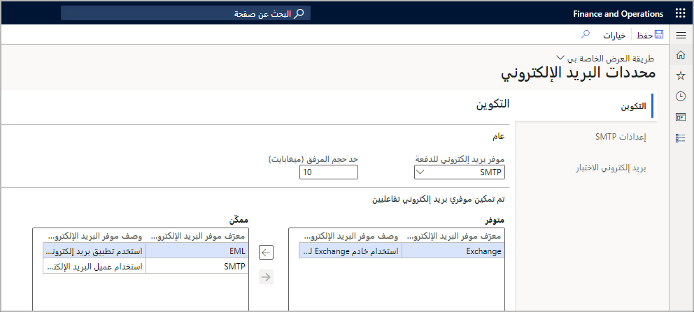
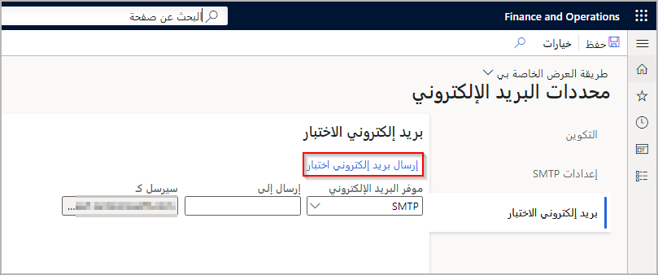
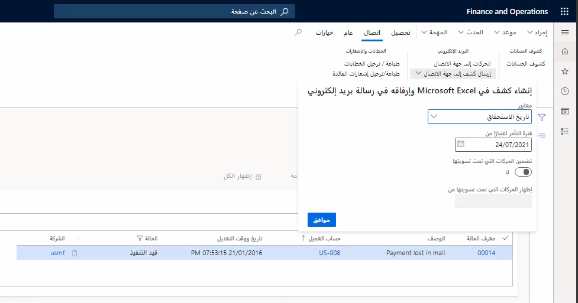

يتأثر سلوك النظام الفرعي للبريد الإلكتروني بمجموعة من تكوينات المسؤول وتكوين المستخدم وخيارات المستخدم.

وكمسؤول، في الصفحة **محددات البريد الإلكتروني**، لاحظ الإعدادات التالية على علامة التبويب **موفرو البريد الإلكتروني‏‎**.
 
 

يحدد **موفر بريد إلكتروني للدفعة** موفر البريد الإلكتروني الذي سيُستخدَم لإرسال رسائل البريد الإلكتروني التي يتم إرسالها بواسطة عمليات دُفعة أو بطريقة غير تفاعلية. سيستخدم موفر Exchange الحساب المرتبط بعملية الدُفعة.

لتحديد الحد الأقصى لحجم رسالة بريد إلكتروني واحدة يمكن إرسالها عن طريق النظام الفرعي للبريد الإلكتروني، قم بتعيين قيمة للحقل **حد حجم المرفق**.

في صفحة **محددات البريد الإلكتروني**، لاحظ الإعدادات التالية في علامة التبويب **إعدادات SMTP**. 
 

- في **خادم البريد الصادر**، يجب تحديد اسم المضيف لخادم **SMTP** المطلوب. بالنسبة لإنتاج Microsoft 365 (بما في ذلك حسابات *.onmicrosoft.com) استخدم **smtp.office365.com**. يمكنك العثور على هذا الإعداد على outlook.office.com في **إعدادات > بريد > POP** و **IMAP**. ولكن، بالنسبة إلى **Outlook/Hotmail**، استخدم **smtp-mail.outlook.com**

- في الحقل **رقم منفذ SMTP**، يجب تعيين رقم المنفذ إلى **587** للنقل الآمن. 
- حدد، حسب الحاجة، إرسال البريد الإلكتروني بواسطة حساب البريد المناسب من خلال تعيين بيانات اعتماد في الحقلين **اسم المستخدم** و **كلمة المرور**. وباعتبارك مسؤول Microsoft 365، قد تفرض عليك شركتك متطلبات للسماح لبعض المستخدمين بالوصول إلى صندوق بريد خاص بمستخدم آخر. 
    - على سبيل المثال، قد ترغب في تمكين مساعد لإرسال رسالة بريد إلكتروني أو قراءتها من صندوق البريد الخاص بالمدير، أو منح أحد المستخدمين لديك القدرة على إرسال رسالة بريد إلكتروني نيابة عن مستخدم آخر. ويحتاج جميع المستخدمين إلى تزويد حساب SMTP بالإذنين "إرسال كـ" و"إرسال نيابة عن" لإتاحة القدرة على إرسال بريد Simple Mail Transfer Protocol ‏(SMTP). يمكنك تكوين أذونات **إرسال كـ** في مركز تعليمات مسؤول Microsoft 365 ‏(portal.office.com/Admin) على **المستخدمون > المستخدمون النشطون > المستخدم > تحرير أذونات علبة البريد > إرسال بريد إلكتروني** من صندوق البريد هذا.

- يحدد الحقل **حدد إذا كان SSL مطلوباً** ما إذا كان النقل الآمن يُستخدَم أم لا. وعادة، يكون ذلك "نعم"، إلا في السيناريوهات الداخلية أو سيناريوهات استكشاف الأخطاء وإصلاحها.

يتم إرسال رسالة البريد الإلكتروني من الخادم مباشرة، بدون تدخل المستخدم، عبر **SMTP** بواسطة عملية **دُفعة موزع البريد الإلكتروني**. يجب بدء عملية الدُفعة لمعالجة قائمة انتظار البريد الإلكتروني. لبدء العملية، افتح جزء "دُفعة موزع البريد الإلكتروني" **إدارة النظام > مهام دورية > معالجة البريد الإلكتروني > الدُفعة** وقم بتشغيل معالجة الدُّفعة.

يتم سحب عنوان البريد الإلكتروني الافتراضي لكل مستخدم من حقل **البريد الإلكتروني** في صفحة **المستخدمون** **إدارة النظام > المستخدمون > المستخدمون**. يجب تحديد عنوان بريد إلكتروني لكل مستخدم لتسجيل الدخول؛ لذلك يجب ملء هذا الحقل. يمكن للمستخدمين تجاوز هذا الإعداد الافتراضي عند الحاجة.

يمكن فتح صفحة **الخيارات** بالانتقال إلى **الإعدادات > خيارات المستخدم**. يقع قسم تحديد **تحديد موفر البريد الإلكتروني** ضمن علامة التبويب **الحساب**.

يسمح حقل **معرّف موفر البريد الإلكتروني** للمستخدم بتحديد موفر البريد الإلكتروني الذي يجب استخدامه عند إرسال بريد إلكتروني. ويعد تحديد خيار هنا مكافئاً لتحديد **لا تسأل مرة أخرى** في مربع الحوار **كيف تريد إرسال البريد الإلكتروني**. سيؤدي تحديد الخيار الفارغ **المطالبة التي يتم استخدام موفر بريد إلكتروني لها** لأن يعرض مربع الحوار **كيف تريد إرسال البريد الإلكتروني** أنه يجري إرسال رسالة بريد إلكتروني.

يمكنك تكوين أذونات **إرسال كـ** و **إرسال نيابة عن** في مركز تعليمات مسؤول Microsoft 365 (‏portal.office.com/Admin‏) على **المستخدمون > المستخدمون النشطون > المستخدم > تحرير أذونات علبة البريد > إرسال بريد إلكتروني** من صندوق البريد هذا.

للسماح للمستخدم بتوفير تجاوز عنوان بريد إلكتروني لحقل **من** الخاص بالبريد الإلكتروني، حدد اسماً مستعاراً في حقل **البريد الإلكتروني**. افتراضياً، يتم استخدام الاسم المستعار للبريد الإلكتروني المقترن بحساب المستخدم كحقل **من** في رسائل البريد الإلكتروني الجديدة، ولكن عنوان البريد الإلكتروني لخيار المستخدم هذا سيتجاوز ذلك.
 
عند إرسال رسالة بريد إلكتروني عبر SMTP، يجب على المستخدم تكوين أذونات **إرسال كـ** و **إرسال نيابة عن** الملائمة في Exchange أو على خادم SMTP.

لاختبار التكوين الخاص بك، استخدم علامة التبويب **بريد إلكتروني الاختبار** وحدد موفر البريد الكتروني والاسم المستعار الخاص بالمستلم، ثم حدد الزر **إرسال بريد إلكتروني اختبار**.
 

## تكوين بريد إلكتروني وإرساله
يتأثر سلوك النظام الفرعي للبريد الإلكتروني بمجموعة من تكوينات المسؤول وتكوين المستخدم وخيارات المستخدم. يقوم كل من المسؤولين والمستخدمين بتعيين سلوك النظام الفرعي للبريد الإلكتروني.

- صفحة **معلمات البريد الإلكتروني** [المسؤول]
    - علامة تبويب **التكوين** - القسم **محفوظات البريد الإلكتروني‬‏‫** يخدم غرضين. الغرض الأول هو توفير نقطة إدخال إلى صفحة **محفوظات البريد الإلكتروني**، والتي تسمح للمسؤولين بمراجعة جميع رسائل البريد الإلكتروني المرسلة وكذلك أي أخطاء حالت دون إرسال رسالة بريد إلكتروني. الغرض الثاني، هو أنه يتيح لك تكوين المدة التي تتم فيها صيانة محفوظات البريد الإلكتروني. يتم حفظ آخر 30 يوماً من محفوظات البريد الإلكتروني بشكل افتراضي. يمكنك تعديل هذه الفترة بتغيير قيمة حقل **عدد الأيام لإبقاء محفوظات البريد الإلكتروني** بعدد غير صفري. يُستخدم الرقم والسلوك الافتراضيان، إذا قمت بتعيين القيمة إلى 0 (صفر)
    
        من الإصدار 10.0.16، يكون قسم **التحكم في البريد الإلكتروني** مرئياً إذا تم تشغيل ميزة **التحكم في البريد الإلكتروني** لبيئتك في مساحة عمل **إدارة الميزات**. تتيح هذه الميزة لموفري البريد الإلكتروني غير التفاعليين (مثل موفر البريد الإلكتروني للدفعة) الالتزام بحد إرسال لكل دقيقة. ومن ثمّ يمكن أن تساعد في منع بعض الأخطاء إذا حاول النظام إرسال المزيد من رسائل البريد الإلكتروني أكثر مما يسمح به الموفر. وبوجه خاص، سيتم تأجيل محاولة إرسال البريد الإلكتروني حتى دقيقة واحدة، إذا لم يتم إرسال البريد الإلكتروني في الأصل لأنه تم الوصول إلى الحد الأقصى للإرسال لكل دقيقة. سيحاول النظام، بعد 10 تأجيلات، إرسال البريد الإلكتروني حتى في حالة الوصول إلى الحد الأقصى للإرسال في الدقيقة. يتم تعيين حدود الإرسال لموفري البريد الإلكتروني Microsoft 365 تلقائياً وفقاً لحدود إرسال [Exchange Online](/office365/servicedescriptions/exchange-online-service-description/exchange-online-limits/?azure-portal=true). التكوين اليدوي مطلوب لجميع موفري البريد الإلكتروني الآخرين. يمكنك إزالة حد الإرسال لكل دقيقة من الموفر عن طريق إعادة تعيين حقل **حد إرسال البريد الإلكتروني لكل دقيقة** إلى 0.

- علامة تبويب **إعدادات SMTP** - **معلومات الخادم والمصادقة**
    - [المسؤول] **‏‫معالجة دُفعة موزع البريد الإلكتروني‬** - يتم إرسال رسالة البريد الإلكتروني من الخادم مباشرة، بدون تدخل المستخدم، عبر SMTP بواسطة معالجة دُفعة **موزع البريد الإلكتروني**. يجب بدء عملية الدُفعة لمعالجة قائمة انتظار البريد الإلكتروني. لبدء العملية، افتح جزء **دُفعة موزع البريد الإلكتروني** (**إدارة النظام > مهام دورية > معالجة البريد الإلكتروني > الدُفعة**) وقم بتشغيل **معالجة الدُّفعة**.

        إذا تم استخدام موفر Exchange، فسيكون حساب المستخدم المقترن بعملية الدُفعة (عادةً المسؤول) هو المرسل.

    - [المسؤول] **البريد الإلكتروني للمستخدم** - يتم سحب العنوان الافتراضي الإرسال من لكل مستخدم من حقل **البريد الإلكتروني** في صفحة **المستخدمون** (**إدارة النظام > المستخدمون > المستخدمون**). يمكن للمسؤولين تجاوز هذا العنوان الافتراضي الإرسال من إذا لزم الأمر باستخدام حقل **البريد الإلكتروني للمرسل** في صفحة **الخيارات**.
    
    - [المستخدم] **‏‫قسم اختيار مزود البريد الإلكتروني في صفحة الخيارات‬** - يمكن فتح صفحة **الخيارات** عبر **الإعدادات > خيارات المستخدم**. يقع قسم تحديد **تحديد موفر البريد الإلكتروني** ضمن علامة التبويب **الحساب**.

    - [المستخدم] **‏‫كيف تريد إرسال مربع حوار البريد الإلكتروني (اختياري)** - عند إرسال بريد إلكتروني، سيرى المستخدم مربع الحوار **كيف تريد إرسال البريد الإلكتروني** الذي سيسرد الخيارات المتوفرة لإرسال البريد الإلكتروني.

    - [المستخدم] **‏‫مربع حوار إرسال بريد إلكتروني (اختياري)‬** - يتم فتح مربع الحوار **إرسال بريد إلكتروني** للسماح للمستخدم بتحرير محتويات رسالة البريد الإلكتروني التي سيتم إرسالها. 

## سيناريوهات الاستخدام الخاصة بالتحقق مما إذا كان قد تم تكوين البريد الإلكتروني‏‎ بشكل صحيح 

يمكن للمستخدمين مشاهده مربع الحوار **كيف تريد إرسال البريد الإلكتروني** الذي سيسرد الخيارات المتوفرة لإرسال البريد الإلكتروني. بعد ذلك، يتم فتح مربع الحوار **إرسال بريد إلكتروني** للسماح للمستخدم بتحرير محتويات رسالة البريد الإلكتروني التي سيتم إرسالها.

## إرسال بريد عبر عميل بريد محلي 

يمكن أن تقوم عمليات سير عمل البريد الإلكتروني التي يتم تمكينها بواسطة إطار عمل **SysEmail‎** بإنشاء رسائل بريد إلكتروني (ملفات ‎.eml) تحتوي على مرفقات. ويمكنك بعد ذلك إرسال هذه الرسائل عن طريق Microsoft Outlook أو عميل بريد إلكتروني آخر.

1.  في مستعرض إنترنت، انتقل إلى **الحسابات المدينة > العملاء > كافة العملاء**.
2.  حدد **US-008 Sparrow Retail**.
3.  حدد **تحصيل > أرصدة العميل > التحصيلات** لفتح صفحة **التحصيلات**.
4.  حدد **اتصال > البريد الإلكتروني > إرسال كشف إلى جهة الاتصال**.
5.  حدد **موافق** لقبول القيم الافتراضية في مربع الحوار.
 
    

6.  في حالة مطالبتك باستخدام خيار البريد المراد استخدامه، ألغِ تحديد خانة الاختيار **لا تسأل مرة أخرى**.
7.  ويمكنك تغيير هذا الخيار من صفحة **خيارات المستخدمين** بتحديد **استخدم تطبيق بريد إلكتروني، على سبيل المثال Outlook**، ثم تحديد **موافق**.
8.  إذا كنت تستخدم مستعرض إنترنت على الكمبيوتر الخاص بك، فافتح ملف البريد الإلكتروني (‎.eml) الذي يتم إنشاؤه. إذا كنت تستخدم مستعرض إنترنت على الجهاز الظاهري، فانسخ الملف إلى الكمبيوتر الخاص بك وافتحه هنالك.
9.  لاحظ عنوان البريد الإلكتروني في الحقل **إلى** ومرفق المصنف الذي تم إنشاؤه.

## إرسال بريد إلكتروني عبر SMTP 

يمكن أيضاً إنشاء عمليات سير عمل بريد إلكتروني يتم تمكينها من خلال إطار عمل SysEmail في مربع حوار بريد إلكتروني بسيط ثم إرسالها من خلال Simple Mail Transfer Protocol (**SMTP**).

1.  في تطبيقات التمويل والعمليات، انتقل إلى صفحة **معلمات البريد الإلكتروني**.
2.  حدد **إعدادات SMTP**.
3.  قم بتعيين **خادم البريد الصادر** على خادم SMTP المطلوب، مثل smtp.office365.com أو smtp-mail.outlook.com. 
4.  قم بتعيين اسم المستخدم وكلمة المرور إلى حساب بريد إلكتروني وكلمة مرور مناسبين.
5.  اترك **حدد إذا كان SSL مطلوباً** قيد التشغيل، واترك **رقم منفذ SMTP** معيناً إلى **587**.
6.  حدد **حفظ**.
7.  في مستعرض إنترنت، انتقل إلى **الحسابات المدينة > العملاء > كافة العملاء**.
8.  حدد **US-008 Sparrow Retail**.
9.  انتقل إلى **تحصيل > أرصدة العميل > التحصيلات** لفتح صفحة **التحصيلات**.
10. انتقل إلى **اتصال > البريد الإلكتروني > إرسال كشف إلى جهة الاتصال**.
11. انقر على **موافق** لقبول القيم الافتراضية في مربع الحوار.
12. وفي حالة مطالبتك بخيار البريد المراد استخدامه، حدد **استخدام عميل البريد الإلكتروني لتطبيقات التمويل والعمليات في Microsoft**، ثم حدد **موافق**.
13. لتلقي رسالة الاختبار، قم بتغيير **إلى العنوان** إلى عنوان البريد الإلكتروني الخاص بك.
14. تأكد من أن الحساب المحدد في إعدادات SMTP ممكَّن به الإذنان **إرسال كـ** و **إرسال نيابة عن** لحساب البريد الإلكتروني الخاص بك. وأسهل طريقة لضمان ذلك هي استخدام حساب البريد الكتروني الخاص بك في إعدادات SMTP.
15. أدخل موضوعاً ونصاً أصلياً للرسالة.
16. حدد **إرسال**. يجب تسليم الرسالة خلال دقيقة إلى خمس دقائق.

