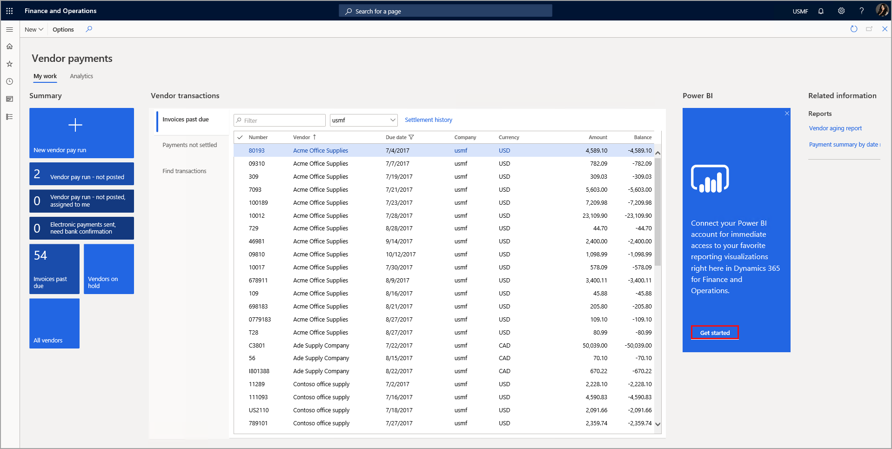
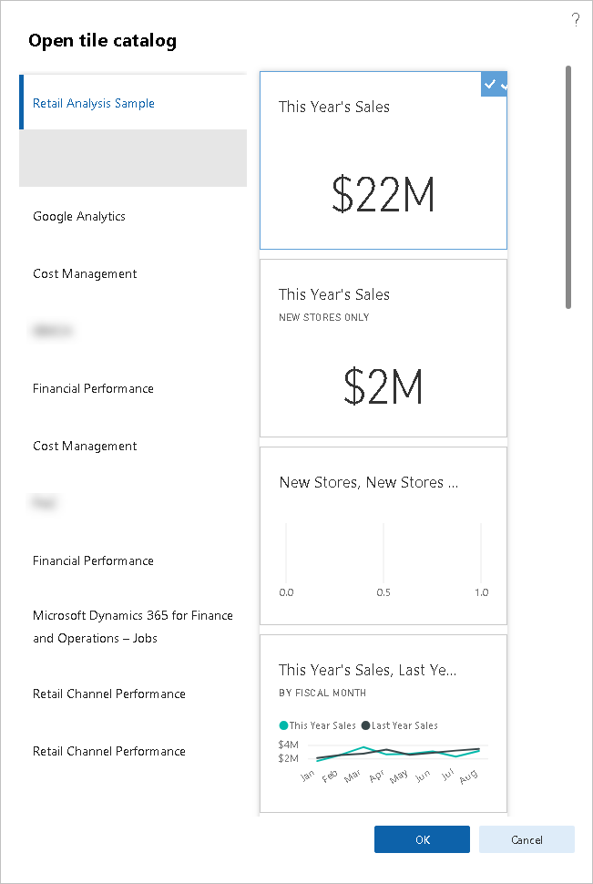

يعتبر Microsoft Power BI مجموعة من أدوات تحليل الأعمال التي تتيح لك تحليل البيانات ومشاركة الرؤى. باستخدام أدوات Power BI، يمكنك استكشاف البيانات وإنشاء تقارير ولوحات معلومات ثرية بسرعة. بعد ذلك، ستتمكن أنت وزملاؤك من استخدام التقارير بشكل تفاعلي على أجهزة متعددة. تستخدم تطبيقات التمويل والعمليات تطبيق Power BI لاكتشاف البيانات.

يتكون Power BI من تطبيق Power BI Desktop وخدمة Power BI وPower BI للأجهزة المحمولة. يمكنك استيراد البيانات وإنشاء التقارير باستخدام تطبيق Power BI Desktop، وتحويل البيانات إلى مرئيات غنية وتفاعلية. يمكنك الاتصال، على سبيل المثال لا الحصر، بكل من Microsoft SQL Server وقاعدة بيانات Microsoft Azure SQL وExcel وOracle وMySQL.

تم إنشاء لوحات معلومات Power BI مع وضع الدور التنفيذي للعمل في ذهنك.
يمكنك نشر التقارير ومجموعات البيانات في خدمة Power BI لإنشاء لوحات معلومات ومشاركتها مع زملائك. لا يتعين عليك استخدام تطبيق Power BI Desktop لإنشاء التقارير. يمكنك تسجيل الدخول إلى Power BI واستيراد البيانات وإنشاء التقارير عبر الإنترنت. يمكن بعد ذلك استخدام أصناف التقرير في لوحات المعلومات.

بعد نشر التقرير إلى Power BI، يمكنك بعد ذلك عرض التقارير ولوحات المعلومات والتفاعل معها باستخدام تطبيق Power BI للهواتف المحمولة متعددة الأنظمة الأساسية.

يمكنك استخدام لغة الاستعلام الطبيعية لطرح أسئلة من البيانات الخاصة بك من خلال أسئلة وأجوبة Power BI. تبحث هذه الخدمة التفاعلية بسرعة عن الإجابات في البيانات.

قبل أن تتمكن من إضافة مكونات Power BI إلى تطبيقات التمويل والعمليات، تحتاج إلى تكوين تطبيقات التمويل والعمليات للاتصال بـ Power BI. لتكوين مساحات العمل في Power BI، يجب عليك أولاً إنشاء تطبيق في Azure AD ومنح الأذونات إلى Power BI ثم تحديد تكوين Power BI في تطبيقات التمويل والعمليات.

بعد تمكين Power BI وتكوينه بشكل صحيح، يمكنك عرض موصل Power BI في مساحات العمل، كما هو موضح في الشكل التالي.

عند تحديد زر **الشروع في العمل**، يمكنك تحديد الإطارات المتجانبة بمساحات العمل المتوفرة في Power BI، كما هو موضح في الشكل التالي.

بعد تحديد **موافق**، يمكنك عرض الإطارات المتجانبة في مساحة العمل.

يمكنك إضافة الإطارات المتجانبة أو إزالتها في أي وقت، كما يمكنك التنقل عبر تحديد أحد الإطارات المتجانبة لعرض التقرير المفصل في عارض Power BI المضمن.

يمكنك فتح محتوى Power BI عن طريق تحديد الزر **فتح في Power BI**.

شاهد عرضًا توضيحيًا حول بكيفية استخدام Power BI في التمويل والعمليات في الفيديو التالي.

> [!VIDEO https://www.microsoft.com/videoplayer/embed/RWRtvf]

اقرأ المزيد حول محتوى Power BI في تطبيقات التمويل والعمليات في [الصفحة الرئيسية لمحتوى Power BI](/dynamics365/fin-ops-core/dev-itpro/analytics/power-bi-home-page?azure-portal=true&toc=%2Ffin-and-ops%2Ftoc.json).
