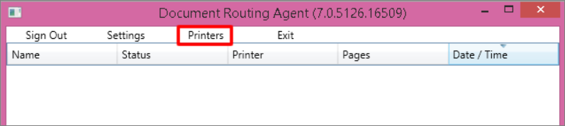

توفر تطبيقات Finance and Operations خدمات متكاملة وتطبيقات للعملاء تُسهِّل عملية إنشاء وتخزين وتوزيع المستندات التي تدعم نشاط العمل.Finance and Operations apps provide integrated services and client applications that make it easy to generate, store, and distribute documents that support business activity. 

يمكنك طباعة المستندات باستخدام طابعة محلية أو جهاز متصل بالشبكة.You can print documents by using either a local printer or a network-connected device. ويمكنك أيضاً تصدير صفحات وتقارير تطبيقات Finance and Operations مباشرةً من العميل كملفات PDF أو مستندات Microsoft Office.You can also export Finance and Operations apps pages and reports directly from the client as PDF files or Microsoft Office documents. 

وأخيراً، يتيح حمل العمل الموزع طباعة مستندات الأعمال مباشرةً من جهاز محمول باستخدام موارد الشبكة.Finally, the distributed workload lets you print business documents directly from a mobile device by using network resources. وعلى الرغم من احتمالية اختلاف متطلبات الطباعة، إلا أنه عادةً ما يتعين على جميع الصناعات إنشاء نسخ ورقية من مستندات الأعمال باستخدام تطبيقات Finance and Operations.Although printing requirements might vary, all industries typically must create hard copies of business documents by using Finance and Operations apps.

تواجه طباعة المستندات على أجهزة الشبكة من التطبيقات المستضافة مجموعة فريدة من التحديات، مثل:Printing documents on network devices from hosted applications presents a unique set of challenges, such as:

- قد لا تتوفر برامج تشغيل الطباعة على جهاز المستخدم.Print drivers might not be available on the user's device.
- قد لا يكون جهاز المستخدم متصلاً بشبكة الشركة.The user's device might not be connected to the corporate network.

باستخدام مضيف مخصص واتباع بضع خطوات سهلة، يمكن لمسؤولي النظام تكوين عمليات النشر بحيث يمكن للمستخدمين الطباعة مباشرةً من تطبيقات الأعمال على أجهزة الشبكة.By using a dedicated host and following a few easy steps, system administrators can configure deployments so that users can print directly from business applications on network devices.

## سيناريوهات الطباعةPrinting scenarios 

- **طباعة ما تشاهده** - لطباعة ما يتم عرضه حالياً في مستعرض الإنترنت، وعند الطباعة، يتم إنشاء نسخة "ملائمة للطباعة" من صفحة الويب للمستعرض.**Printing what you see** – To print what is currently shown in the internet browser, when you print, a "print-friendly" version of the webpage is generated for the browser. هذه الخاصية مدعومة من قبل وظيفة العرض في عميل HTML5 في المستعرض.This is supported by the browser's rendering of the HTML5 client.
- **الطباعة التفاعلية** - يمكنك تصدير نسخة PDF من التقرير وتنزيلها إلى المستعرض لطباعة مستند دقيق على جهاز متصل محلياً.**Interactive printing** – You can export a PDF version of the report and download it to the browser to print a precision document on a locally connected device. ويستخدم هذا تطبيقات العميل وخدمات Microsoft 365.This uses client applications and Microsoft 365 services. لعرض ملفات PDF، يجب أن تقوم بتثبيت Adobe Acrobat Reader.To view the PDF files, you need to install Adobe Acrobat Reader.
- **الطباعة على جهاز متصل بالشبكة** - يمكنك إرسال مستند دقيق إلى جهاز طابعة موجود بالمجال.**Printing on a network device** – You can send a precision document to a domain printer device. يتم إرسال مستند الدقة إلى تطبيق عميل يتم تشغيله على خادم تتم استضافته في مجال العميل.The precision document is sent to a client application that runs on a server that is hosted in the customer's domain. يتطلب هذا الدعم من تطبيقات العميل ومن الخدمات التي تتم استضافتها في Microsoft Azure.This requires support from client applications and from services that are hosted in Microsoft Azure.

بالإضافة إلى النظام الأساسي الذي يتم نشره في اشتراك Azure، تُزود تطبيقات Finance and Operations العملاء بتطبيق Azure متكامل للطرف الأول يساعدهم على استخدام الأجهزة المستضافة على المجال بسهولة لطباعة المستندات.In addition to the platform that is deployed to the Azure subscription, Finance and Operations apps provide customers with an integrated, first-party Azure application that helps them easily use domain-hosted devices to print documents.

يمكن استخدام طابعات الشبكة المسجلة لتطبيقات Finance and Operations بواسطة جميع الكيانات القانونية (المعروفة أيضاً باسم الشركات) المُحددة في البيئة.Network printers that are registered for Finance and Operations apps can be used by all legal entities (also known as companies) that are defined in the environment. وتكون إعدادات طابعة الشبكة خاصة بالشركة.Network printer settings are company-specific. لذا، يمكن للمسؤولين تقييد الوصول، بناءً على شركة المستخدم النشطة.Therefore, administrators can restrict access, based on the user's active company. 

على سبيل المثال، قد يتمكن المستخدمون في الشركة النشطة من الوصول إلى جميع طابعات الشبكة المُسجَلة بواسطة مندوب توجيه المستندات.For example, users in the active company might have access to all the network printers that are registered by the Document routing agent. ولكن، لن يتمكن المستخدمون في شركة أخرى من الوصول إلى هذه الطابعات حتى يتم تمكين الوصول صراحةً لتلك الشركة.However, users in another company won't have access to those printers until access is explicitly enabled for that company.

## نظرة عامة على الخدمةService overview 

في أثناء انتظار طباعة المستندات التي تم إنتاجها بواسطة التطبيقات المستَضَافة على جهاز متصل بالشبكة، يتم تخزينها في مخزن الكائنات الثنائية كبيرة الحجم لـ Azure.While documents that are produced by the hosted applications are waiting to be printed on a network-connected device, they are stored in Azure blob storage. ويكون تسلسل التنفيذ على النحو التالي:The execution sequence is as follows:

1.  يتم إنشاء التقرير بواسطة Microsoft SQL Server Reporting Services (SSRS) ويُخزن في مخزن الكائنات الثنائية كبيرة الحجم لـ Azure.The report is generated by Microsoft SQL Server Reporting Services (SSRS) and stored in Azure blob storage. يتم تخزين إعدادات الطابعة المرفقة مع المستند.Attached printer settings are stored together with the document.
2.  يستعلم مندوب توجيه المستندات عن صف ناقل خدمة Azure للوظائف النشطة.The Document routing agent queries the Azure Service Bus queue for active jobs.
3.  يتم تنزيل المستند بواسطة مندوب توجيه المستندات ويتم تخزينها مؤقتاً في طابعة الشبكة.The document is downloaded by the Document routing agent and spooled to the network printer.

يتيح الحل المستند إلى العميل للعملاء إدارة حجم احتياجات الطباعة لديهم.The client-based solution lets customers manage the scale of their printing needs. يمكن للعملاء الذين لديهم أحمال عمل طباعة كبيرة الحجم تثبيت العديد من مندوبي توجيه المستندات لزيادة عدد عمليات الطباعة المتزامنة.Customers who have heavy-volume printing workloads can install many Document routing agents to increase the number of concurrent printing operations. أو بدلاً من ذلك، يحتاج بعض العملاء إلى عدد قليل من عمليات التثبيت لمندوب توجيه المستندات للتعامل مع احتياجات الطباعة المتوقعة.Alternatively, some customers require few installations of the Document routing agent to handle their anticipated printing needs.

## تثبيت "مندوب توجيه المستندات" لتمكين طباعة الشبكةInstall the Document routing agent to enable network printing 

يمكنك تمكين طابعات الشبكة لشركات معينة باستخدام صفحات إدارية لدى العميل.You can enable network printers for specific companies by using in-client administrative pages. ومع ذلك، للوصول إلى موارد طباعة الشبكة، تحتاج إلى مصادقة خدمات مجال Active Directory (AD DS).However, to access the network printing resources, you require Active Directory Domain Services (AD DS) authentication. يتعين لحساب Microsoft Azure Active Directory (Azure AD) المُستَخدم لتكوين مندوب توجيه المستندات مشاركة نفس المجال مثل مستأجر Azure.The Microsoft Azure Active Directory (Azure AD) account that is used to configure the Document routing agent must share the same domain as the Azure tenant.

## تثبيت مندوب توجيه المستنداتInstall the Document routing agent 

تستخدم تطبيقات Finance and Operations مندوب توجيه المستندات لإدارة التخزين المؤقت للمستندات على أجهزة طابعة الشبكة.Finance and Operations apps uses the Document routing agent to manage the spooling of documents to network printer devices. يمكنك الحصول على العميل باستخدام الروابط المباشرة المضمنة في تطبيق الويب.You can obtain the client by using direct links that are embedded in the web application. يمكنك استخدم الإجراء التالي لتنزيل التطبيق على جهاز الكمبيوتر المحلي الخاص بك.Use the following procedure to download the application to your local computer. ستتمكن بعد ذلك من الوصول إلى الطابعات المحلية والمتصلة بالشبكة، المتصلة بجهاز الكمبيوتر الخاص بك، من خلال عملية نشر واحدة لتطبيقات Finance and Operations.You will then be able to access local and network printers, which are connected to your computer, from a single deployment of Finance and Operations apps.

1.  افتح صفحة **إدارة طابعات الشبكة** بالانتقال إلى **إدارة المؤسسة > إعداد > طابعات الشبكة**.Open the **Manage network printers** page by going to **Organization administration > Setup > Network printers**.
2.  ضمن علامة التبويب **خيارات**، في مجموعة **التطبيق**، حدد **تنزيل مثبت مندوب توجيه المستندات**.On the **Options** tab, in the **Application** group, select **Download document routing agent installer**.
3.  إذا لم تكن قد قمت بتثبيت برنامج Adobe Acrobat Reader، فستحتاج إلى القيام بذلك قبل المتابعة إلى الخطوة التالية.If you have not installed Adobe acrobat reader, you need to do so prior to proceeding to the next step.

4.  قم بتشغيل الملف الذي تم تنزيله لبدء عملية التثبيت.Run the downloaded file to begin the installation process.
5.  أكمل عملية الإعداد.Complete the setup process.
 
يمكنك البدء في تسجيل الطابعات المحلية كطابعات شبكة لتطبيقات Finance and Operations بعد تثبيت التطبيق.After the application is installed, you can begin to register local printers as network printers for the Finance and Operations apps.

## تكوين مندوب توجيه المستنداتConfigure the Document routing agent 

استخدم الإجراء التالي لتكوين تطبيق العميل بحيث يمكنه الاتصال بخدمات Azure التي تستضيف المستندات قيد التنفيذ.Use the following procedure to configure the client application so that it can communicate with the Azure services that host the documents that are in-flight.

1.  أغلق جميع مثيلات المستعرض التي تقوم بتشغيل تطبيقات Finance and Operations.Close all browser instances that are running the Finance and Operations apps. يؤدي ذلك إلى إعادة تعيين الرموز المميزة الخاصة بمصادقة Azure المحلية.This resets the local Azure authentication tokens.
2.  من جهاز الكمبيوتر الخاص بك، قم بتشغيل **توجيه المستندات** عن طريق تحديد الاختصار الموجود على سطح المكتب أو عن طريق تشغيل *Microsoft.Dynamics.AX.Framework.DocumentRouting.Agent.exe*.From your computer, run **Document Routing** by selecting the shortcut on your desktop or by running *Microsoft.Dynamics.AX.Framework.DocumentRouting.Agent.exe*.
3.  في شريط الأدوات، حدد **الإعدادات**.On the toolbar, select **Settings**.
4.  لاحظ أنه يتم إدخال **معرّف التطبيق**، الفريد للتطبيق، تلقائياً.Note that the **Application ID**, which is unique to the application, is entered automatically.
5.  في الحقل **عنوان URL لتطبيقات Finance and Operations**، أدخل عنوان URL الأساسي لمثيل تطبيقات Finance and Operations الذي تستخدمه.In the **Finance and Operations apps URL** field, enter the base URL of the Finance and Operations apps instance that you are using.
6.  في الحقل **مستأجر Azure AD**، أدخل اسم المجال لـ Azure AD.In the **Azure AD tenant** field, enter the domain name of the Azure AD.
7.  حدد **تسجيل**.Select **Register**.
8.  حدد **خروج**.Select **Exit**.
9.  من جهاز الكمبيوتر الخاص بك، قم بتشغيل **توجيه المستندات** عن طريق تحديد الاختصار الموجود على سطح المكتب أو عن طريق تشغيل *Microsoft.Dynamics.AX.Framework.DocumentRouting.Agent.exe*.From your computer, run **Document Routing** by selecting the shortcut on your desktop or by running *Microsoft.Dynamics.AX.Framework.DocumentRouting.Agent.exe*.
10. حدد **تسجيل الدخول** لتسجيل الدخول إلى حسابك.Select **Sign In** to sign into your account.
11. والآن، قمت بتسجيل مندوب توجيه المستندات.Now, you have registered the document routing agent.

يجب أن يشارك الحساب نفس المجال مثل Azure AD المرتبط بتطبيقات Finance and Operations.The account must share the same domain as the Azure AD that is associated with the Finance and Operations apps. أصبح مندوب توجيه المستندات جاهزاً الآن لمعالجة المستندات.The Document routing agent is now ready to process documents. بعد تسجيل الدخول بنجاح، يصبح زر **الطابعات** متاحاً على شريط الأدوات.After you've successfully signed in, the **Printers** button becomes available on the toolbar.    
 

## تسجيل طابعات الشبكةRegister network printers

قبل إكمال هذا الإجراء، تأكد من تثبيت جميع طابعات الشبكة على الكمبيوتر المضيف المحلي.Before you complete this procedure, make sure that you've installed all the network printers on the local host computer. سوف تصبح كافة أجهزة الطابعة التي تم تثبيتها متاحة لتسجيل الخدمة.All the printer devices that are installed will be available for service registration. تأكد من تحديد الطابعات التي تريد عرضها فقط في تطبيق Finance and Operations.Be sure to select only the printers that you want to expose in the Finance and Operations app.

1.  في شريط الأدوات، حدد **الطابعات**.On the toolbar, select **Printers**.
2.  حدد الطابعات التي تريد إتاحتها في تطبيق Finance and Operations.Select the printers to make available in the Finance and Operations app.
3.  حدد اسماً افتراضياً للطابعة.Specify a default name for the printer.
4.  حدد **موافق**.Select **OK**.

بعد الانتهاء من هذا الإجراء، يتم تسجيل أجهزة الطابعة المحددة في كتالوج طابعة الشبكة لتطبيق Finance and Operations.After you've completed this procedure, the selected printer devices are registered in the Finance and Operations app's network printer catalog. يمكن لمسؤولي النظام الآن تمكين الطابعات للوصول من داخل التطبيق.System administrators can now enable the printers for access from within the application.

## إدارة طابعات الشبكةAdminister network printers 

يمكنك استخدام صفحات العميل لإدارة الوصول إلى طابعات الشبكة التي تم تسجيلها بواسطة واحد أو أكثر من مندوبي توجيه المستندات.You can use client pages to manage access to the network printers that have been registered by one or more Document routing agents. يتم تعريف طابعات الشبكة بشكل فريد حسب مسارها.Network printers are uniquely identified by their path. وبالتالي تُدرج الطابعات مرة واحدة، حتى إذا تم تسجيلها بواسطة أكثر من مندوب توجيه مستندات.Therefore, printers are listed one time, even if they have been registered by more than one Document routing agent. 

ويمكنك استخدم هذا الإجراء لتنشيط طابعات شبكة Application Object Server‏ (AOS).Use this procedure to activate the Application Object Server (AOS) network printers.

1.  لفتح صفحة **إدارة طابعات الشبكة**، انتقل إلى **إدارة المؤسسة > إعداد > طابعات الشبكة**.To open the **Manage network printers** page, go to **Organization administration > Setup > Network printers**.
2.  قم بتحرير الإدخالات الموجودة التي تم تعيينها لكل طابعة شبكة.Edit the existing entries that are mapped to each network printer. وكجزء من تغييراتك، قم بتحرير مسار الاتصال.As part of your changes, edit the connection path.
3.  لتضمين طابعة كخيار في حقل **وجهات الطباعة**، اضبط الحقل **نشط** على **نعم**.To include a printer as an option in the **Print Destinations** field, set the **Active** field to **Yes**.

يمكن الآن استخدام طابعات الشبكة في تطبيقات Finance and Operations.The network printers can now be used in the Finance and Operations apps.

يمكن مشاركة عمليات تثبيت العميل لمندوب توجيه المستندات بواسطة الأفراد الذين يصلون إلى بيئة تطبيقات Finance and Operations المتوفرة.Client installations of the Document routing agent can be shared by individuals who access the provisioned Finance and Operations apps environment. لذلك، يتعين تثبيت مندوب توجيه المستندات على كل كمبيوتر يتصل به المستخدم من خلال استخدام مستعرض.Therefore, the Document routing agent must be installed on each computer where a user connects by using a browser.

نوصي بتثبيت المندوبين على خادم أو أكثر من خوادم الطباعة أو غيرها من العملاء المستضافين في المجال الذين لديهم حق الوصول إلى طابعات الشبكة.We recommend that you install agents on one or more Print Servers or other domain-hosted clients that have access to network printers. يدعم مندوب توجيه المستندات تشغيل الطباعة في الخلفية كخدمة.The Document routing agent supports running in the background as a service. تحتاج إلى التأكد من أنك قمت بتنزيل أحدث إصدار من العميل.You need to ensure that you have downloaded the latest version of the client. 

يعتمد عدد طابعات الشبكة المدعومة على عدد الكيانات القانونية وعدد طابعات الشبكة الموزعة.The number of supported network printers depends on the number of legal entities and the number of network printers deployed. إذا كان لديك خمسون طابعة وكياناً قانونياً واحداً، فيمكن لوكيل توجيه مستندات واحد التعامل مع حمل العمل.If you have fifty printers and one legal entity, a single Document routing agent can handle the load. لضمان التوافر العالي، ضع في اعتبارك وجود أكثر من مندوب توجيه واحد.To ensure high availability, consider having more than one routing agent.  

لا يمكنك أبداً امتلاك عدد كبير جداً من مندوبي توجيه المستندات لأنها آلية لتوسيع نطاق خدمة طباعة الشبكة.You can never have too many Document routing agents because it is the mechanism for scaling the network printing service. إذا كان لديك العديد من الطابعات والكيانات القانونية، فإننا نوصي بإجراء بعض اختبارات الأداء لتحديد عدد مندوبي توجيه المستندات الذين ستحتاجهم.If you have many printers and legal entities, we recommend that you do some performance testing to determine the number of Document routing agents that you'll need.

لمتابعة تشغيل مندوب توجيه المستند (DRA) كخدمة Microsoft Windows، يتعين أن يكون لديك اسم المستخدم وكلمة المرور لحساب المجال المستخدم لتشغيل الخدمة.To continue to run the Document routing agent (DRA) as a Microsoft Windows service, you must have the user name and the password of the domain account that is used to run the service. ينبغي إتاحة هذه المعلومات بعد اكتمال الترقية.This information must be available after the upgrade is completed. للعثور على معلومات حساب الخدمة النشط، ابدأ الأداة الإضافية خدمات Microsoft Management Console (MMC)، وحدد **خدمة توجيه مستندات Microsoft Dynamics 365 Document** في القائمة.To find the information for the active service account, start the Microsoft Management Console (MMC) Services snap-in, and select **Microsoft Dynamics 365 Document Routing Service** in the list.

## إزالة تثبيت مندوب توجيه المستندات الحاليUninstall an existing Document routing agent 

لإزالة تثبيت مندوب توجيه المستندات (DRA)، افتح **البرامج والميزات**، ثم ابحث عن **تطبيقات Microsoft Finance and Operations: توجيه المستندات** ثم أزل تثبيته.To uninstall the DRA, open **Programs and Features**, and then find and uninstall **Microsoft Finance and Operations apps: Document Routing**.

أثناء عملية إزالة التثبيت، إذا طُلب منك إغلاق تطبيق خدمة توجيه المستندات في Microsoft Dynamics 365، فحدد **إغلاق التطبيقات تلقائياً ومحاولة إعادة تشغيلها بعد اكتمال الإعداد**.During the uninstallation process, if you're prompted to close the Microsoft Dynamics 365 Document Routing Service application, select **Automatically close applications and attempt to restart them after setup is complete**.

