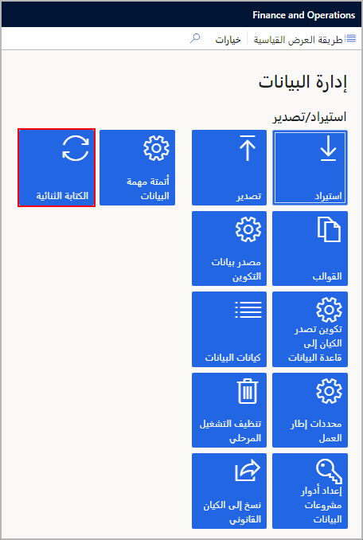

يمكنك استخدام Microsoft Dataverse لتمكين تدفق البيانات بين تطبيقات Finance and Operations وDynamics 365 Sales باستخدام وظيفة الكتابة المزدوجة. 

على سبيل المثال، يمكن أن تتدفق معلومات العميل في قسم المبيعات إلى Finance and Operations. لا يتعين عليك نقل البيانات يدوياً أو استخدام أداة تكامل بيانات تابعة لجهة خارجية.

لفهم استخدام Dataverse بشكل أفضل، ضع في اعتبارك سيناريو النقد المحتمل. يوفر حل العميل المتوقع إلى النقدية مزامنة مباشرة عبر تطبيقات Finance and Operations وSales. 

يمكنك تنزيل حل **العميل المتوقع إلى النقدية في Dynamics 365** من [AppSource](https://appsource.microsoft.com/?azure-portal=true)

تتيح قوالب العميل المتوقع إلى النقدية المتوفرة مع ميزة تكامل البيانات تدفق البيانات للحسابات وجهات الاتصال والمنتجات وعروض أسعار المبيعات وأوامر المبيعات وفواتير المبيعات بين تطبيقات Finance and Operations وSales. 

بينما يتم تدفق البيانات بين Finance and Operations وSales، يمكنك تنفيذ أنشطة المبيعات والتسويق في المبيعات، ويمكنك التعامل مع تنفيذ الطلبات باستخدام إدارة المخزون في Dynamics 365 Supply Chain Management.

لمزيد من المعلومات حول كيفية استخدام كيانات البيانات وتجهيزها لتكامل البيانات باستخدام Dataverse، راجع [التعامل مع إدارة البيانات في تطبيقات Finance and Operations ](/learn/modules/work-data-management-finance-operations/?azure-portal=true). 

## الكتابة المزدوجة
إذا كنت ترغب في تكامل تطبيقات Finance and Operations مع تطبيقات Dynamics 365 الأخرى مثل Dynamics 365 Sales، يمكنك استخدام الكتابة المزدوجة. 

ببضع نقرات، ستتمكن من ربط Finance and Operations بـ Dataverse لإرسال البيانات من تطبيق إلى آخر. اختيارياً، يمكن لمسؤولي Finance and Operations استخدام إصدار متقدم من الإعداد، حيث يمكنهم تخصيص الكيانات وتعيينات الحقول وأيضاً إجراء تصفية وتحويل لبيانات المصدر.

لإعداد الكتابة المزدوجة، ستحتاج إلى استخدام مساحة العمل **إدارة البيانات** وتحديد الإطار المتجانب **الكتابة المزدوجة** في قسم **الملخص**.

