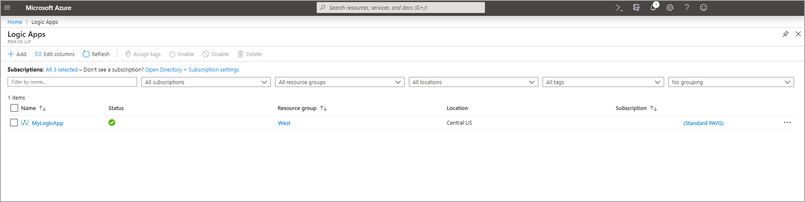

إن Logic Apps هي خدمة سحابية تساعدك على تنظيم المهام وعمليات الأعمال وسير العمل وتنفيذها تلقائياً عندما تحتاج إلى دمج التطبيقات والبيانات والأنظمة والخدمات عبر المؤسسات أو المؤسسات.
تعمل Logic Apps على تبسيط كيفية تصميم وبناء حلول قابلة للتطوير لتكامل التطبيقات وتكامل البيانات وتكامل النظام وتكامل تطبيقات المؤسسة (EAI) والتواصل بين الشركات (B2B)، سواء في السحابة أو في أماكن العمل أو كليهما. يمكنك إنشاء Logic Apps وتحريرها من بوابة Azure على [Microsoft Azure](https://portal.azure.com/?azure-portal=true).

فيما يلي أمثلة لأحمال العمل التي يمكنك تنفيذها تلقائياً باستخدام Logic Apps:

-   معالجة الأوامر وتوجيهها عبر الأنظمة المحلية والخدمات السحابية.
-   إرسال إعلامات بالبريد الإلكتروني باستخدام Microsoft 365 عند وقوع أحداث في أنظمة وتطبيقات وخدمات مختلفة.
-   انقل الملفات التي تم تحميلها من خادم SFTP أو FTP إلى Azure Storage.
-   يمكنك مراقبة المنشورات على Twitter الخاصة بموضوع معين، وتحليل ‏‫التوجهات، وإنشاء تنبيهات أو مهام للأصناف التي تحتاج إلى المراجعة.

لإنشاء حلول تكامل مؤسسية باستخدام Logic Apps، يمكنك الاختيار من معرض متزايد يضم أكثر من 200 موصل، والتي تتضمن خدمات مثل Azure Service Bus، والوظائف، والتخزين، وSQL، وMicrosoft 365، وDynamics، وSalesforce، BizTalk، وSAP، وOracle DB، ومشاركة الملفات، والمزيد.
توفر الموصلات مشغلات أو إجراءات أو كليهما لإنشاء Logic Apps يمكنها الوصول إلى البيانات ومعالجتها بأمان في الوقت الحقيقي. 
