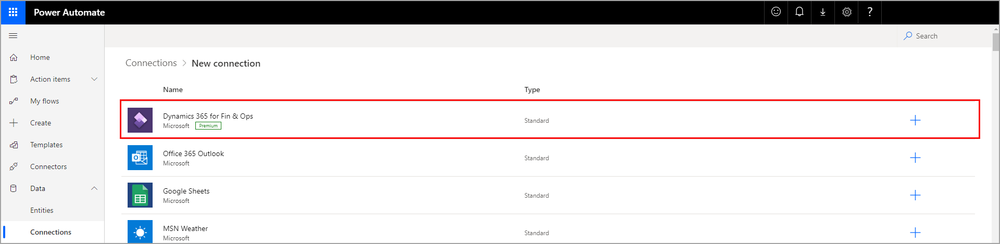
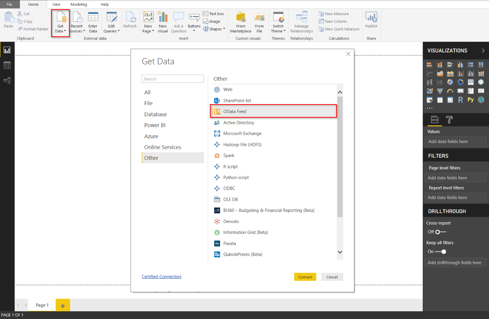
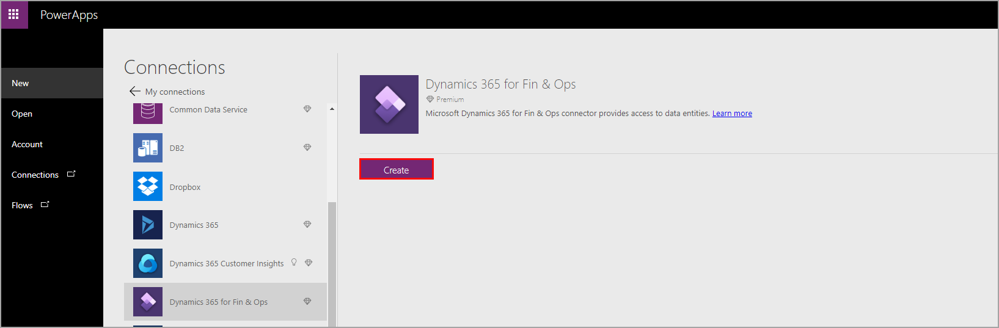

تتكامل تطبيقات التمويل والعمليات أيضًا مع Microsoft Power Platform.
يدعم Power Automate هذا التكامل عبر الموصلات الخاصة به، في حين يصل Power BI وPower Apps إلى كيانات البيانات العامة التي يتم تخزينها في قاعدة بيانات تطبيقات التمويل والعمليات. 

## الاتصال بـ Power Automate

اتبع الخطوات التالية للبحث عن موصلات Power Automate لتطبيقات التمويل والعمليات. 

1.  في Power Automate، حدد رمز الترس لقائمة الإعدادات.
2.  في القائمة المنسدلة، حدد **اتصالات**. اتصالات تطبيقات التمويل والعمليات، المدرجة كـ **Dynamics 365 for Fin & Ops** من بين قائمة الاتصالات المتوفرة.

    

4.  عند تحديد الاتصال المناسب، حدد **إنشاء اتصال** وقم بإعداد الاتصال عن طريق إدخال بيانات الاعتماد الخاصة بك. سيظهر الاتصال في **الاتصالات الخاصة بي** عندما تقوم بإعداده.

## الاتصال بـ Power BI Desktop
  
اتبع الخطوات التالية للاتصال بـ Power BI Desktop لتطبيقات التمويل والعمليات. 

1.  حدد  **الحصول على البيانات** من شريط  **الصفحة الرئيسية** .
2.  حدد الفئة **أخرى** .
3.  حدد **موجز OData**.

    
4.  انقر على **اتصال**.
5.  أدخل معلومات الاتصال في الصفحة التي تظهر، ثم حدد **موافق**.
5.  حدد البيانات التي تحتاج إليها ثم حدد **تحميل**.

## الاتصال بـ Power Apps

اتبع الخطوات التالية للاتصال بتطبيقات التمويل والعمليات في Power Apps.

1.  عند إنشاء تطبيق Power Apps جديد، حدد الخيار **بدء من البيانات**. 
2.  حدد **إنشاء**.
3.  في صفحة **نشاء تطبيق**، انقر على السهم المواجه لليمين لعرض مزيد من خيارات الاتصال. 
4.  انقر على **اتصال جديد.** 
5.  حدد خيار **Dynamics 365 for Fin & Ops**.
6.  حدد **إنشاء**. 
7.  ستحتاج الآن إلى تحديد المثيل (بيئات تطبيقات التمويل والعمليات) والجدول (كيان بيانات) الذي تريد الاتصال به. تحتاج إلى التأكد من أنك مستخدم مسؤول للبيئة التي تحددها وأن لديك أذونات للوصول إلى الجدول (كيان البيانات) الذي تحدده. 

     
  

   
