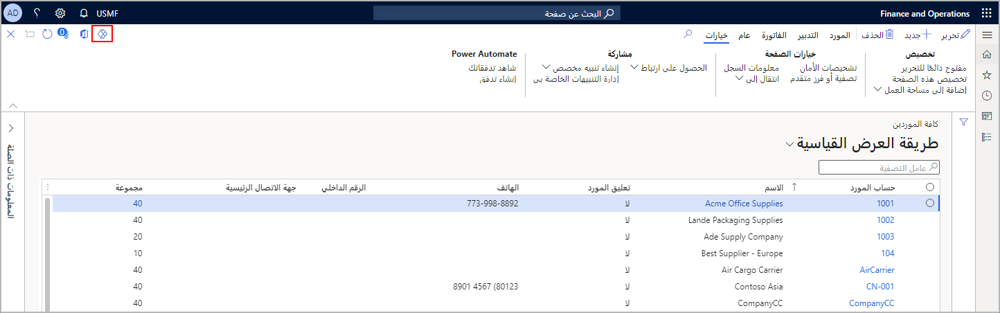

تتكامل تطبيقات Finance and Operations مع Microsoft Power Apps، وهي خدمة للمطورين والمستخدمين غير التقنيين لإنشاء تطبيقات أعمال مخصصة للأجهزة المحمولة والأجهزة اللوحية والويب دون كتابة كود.Finance and Operations apps integrate with Microsoft Power Apps, which is a service for developers and non-technical users to build custom business apps for mobile devices, tablets, and the web without writing code.
يمكنك تضمين تطبيقات Power Apps الموجودة في تطبيقات Finance and Operations لتعديل وظائف المنتج.You can embed Power Apps apps in Finance and Operations apps to modify the product's functionality. كما بإمكانك أيضاً تضمين تطبيقات Power Apps من داخل واجهة المستخدم عن طريق تحديد شعار Power Apps في الصفحة التي ترغب في تضمين تطبيق Power Apps بها.You can embed Power Apps apps from within the user interface by selecting the Power Apps logo on the page you wish to embed a Power Apps app.

علي سبيل المثال، يمكنك إنشاء تطبيق Power Apps لتكملة تطبيقات Finance and Operations بالمعلومات التي يتم سحبها من نظام آخر.For example, you can build a Power Apps app to supplement Finance and Operations apps with information that is pulled from another system.

عند استخدام تطبيقات Finance and Operations كمصدر بيانات لأحد تطبيقات Power Apps، ستقوم بتحديد قائمة تضم وحدات البيانات الخاصة بك.When using Finance and Operations apps as the data source for a Power Apps app, you will select from a list of your data entities. وكما هو الحال مع كافة سيناريوهات التكامل الأخرى، يستخدم تكامل تطبيقات Power Apps كيانات البيانات للوصول إلى بيانات تطبيقات Finance and Operations الخاصة بك.As with all other integration scenarios, the Power Apps integration uses data entities to access your Finance and Operations apps data. توجد العديد من مصادر البيانات خارج تطبيقات Finance and Operations، والتي يمكنك استخدامها أيضاً لتطبيقات Power Apps.Many data sources exist outside of Finance and Operations apps, which you can also use for Power Apps apps. 

فيما يلي أمثلة على مصادر البيانات الأخرى:Examples of other data sources are:

- Microsoft DataverseMicrosoft Dataverse
- AzureAzure
- SharePointSharePoint
- SQL ServerSQL Server
- تطبيقات Dynamics 365 الأخرىOther Dynamics 365 apps

الطريقتان التي يمكنك بهما الوصول إلى تطبيق Power Apps في الصفحة هما:The two ways that you can access a Power Apps app on a page are:

-   حدد الزر **Power Apps** في الزاوية اليسرى من جزء الإجراءات.Select the **Power Apps** button in the right-corner of the Action Pane. عندما تقوم بتضمين تطبيق Power Apps ليتم تشغيله باستخدام الزر **Power Apps**، فسيظهر صنف قائمة خاص بتطبيق Power Apps، وسيُفتح التطبيق في جزء جانبي.When you embed a Power Apps app to be launched by using the **Power Apps** button, a menu item for the Power Apps app appears, and the app will open in a side pane.
-   اعرض تطبيق Power Apps في أي صفحة في صورة علامة تبويب جديدة أو علامة تبويب سريعة أو ريشة أو كقسم جديد في مساحة عمل.Display a Power Apps app on a page as a new tab, FastTab, blade, or new section in a workspace. تم أخذ لقطة الشاشة التالية من صفحة **كافة الموردين** بواجهة مستخدم تطبيقات Finance and Operations التي تعرض الزر **Power Apps**.The following screenshot is from the **All vendors** page in the Finance and Operations apps user interface that shows the **Power Apps** button. نظراً لعدم وجود أي تطبيق Power Apps في صفحة **كافة الموردين**، فستتم مطالبتك بإدراج واحد.Because there is no Power Apps app on the **All vendors** page, you are prompted to insert one.
    
    

بصفتك مطوراً، فإنه يمكنك التحكم في مكان تضمين تطبيق Power Apps.As a developer, you're able to control where a Power Apps app can be embedded.
وبشكل افتراضي، يمكن لأي مستخدم تضمين تطبيق Power Apps في أي صفحة.By default, any user can embed a Power Apps app on a page. كما يمكنك تكوين ميزة Power Apps للسماح بالتضمين في صفحات معينة فقط وذلك عن طريق تطبيق الأسلوبين التاليين:You can configure the Power Apps feature to only allow embedding on certain pages by implementing two methods:

-   **`isPowerAppPersonalizationEnabled`** - إذا أعاد هذا الأسلوب خطأ للصفحة، فلن يظهر زر قائمة **Power Apps** ولن يتمكن المستخدمون من تضمين تطبيقات Power Apps في أي مكان على تلك الصفحة.**`isPowerAppPersonalizationEnabled`** - If this method returns false for a page, then the **Power Apps** menu button won't be shown and users won't be able to embed Power Apps apps anywhere on that page.
-   **`isPowerAppTabPersonalizationEnabled`** - إذا أعاد هذا الأسلوب خطأ للصفحة، فلن يتمكن أي مستخدم من تضمين Power Apps كعلامة تبويب أو علامة تبويب سريعة أو قسم بانوراما.**`isPowerAppTabPersonalizationEnabled`** - If this method returns false for a page, then a user can't embed Power Apps as a tab, FastTab, or panorama section. ومع ذلك، لا يزال بإمكان المستخدم تضمين Power Apps من خلال زر قائمة **Power Apps**.However, a user can still embed a Power Apps through the **Power Apps** menu button. 

## تكامل البياناتData integration 
يمكنك الاتصال ببياناتك من تطبيقات Finance and Operations من داخل Power Platform بسلاسةٍ لإنشاء التطبيقات الخاصة باللوحة والتطبيقات المستندة إلى النموذج.You can connect to your data from Finance and Operations apps seamlessly within the Power Platform to build canvas and model-driven apps. وبصفتك مسؤول النظام، فبإمكانك الوصول إلى بيانات تطبيقات Finance and Operations التي يتم عرضها من خلال كيانات البيانات.As a System Administrator, you can access Finance and Operations apps data that is exposed through Data entities. يجب تمكين هذه الكيانات حتى يتم الكشف عن واجهة برمجة التطبيقات (API) "API" العامة في بيئة التطوير.These entities must be enabled for public API in the development environment to be exposed. 

إذا كنت تستخدم تطبيقات Finance and Operations وترغب في إنشاء تطبيقات Power Apps مستندة إلى النموذج، ستتوفر جميع كيانات OData باعتبارها كيانات ظاهرية في Microsoft Dataverse وPower Platform.If you are using Finance and Operations apps and wish to create model-driven Power Apps, OData entities are all available as virtual entities in Microsoft Dataverse and the Power Platform. يمكنك بناء الخبرات في تطبيقات مثل المبيعات والتسويق ومشاركة العملاء باستخدام البيانات مباشرةً من تطبيقات Finance and Operations.You can build experiences in applications such as Sales, Marketing, Customer Engagement using data directly from Finance and Operations apps. من خلال قيامك بذلك، يمكنك استخدام نموذج إمكانات الإنشاء والقراءة والتحديث والحذف في Dataverse وPower Platform.By doing this, you can use create, read, update, delete capabilities form the Dataverse and the Power Platform. كما يمكنك أيضاً استخدام هذه الإمكانية لإنشاء مداخل لتطبيقات Power Apps.You can also use this capability to create Power Apps portals. 

