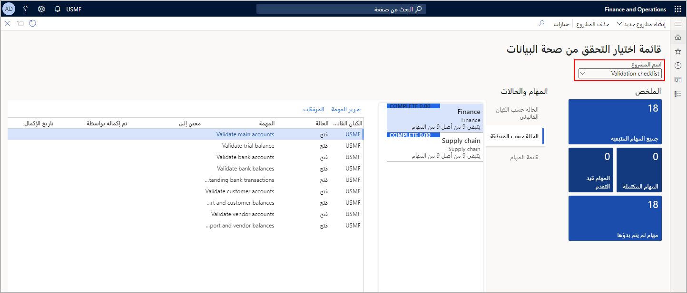
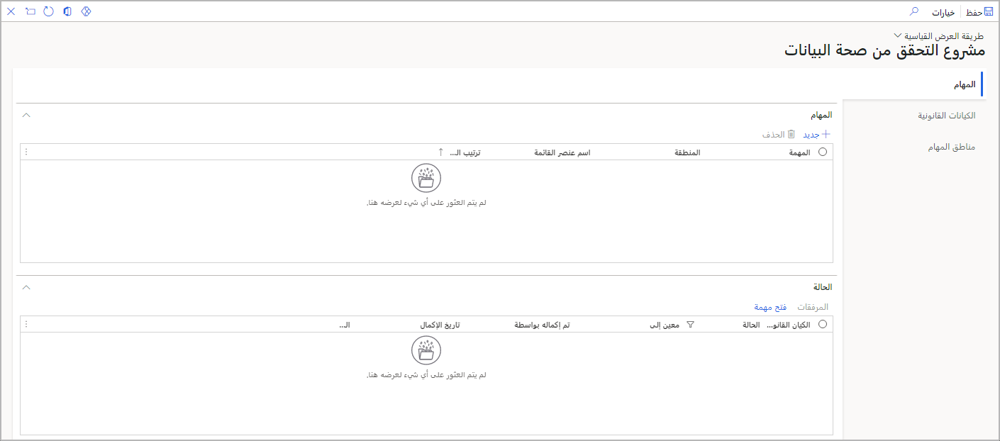

تُستخدم مساحة العمل **قائمة التحقق من صحة البيانات** لتعقب عمليات التحقق من صحة البيانات أثناء تنفيذ جديد، أو بعد الترقية، أو بعد الترحيل.

تظهر لقطة الشاشة التالية مساحة العمل **قائمة التحقق من صحة البيانات**، وتبرز القائمة المنسدلة حيث تحدد **اسم المشروع**.  عند تحديد مشروعك، سترى حمل عمل البيانات في قسمي **الملخص** و **المهام والحالة**.

ووفقاً لطريقة عرضك، سترى المهام التي تم تعيينها لك فقط، أو جميع المهام والحالات لمشروع التحقق من صحة البيانات. في مساحة العمل، حدد مشروع التحقق من صحة البيانات في أعلي الصفحة. سيتم بعد ذلك تصفية البيانات حسب المشروع الذي قمت بتحديده.

تعرض الإطارات المتجانبة الموجودة في قسم **الملخص** نظرة عامة على العملية، مما يساعدك في الحفاظ على عملية التحقق من صحة البيانات في المسار الصحيح. وتوجد إطارات متجانبة للمهام التي لم تبدء، والمهام قيد التقدم، والمهام المكتملة، وجميع المهام المتبقية. في حاله تضمين شركات متعددة في المشروع، سيتم عرض البيانات عبر كافة الشركات المضمنة.

في قسم **المهام والحالة**، ستشاهد تفاصيل حالة المشروع بشكل عام. يمكنك عرض الحالة حسب الكيان القانوني أو المنطقة أو المهمة أو لشركة معينة. تمنحك علامات تبويب **الحالة** هذه تفصيلاً للنسبة المئوية المنجزة وعدد المهام التي لا تزال بحاجة إلى إكمال. توجد أيضاً علامة تبويب تعرض قائمة مهام مفصلة قابلة للتصفية. يمكنك تغيير حالة المهمة أو تعيين مهمة باستخدام الزر **تحرير مهمة**. تربطك أسماء المهام بالصفحة التي يحتاج فيها المستخدم لإكمال العمل اللازم للمهمة. يمكنك إضافة ملفات أو ملاحظات أو صور أو عناوين URL إلى مهمة باستخدام زر **المرفقات**. يتم ملء الحقلين **مكتمل بواسطة** و **تاريخ الاكمال** تلقائياً عند إكمال العامل للمهمة.

لإعداد مشروع في مساحة العمل، حدد صفحة **مشروع التحقق من صحة البيانات**.
تُظهر لقطة الشاشة التالية صفحة **مشروع التحقق من صحة البيانات** حيث يمكنك إضافة **مهام** جديدة و **كيانات قانونية** و **مناطق مهام**. 

