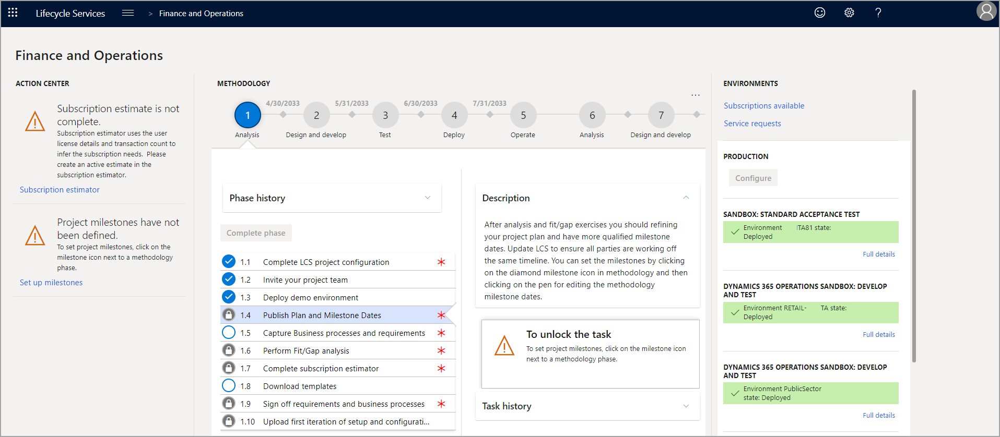
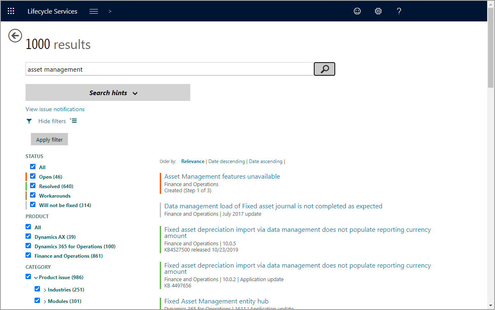

توفر Lifecycle Services العديد من الميزات لمساعدتك في دعم البيئات التي تديرها. من صفحة **التفاصيل الكاملة** لأي بيئة، يمكنك إعادة تشغيل الخدمات الرئيسية ورؤية التغييرات التي تم تطبيقها على البيئة والوصول إلى الواجهتين الأمامية والخلفية للبيئة.

من القائمة الرئيسية، في صفحة **التفاصيل الكاملة** لأي بيئة في Lifecycle Services، حدد **محفوظات**، ثم حدد **تغييرات البيئة‬‏‫** من القائمة المنسدلة. تعرض لك الصفحة الناتجة كل حزمة تم تطبيقها من مكتبة الأصول على البيئة، سواء كانت تحديث النظام الأساسي أو حزمة الكود أو مهمة صيانة قاعدة البيانات.

لتطبيق الكود أو التحديثات على بيئة، حدد **تطبيق التحديثات** ضمن قائمة **صيانة** في صفحة **التفاصيل الكاملة**، ثم اختر الحزمة المناسبة من القائمة وحدد **تطبيق**.

بالنسبة للبيئات من الطبقة 2 فأعلى، يتوفر أيضاً خيار **نقل قاعدة البيانات** ضمن قائمة **صيانة**. يتيح لك هذا الخيار تصدير نسخة احتياطية من قاعدة بيانات البيئة إلى مكتبة الأصول أو استيراد نسخة احتياطية من مكتبة الأصول أو تحديث قاعدة بيانات البيئة مباشرةً من بيئة أخرى من الطبقة 2. يتم تشغيل جميع العمليات تلقائياً عند وضعها في قائمة الانتظار لضمان التكرار والموثوقية.

ثمة خيار آخر متاح في بيئات الطبقة 2 فأعلى هو إعادة تشغيل الخدمات، حيث يُتيح لك إعادة تشغيل خدمة IIS أو Batch أو خدمة تشخيص Lifecycle Services أو خدمة DIXF أو خادم التقارير عن بُعد.

## دعم إضافي

هناك عدة طرق يمكنك من خلالها الحصول على دعم إضافي في Lifecycle Services لتطبيقات التمويل والعمليات.

### Dynamics 365 Community

Dynamics 365 Community يمكنك فيه التفاعل مع الخبراء والنظراء الذين يستخدمون تطبيقات Dynamics 365 ويعملون بها. يمكنك هنا قراءة المنتديات والمدوّنات والوصول إلى الندوات عبر الإنترنت ومقاطع الفيديو والعثور على أحداث مفيدة. لبدء استخدام Dynamics 365 Community، انتقل إلى [‏‫مرحباً بك في Dynamics 365 Community](https://community.dynamics.com/?azure-portal=true) وسجّل الدخول باستخدام حسابك في Microsoft أو حساب العمل أو المؤسسة التعليمية لديك. يمكنك استكشاف المحتوى من خلال تسجيل الدخول أو دونه. إذا كنت تريد نشر سؤال أو تعليق أو تلقي إعلامات بالبريد الإلكتروني، فسيتعيّن عليك تسجيل الدخول.

### البحث عن المشاكل

في Lifecycle Services، يمكنك استخدام أداة البحث عن المشاكل للبحث بسرعة عن مقالات قاعدة معارف Microsoft ‏(KB) والإصلاحات العاجلة والحلول البديلة والمشكلات التي تم الإبلاغ عنها. ضمن أداة البحث عن المشاكل، يمكنك أيضاً مراجعة المشاكل الحالية التي يجري الآن إصلاحها في منطقة عمل معيّنة من Dynamics 365 Finance and Operations Tools والمشاكل التي تم إصلاحها.

للوصول إلى أداة البحث عن المشاكل واستخدامها، افتح مشروعك في Lifecycle Services، ثم حدد لوحة **بحث عن المشاكل**. يمكنك هنا البحث عن مشكلة. بمجرد كتابة استعلام، ستتمكن من البحث في أي محتوى ذي صلة. لعرض معلومات حول حالة محتوى البحث عن المشاكل في Lifecycle Services، انتقل إلى [بحث عن المشاكل في Lifecycle Services](/dynamics365/fin-ops-core/dev-itpro/lifecycle-services/issue-search-lcs/?azure-portal=true).

### مزيد من المعلومات

لقراءة المزيد حول كيفية إدارة تجربة الدعم، انتقل إلى [إدارة تجارب دعم تطبيقات التمويل والعمليات](/dynamics365/fin-ops-core/dev-itpro/lifecycle-services/cloud-powered-support-lcs/?azure-portal=true).
