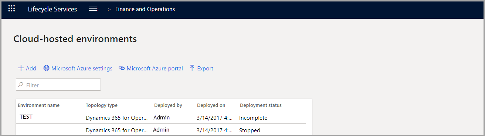

يحتوي جدول البيئات المستضافة على الشبكة السحابية في صفحة **البيئات المستضافة على الشبكة السحابية** لأحد المشاريع على زر **إضافة** بحيث يمكنك توزيع بيئات جديدة. 

عند تحديد الاسم وإصدار التطبيق وإصدار النظام الأساسي والغرض من البيئة التي تريد توزيعها، يجب أن تفكر في تغيير بعض الإعدادات الأساسية:

-   **نوع الجهاز الظاهري** - يعتمد على احتياجات العميل.

-   **اسم الجهاز** - يجعل رؤوس نافذة RDP أكثر قابلية للقراءة من قِبل الإنسان من GUID.

-   **البيانات** - إذا كنت لا تريد بيانات العرض التوضيحي، فتأكد من تحديد القيمة **بلا**.
