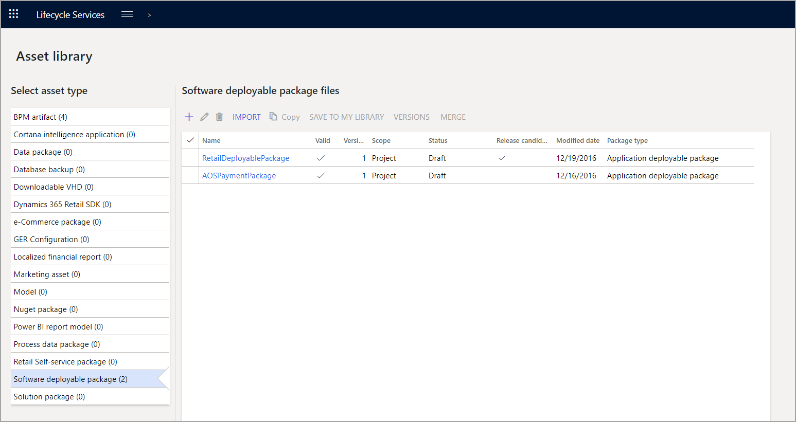

تنقسم مكتبة الأصول إلى العديد من الفئات التي تحتوي على أنواع مختلفة من الملفات. تشتمل بعض أنواع الملفات التي غالباً ما تستخدمها على:

-   **منتج عارض العمليات التجارية** - المستندات المتعلقة بنموذج العمليات التجارية (BPM).
-   **النسخ الاحتياطي لقاعدة البيانات** - ملفات يمكنك استخدامها لاستعادة قاعدة بيانات SQL أو Azure SQL.
-   **النموذج** - ملحقات سابقة التعبئة يمكنك تثبيتها في بيئة ما.
-   **حزمة برامج قابلة للتوزيع** - الحزم التي أنشأتها من Azure DevOps من الكود الذي تم إعداده في Visual Studio.

يمكن زيادة حجم مكتبة الأصول بطريقتين:

-   استخدم الزر **استيراد** لجلب الملفات التي تم نشرها بواسطة Microsoft أو موردي البرامج المستقلين (ISVs). يؤدي هذا إلى فتح جدول يمكنك تصفيته للحزمة التي تحتاجها. عند العثور على الحزمة الصحيحة، حددها وقم بالتأكيد على الاستيراد.

-   أضف ملفات إلى مكتبة الأصول عن طريق تحميل الملفات من جهاز الكمبيوتر الخاص بك باستخدام الزر **إضافة**. أدخل اسماً ووصفاً للأصل، وحدد **تحميل ملف**، الذي سينقلك إلى شاشة أخرى. حدد **استعراض** لفتح إطار مستكشف الملفات، الذي يمكنك استخدامه لتحديد موقع الملف. عند قيامك بالتحديد، استخدم زر **تحميل** لإضافة الملف إلى الأصل.
    مع اكتمال الأصل، قم بتأكيده لإضافته إلى المكتبة.

تحتوي مكتبة الأصول أيضاً على زر **حذف** الذي يتيح لك إزالة الأصناف، وزر **تحرير** لتعديل أسماء الأصول ووصفها.
