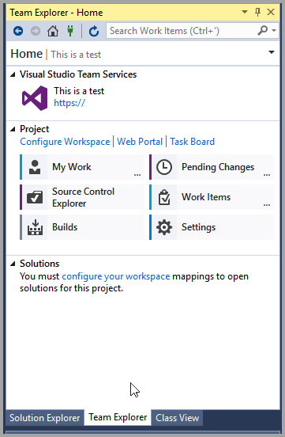

تشرح هذه الوحدة كيفية تكوين Visual Studio للاتصال بـ Team Foundation Version Control Services في Azure DevOps.This unit explains how to configure Visual Studio to connect to the Team Foundation Version Control Services in Azure DevOps.

عندما يكون لديك مشروع في Azure DevOps لاستضافة مستودعك، فإنك تكون جاهزاً للاتصال بـ Visual Studio لبدء التطوير.When you have a project in Azure DevOps to host your repository, you are ready to connect with Visual Studio to start developing. كل ما تحتاجه للتفاعل مع Azure DevOps موجود ضمن عنوان **الفريق** في شريط القوائم أو في نافذة **مستكشف الفريق**.Everything you need to interact with Azure DevOps is found under the **Team** heading on the menu bar or in the **Team Explorer** window.

 

للاتصال بمشروع في Azure DevOps من Visual Studio، اتبع الخطوات التالية:To connect to an Azure DevOps project from Visual Studio, follow these steps:

1.  حدد **إدارة الاتصالات** في نافذة **مستكشف الفريق** أو ضمن عنوان **الفريق** في شريط القوائم.Select **Manage Connections** in the **Team Explorer** window or under the **Team** header on the menu bar. قد يظهر هذا الخيار ببساطة كرمز توصيل أخضر.This option might appear simply as a green plug icon.
2.  ستكون جميع اتصالات المشروع الحالية من جهازك المحلي متوفرة لتحديدها في النافذة التي تظهر.All the existing project connections from your local machine will be    available to select in the window that appears. انقر بزر الماوس الأيمن وحدد **اتصال** لإجراء الاتصال.Right-click and select **Connect** to make the connection.
3.  في النافذة التي تفتح في نافذة **مستكشف الفريق‬‏‫**، حدد **إدارة الاتصالات**.In the window that opens in the **Team Explorer** window, select **Manage Connections**.
4.  حدد **الاتصال بمشروع الفريق**.Select **Connect to Team Project**. سيؤدي ذلك إلى فتح مربع حوار جديد.This will open a new dialog box.
5.  في مربع الحوار، حدد **خوادم**.In the dialog box, select **Servers**.
6.  يؤدي هذا إلى فتح مربع حوار جديد، حيث ستقوم بإدخال ‏‫عنوان URL لـ Azure DevOps.This opens a new dialog box, where you will enter the Azure DevOps URL. إذا كان عنوان URL يبدو مثل `clientname.visualstudio.com`، وعادةً ما يكون كذلك، فسيتم ملء الحقول المتبقية تلقائياً.If the URL looks like `clientname.visualstudio.com`, and it usually does, the remaining fields will be automatically populated.
7.  بعد تأكيد هذه الإعدادات، سيطالبك مربع حوار جديد بتسجيل الدخول إلى Azure DevOps.After you confirm these settings, a new dialog box will prompt you to sign in to Azure DevOps.
8.  عند تسجيل الدخول، حدد المربع الخاص بمشروع Azure DevOps     المطلوب في جزء **مشاريع الفريق**.When you have signed in, select the box for the desired Azure DevOps     project on the **Team Projects** pane.
9.  حدد **اتصال**.Select **Connect**.
10. حدد **تكوين متقدم** لفتح مربع حوار لضبط معلمات تعيين مساحة العمل الخاصة بك.Select **Advanced Configuration** to open a dialog box for adjusting the parameters of your workspace mapping.
11. حدد **خيارات متقدمة** في مربع الحوار هذا لمزيد من الخيارات.Select **Advanced** in this dialog box for more options.
12. قم بتغيير مساحة العمل من مساحة عمل **خاصة** إلى مساحة عمل **عامة**.Change the workspace from a **Private** workspace to a **Public** workspace.
13. في جدول **مجلدات العمل**، قم بإزالة جميع التعيينات الموجودة.In the **Working folders** table, remove all existing mappings.
14. في صف جديد من الجدول، قم بتعيين مجلد **المشاريع** الخاص بالفرع المطلوب لمشروع Azure DevOps الخاص بك إلى مجلد    **المشاريع** الخاص بالمستخدم المحلي لـ Visual Studio.On a new row of the table, map the **Projects** folder of the    desired branch of your Azure DevOps project to your local user's    **Projects** folder for Visual Studio.
15. في صف آخر في الجدول، قم بتعيين مجلد **بيانات التعريف** لنفس    فرع مشروع Azure DevOps الخاص بك إلى مجلد **دليل الحزم المحلي**    لمحرك أقراص **خدمة AOS**.On another row in the table, map the **Metadata** folder of the same    branch of your Azure DevOps project to the **Packages Local Directory**    folder of the **AOS Service** drive.
16. حدد **موافق**.Select **OK**.
17. حدد **إغلاق** للخروج من جميع مربعات الحوار المفتوحة.Select **Close** to exit all open dialog boxes.