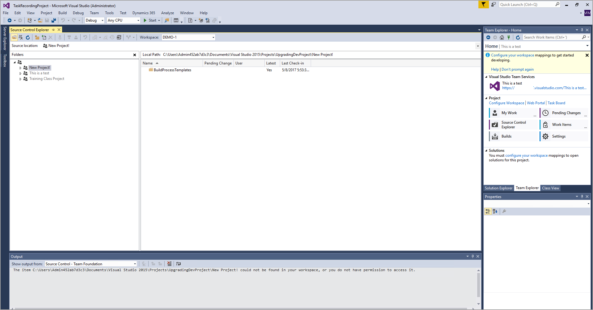

تشرح هذه الوحدة كيفية إيداع الكود، ودمج الكود، وحل التعارضات، والتراجع عن التغييرات في Visual Studio.This unit explains how to check in code, merge code, resolve conflicts, and roll back changes in Visual Studio.

## الحصول على أحدث إصدار وإيداع الكودGet the latest version and check in code 

 
عند العمل مع عدة مطورين أو مشاريع، يجب أن تتحقق من أن الكود يتضمن أحدث إصدار للتحكم في المصادر.When working with multiple developers or projects, you should validate that your code includes the latest source control's version. لتجنب التعارض والتأكد من تطوير الكود بشكل صحيح، يعد التحقق من المصدر أمراً إلزامياً.To avoid conflicts and ensure that the code is developed correctly, checking the source is mandatory.

مستكشف التحكم في المصادر هو عرض لجميع الأكواد والكائنات التي تم التحقق منها في التحكم في المصادر.The Source Control Explorer is your go-to view for all the code and objects that have been checked into source control. 
 

للوصول إلى "مستكشف التحكم في المصادر"، اتبع الخطوات التالية:To reach the Source Control Explorer, follow these steps:

1.  حدد **عرض** علي شريط القائمة في Visual Studio.Select **View** on the menu bar of Visual Studio.
2.  في القائمة المنسدلة، حدد **نوافذ أخرى**.In the drop-down menu, select **Other Windows**.
3.  من الخيارات المتوفرة، حدد **مستكشف التحكم في المصادر**.From the available options, select **Source Control Explorer**.

للتأكد من أنك تبحث عن أحدث إصدار تم إيداعه من الكائنات في مستكشف التحكم في المصادر، انقر بزر الماوس الأيمن فوق الكائنات وحدد **الحصول على أحدث إصدار**.To make sure that you are looking at the most recent checked-in version of objects in the Source Control Explorer, right-click on the objects and select **Get Latest Version**. بدلاً من ذلك، يمكنك القيام بذلك على مستوى المجلد للحصول على جميع التحديثات.Alternatively, you can do this at the folder level to get all the updates.

يجب أن تحصل دائماً على أحدث الملفات من الفرع الذي تعمل فيه قبل إيداع التغييرات الجديدة.You should always get the latest files from the branch that you are working in before checking in new changes. إذا قام شخص آخر أيضاً بدفع التغييرات إلى الملف الذي كنت تقوم بتحريره، فإن ذلك يمنحك فرصة لتسوية تغييراتك مع تغييراته والتأكد من عمل جميع الميزات قبل إيداع التغييرات الناتجة.If someone else has also pushed changes to the file that you were editing, this will give you an opportunity to reconcile your changes with theirs and make sure that all the features are working before the resulting changes are checked in.

لإجراء عملية الإيداع، اتبع الخطوات التالية:To perform the check-in process, follow these steps:

1.  حدد **التغييرات المعلقة** من نافذة **مستكشف الفريق**.Select **Pending Changes** from the **Team Explorer** window.
2.  أدخل تعليقاً على الإيداع.Enter a check-in comment.
3.  حدد **إيداع**.Select **Check In**.

## دمج الكود وحل تعارضات الأكوادMerging code and resolving code conflicts

أحياناً، عند الحصول علي أحدث كود من فرع في Visual Studio، سيكون للكود المخزن في الخادم تغييرات مختلفة عن التغييرات التي أجريتها محلياً.Sometimes, when you get the latest code from a branch into Visual Studio, the code stored on the server will have changes that are different from the changes that you made locally. هذا تعارض في الدمج.This is a merge conflict.

عندما يواجه Visual Studio تعارضاً في الدمج، سيحاول حله تلقائياً.When Visual Studio encounters a merge conflict, it will attempt to resolve it automatically. وتوجد أمثلة هذا الحل في سجل المخرجات.Any such resolution is in the output log. إذا فشل حل أي تعارضات تلقائياً، فستظهر في نافذة جديدة تطالبك بإخبار Visual Studio بما يجب أن يفعله لكل ملف متعارض.If any conflicts fail to resolve automatically, they will appear in a new window that prompts you to tell Visual Studio what it should do for each conflicting file.

تمنحك نافذة **حل التعارضات** الخيارات التالية لكل ملف:The **Resolve Conflicts** window gives you the following options for each file:

-   **الحصول على المصدر** - استخدام الملف الذي قمت بسحبه من التحكم في المصادر، ومحو جميع التغييرات المحلية.**Take Source** - Use the file that you pulled from source control, erasing all your local changes.
-   **الاحتفاظ بالملف المحلي** - الاحتفاظ بملفك المحلي، وفقد أي تغييرات موجودة في التحكم في المصادر.**Keep Local** - Keep your local file, losing any changes that are present in source control.
-   **الدمج باستخدام أداة الدمج** - عرض كلا الإصدارين من الملف جنباً إلى جنب، واختيار الاحتفاظ بكل تغيير في أي إصدار أو تجاهله، واحداً تلو الآخر.**Merge using Merge Tool** - View both versions of the file side by side, choosing to keep or discard each change in either version, one at a time.

لن تتمكن من التحقق من مجموعة التغييرات حتى لا توجد تعارضات دمج لم يتم حلها، لذا فإن إتقان هذه الأدوات هو مفتاح نجاحك كعضو في فريق التطوير.You will not be able to check in a changeset until there are no unresolved merge conflicts, so mastering these tools is key to your success as a member of a development team.

## التراجع عن التغييرات في Visual StudioRoll back changes in Visual Studio

يرتكب الجميع أخطاء، وفي بعض الأحيان تحتاج إلى التراجع عن التغييرات التي تم التحقق منها في فرع التحكم في المصادر.Everybody makes mistakes, and sometimes you need to roll back changes that were checked into a source control branch.

يسهل تنفيذ ذلك في Visual Studio من مستكشف التحكم في المصادر.In Visual Studio, this is simple to accomplish from the Source Control Explorer. انقر بزر الماوس الأيمن فوق الفرع الذي تريد التراجع عن التغييرات منه وحدد **عرض المحفوظات**.Right-click the branch that you want to roll back changes from and select **View History**. يفتح هذا التحديد نافذة جديدة، حيث يمكنك مشاهدة جميع مجموعات التغييرات التي تم إيداعها في هذا الفرع.This selection opens a new window, where you can see all the changesets that have been checked in to this branch. لاسترجاع مجموعة التغييرات، انقر بزر الماوس الأيمن فوق مجموعه التغييرات وحدد **العودة بأكملها إلى مجموعة التغييرات**.To roll back a changeset, right-click the changeset and select **Rollback Entire Changeset**.
