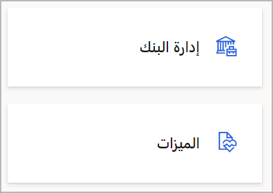
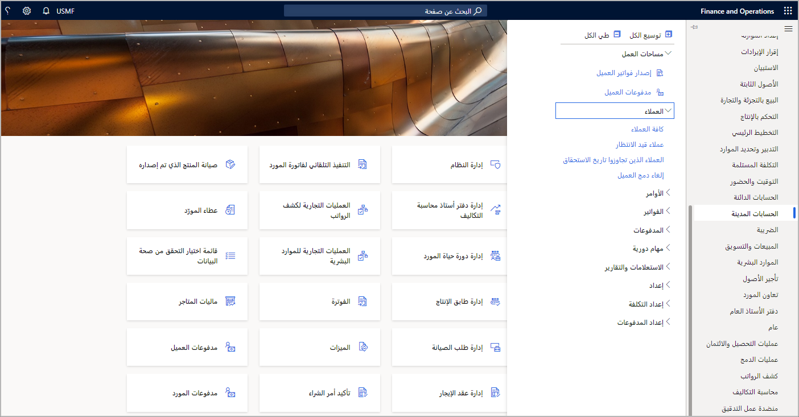
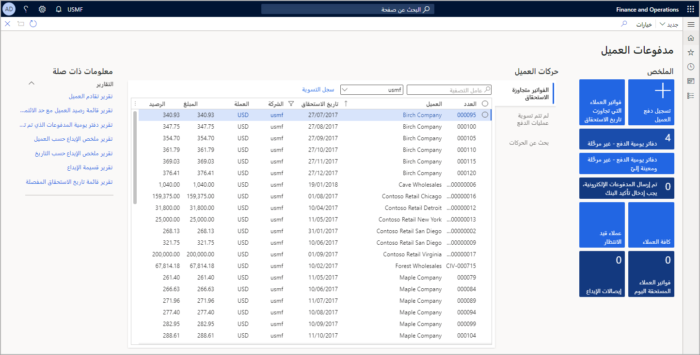

لوحة المعلومات هي الصفحة الأولى التي ستشاهدها في تطبيقات التمويل والعمليات. تحتوي على إطارات متجانبة تظهر معلومات مختلفة. يمكنك العودة إلى لوحة المعلومات في أي وقت عن طريق النقر فوق تطبيقات التمويل والعمليات على شريط التنقل أعلى الإطار.

تتكون لوحة المعلومات بشكل أساسي من قسم كبير من الإطارات المتجانبة لمساحة العمل. 

## ال‏‫إطارات المتجانبة‬

الإطار المتجانب هو زر مستطيل الشكل يتصرف مثل زر صنف القائمة. يُستخدم للانتقال إلى الصفحات أو فتحها. يمكن أن تعرض الإطارات المتجانبة أيضاً البيانات ذات الصلة، مثل الأعداد أو مؤشرات الأداء الأساسية (KPI). يمكن أن يتضمن الإطار المتجانب صوراً توفر لك سياقاً مرئياً إضافياً.

تعرض لقطه الشاشة أدناه الإطارين المتجانبين **إدارة البنوك** و **المزايا**.

## جزء التنقل

يوفر جزء التنقل الوصول إلى مساحات العمل وعناصر القائمة الرئيسية والصفحات التي تم فتحها مؤخراً والمفضلة التي يحددها المستخدم. يمكنك فتح "جزء التنقل" عن طريق تحديد زر **إظهار جزء التنقل** ضمن شريط التنقل. 
 

يتكون جزء التنقل من أربعة أقسام قابلة للطي.
 
- **المفضلة** - يوفر هذا القسم وصولاً سريعاً إلى قائمة الصفحات التي حددها المستخدم صراحة كمفضلة. يتم وضع علامة على الصفحة كمفضلة عن طريق النقر فوق رمز النجمة الموجود بجوار الصفحة في جزء التنقل. يمكن أن يكون هذا مفيداً لمناطق النظام التي يتم استخدامها بشكل متكرر، أو على العكس من ذلك، مناطق النظام التي لا يتم استخدامها بشكل متكرر ولكن يمكن أن تستفيد من سهولة الوصول إليها عند الحاجة.
- **الأخيرة** - هذا القسم عبارة عن قائمة يتم ملؤها تلقائياً بارتباطات إلى مناطق النظام التي تم عرضها مؤخراً. يمكن أن يكون هذا مفيداً للأغراض المرجعية، بالإضافة إلى التبديل بسهولة ذهاباً وإياباً بين مناطق منفصلة في النظام. 
- **مساحات العمل** - هذه هي مجموعة مساحات العمل التي يمكن للمستخدم الوصول إليها. 
- **الوحدات** - يقدم هذا القسم القائمة الكاملة للوحدات. سيؤدي النقر فوق وحدة إلى فتح الجانب الأيمن من جزء التنقل، حيث يمكنك الانتقال إلى صفحة معينة في تلك الوحدة. 

## مساحات العمل

مساحات العمل عبارة عن صفحات موجهة للأنشطة تم تصميمها لزيادة إنتاجيتك من خلال توفير المعلومات التي تجيب على الأسئلة الأكثر إلحاحاً المتعلقة بالنشاط. هذا هو المكان الذي تخزن فيه مهامك المتكررة.  

يعتمد الوصول إلى مساحات العمل المختلفة على الأدوار التي يقوم بها المستخدمون في المؤسسة. 

للانتقال إلى مساحة عمل، يمكنك النقر فوق مربع في لوحة المعلومات، أو النقر فوق ارتباط في جزء التنقل، أو العثور على مساحة العمل باستخدام ميزة بحث التنقل.

فيما يلي صورة لمساحة عمل **مدفوعات العميل**.
 

تحتوي مساحات العمل على أقسام من المحتوى ذات صلة بالمهمة التي تم تخصيص مساحة العمل من أجلها.
 
عادةً ما يكون القسم الأول عبارة عن مجموعة من الإطارات المتجانبة التي يمكنك النقر فوقها لبدء مهام جديدة أو الوصول إلى قوائم العناصر. يحتوي القسم الثاني على مجموعة من القوائم ذات الصلة بالنشاط. يحتوي القسم الأخير على عدة ارتباطات لصفحات مهمة ولكنها غير مستخدمة بشكل متكرر لهذا النشاط. 

يوجد بين قسم القائمة والارتباطات بعض الأقسام الاختيارية التي قد تحتوي على مخططات ورسوم بيانية. أحد الاختلافات المهمة في مساحات العمل هو عدم وجود مصدر بيانات لها. 

إذا كان المحتوى يتطلب مصدر بيانات، فيمكن تحديثه ليشمل ذلك.