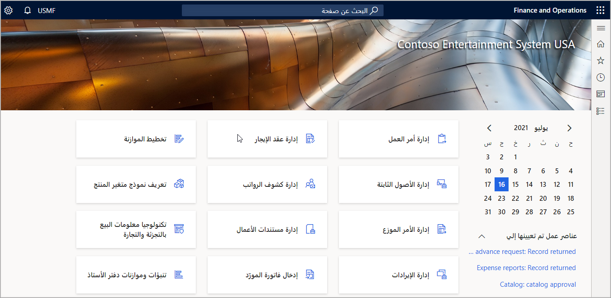

لوحة المعلومات هي الصفحة الأولى التي ستشاهدها في تطبيقات Finance and Operations.The dashboard is the first page that you will see in Finance and Operations apps. تحتوي على إطارات متجانبة تظهر معلومات مختلفة.It contains tiles that show various information. يمكنك العودة إلى لوحة المعلومات في أي وقت عن طريق النقر فوق تطبيقات Finance and Operations على شريط التنقل أعلى الإطار.You can return to the dashboard at any time by clicking Finance and Operations apps on the navigation bar at the top of the frame.

تتكون لوحة المعلومات بشكل أساسي من قسم كبير من الإطارات المتجانبة لمساحة العمل.The dashboard consists primarily of a large section of workspace tiles. 

## ال‏‫إطارات المتجانبة‬Tiles

الإطار المتجانب هو زر مستطيل الشكل يتصرف مثل زر صنف القائمة.A tile is a rectangular button that behaves like a menu item button. يُستخدم للانتقال إلى الصفحات أو فتحها.It is used to navigate to, or open pages. يمكن أن تعرض الإطارات المتجانبة أيضاً البيانات ذات الصلة، مثل الأعداد أو مؤشرات الأداء الأساسية (KPI).Tiles can also display relevant data, such as counts or key performance indicators (KPIs). يمكن أن يتضمن الإطار المتجانب صوراً توفر لك سياقاً مرئياً إضافياً.A tile can include images that provide you with additional visual context.

تعرض لقطه الشاشة أدناه الإطارين المتجانبين **إدارة البنوك** و **المزايا**.The screenshot below shows the **Bank management**, and **Benefits** tiles.

## جزء التنقلNavigation pane

يوفر جزء التنقل الوصول إلى مساحات العمل وعناصر القائمة الرئيسية والصفحات التي تم فتحها مؤخراً والمفضلة التي يحددها المستخدم.The navigation pane provides access to workspaces, main menu elements, recently opened pages, and user-defined favorites. يمكنك فتح "جزء التنقل" عن طريق تحديد زر **إظهار جزء التنقل** ضمن شريط التنقل.You can open the navigation pane by selecting the **Show navigation pane** button under the navigation bar. 
 

يتكون جزء التنقل من أربعة أقسام قابلة للطي.The navigation pane consists of four collapsible sections.
 
- **المفضلة** - يوفر هذا القسم وصولاً سريعاً إلى قائمة الصفحات التي حددها المستخدم صراحة كمفضلة.**Favorites** - This section provides quick access to the list of pages the user has explicitly marked as a favorite. يتم وضع علامة على الصفحة كمفضلة عن طريق النقر فوق رمز النجمة الموجود بجوار الصفحة في جزء التنقل.Marking a page as a favorite is accomplished by clicking the star icon next to the page in the navigation pane. يمكن أن يكون هذا مفيداً لمناطق النظام التي يتم استخدامها بشكل متكرر، أو على العكس من ذلك، مناطق النظام التي لا يتم استخدامها بشكل متكرر ولكن يمكن أن تستفيد من سهولة الوصول إليها عند الحاجة.This can be helpful for areas of the system that are used frequently, or, conversely, areas of the system that are not used frequently but could benefit from being easily accessible when the need arises.
- **الأخيرة** - هذا القسم عبارة عن قائمة يتم ملؤها تلقائياً بارتباطات إلى مناطق النظام التي تم عرضها مؤخراً.**Recent** - This section is a list that is auto populated with links to the areas in the system that have been viewed most recently. يمكن أن يكون هذا مفيداً للأغراض المرجعية، بالإضافة إلى التبديل بسهولة ذهاباً وإياباً بين مناطق منفصلة في النظام.This can be helpful for reference purposes, as well as easily switching back and forth between separate areas of the system. 
- **مساحات العمل** - هذه هي مجموعة مساحات العمل التي يمكن للمستخدم الوصول إليها.**Workspaces** - This is the set of workspaces a user has access to. 
- **الوحدات** - يقدم هذا القسم القائمة الكاملة للوحدات.**Modules** - This section provides the full list of modules. سيؤدي النقر فوق وحدة إلى فتح الجانب الأيمن من جزء التنقل، حيث يمكنك الانتقال إلى صفحة معينة في تلك الوحدة.Clicking on a module will open the right side of the navigation pane, where you can navigate to a specific page in that module. 

## مساحات العملWorkspaces

مساحات العمل عبارة عن صفحات موجهة للأنشطة تم تصميمها لزيادة إنتاجيتك من خلال توفير المعلومات التي تجيب على الأسئلة الأكثر إلحاحاً المتعلقة بالنشاط.Workspaces are activity-oriented pages that are designed to increase your productivity by providing information that answers your most pressing activity-related questions. هذا هو المكان الذي تخزن فيه مهامك المتكررة.This is where you store your more frequent tasks.  

يعتمد الوصول إلى مساحات العمل المختلفة على الأدوار التي يقوم بها المستخدمون في المؤسسة.Access to the various workspaces depends on the roles that users have in the organization. 

للانتقال إلى مساحة عمل، يمكنك النقر فوق مربع في لوحة المعلومات، أو النقر فوق ارتباط في جزء التنقل، أو العثور على مساحة العمل باستخدام ميزة بحث التنقل.To navigate to a workspace, you can click a tile on the dashboard, click a link in the navigation pane, or find the workspace using the navigation search feature.

فيما يلي صورة لمساحة عمل **مدفوعات العميل**.Below is an image of the **Customer payments** workspace.
 

تحتوي مساحات العمل على أقسام من المحتوى ذات صلة بالمهمة التي تم تخصيص مساحة العمل من أجلها.Workspaces contains sections of content that are relevant to the task for which the workspace is intended.
 
عادةً ما يكون القسم الأول عبارة عن مجموعة من الإطارات المتجانبة التي يمكنك النقر فوقها لبدء مهام جديدة أو الوصول إلى قوائم العناصر.The first section will usually be a set of tiles that you can click to begin new tasks or access lists of items. يحتوي القسم الثاني على مجموعة من القوائم ذات الصلة بالنشاط.The second section contains a set of relevant lists for the activity. يحتوي القسم الأخير على عدة ارتباطات لصفحات مهمة ولكنها غير مستخدمة بشكل متكرر لهذا النشاط.The last section contains several links to pages that are important but not frequently used for this activity. 

يوجد بين قسم القائمة والارتباطات بعض الأقسام الاختيارية التي قد تحتوي على مخططات ورسوم بيانية.In between the list and links section are a few optional sections that might contain charts and graphs. أحد الاختلافات المهمة في مساحات العمل هو عدم وجود مصدر بيانات لها.One important distinction of workspaces is that they do not have a data source. 

إذا كان المحتوى يتطلب مصدر بيانات، فيمكن تحديثه ليشمل ذلك.If the content requires a data source, it can be updated to include that.