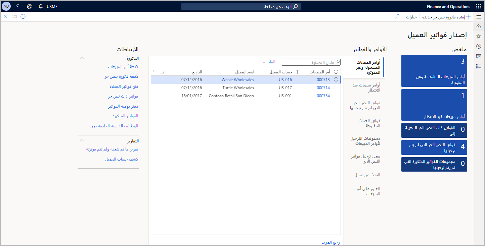

مساحة العمل هي محطة واحدة لأنشطة محددة. فيما يلي بعض الطرق التي يمكن أن تساعد بها مساحة العمل في زيادة الإنتاجية:

- **طريقة عرض شاملة للأنشطة** - لا حاجة للتنقل إلى قوائم متعددة.
- **الإجابة عن أسئلة محدد** - الأسئلة، مثل:
   - هل هناك حالات عاجلة تحتاج للحضور
   - ما مدى صعوبة حمل عملي؟
   - هل المشكلات سهلة أم يصعب حلها؟
- **توفير نتيجة تحليلات** - قارن بين مصادر البيانات المتعددة. قدم عرضاً للصورة الكبيرة قد يكون من الصعب تحقيقه عند النظر فقط إلى القوائم في وحدات محددة.
- **التنقل حسب البيانات** - قضاء وقت أقل في التصفية للعثور على النتائج
- **الوصول المباشر إلى المهام** - يمكن تنفيذ المهام مباشرة من مساحة العمل.

شاهد هذا الفيديو لمعرفة كيفية استخدام ميزات المبيعات والتسويق باستخدام مساحة العمل في تطبيقات Finance and Operations.
 
 > [!VIDEO https://www.microsoft.com/videoplayer/embed/RE450W7]

دعونا نلقي نظرة على بعض المناطق الرئيسية في مساحة عمل **فوترة العميل**.
 
 
 
**الملخص** - يحتوي هذا القسم على إطارات متجانبة لأنواع مختلفة من الأوامر والفواتير. سيعرض كل إطار متجانب أيضاً عدد الطلبات التي تنتمي إلى كل فئة. يمكنك النقر فوق إطار متجانب لفتح صفحة قائمة ذات صلة. على سبيل المثال، يُظهر الإطار المتجانب **أوامر المبيعات المشحونة ولكن غير المفوترة** أن هناك ثلاثة أوامر قيد الانتظار. يمكنك النقر فوق الإطار المتجانب للاطلاع على الأوامر الثلاثة قيد الانتظار.

**عامل التصفية** - يتيح لك مربع بحث **التصفية** العثور على الطلبات والفواتير بسهولة.

**الأوامر والفواتير** - توفر علامات التبويب المختلفة الوصول إلى أقسام مختلفة من منضدة العمل. تحتوي كل علامة تبويب على أي أوامر مبيعات أو فواتير متعلقة بعلامة التبويب. تتضمن علامة التبويب الأولى أوامر المبيعات المشحونة ولكن غير المفوترة.

**الارتباطات** - ينقسم قسم **الارتباطات** إلى قسمين: روابط متعلقة بالفواتير وروابط متعلقة بالتقارير.

**الفاتورة ذات النص الحر الجديدة** - يمكن إنشاء الفواتير ذات النص الحر الجديدة مباشرةً في صفحة مساحة عمل **فوترة العميل** من خلال النقر فوق زر **الفاتورة ذات النص الحر الجديدة** في جزء الإجراءات.