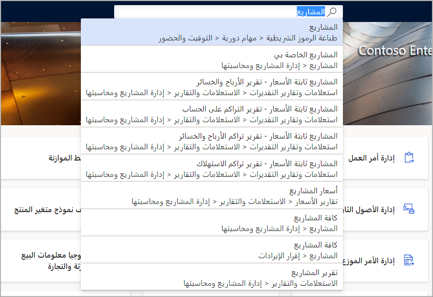
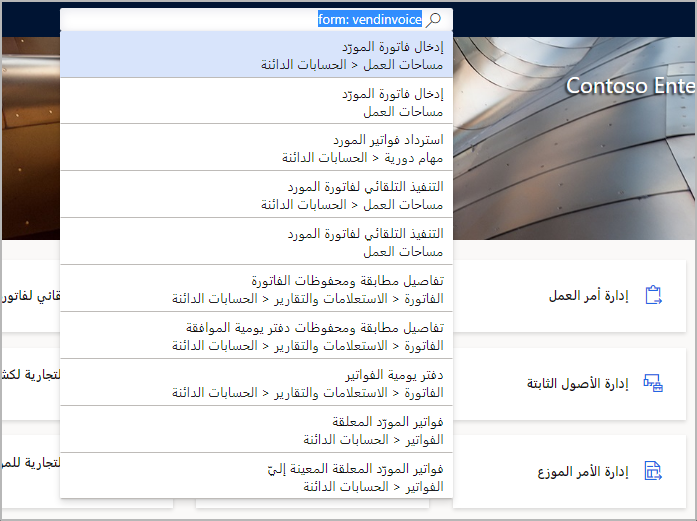

تُستخدم آلية البحث للبحث عن الصفحات ومساحات العمل التي تظهر في جزء التنقل وعلى لوحة المعلومات، والانتقال إليها.The search mechanism is used for finding and navigating to pages and workspaces that appear in the navigation pane and on the dashboard. ولا تتطابق الكلمات الأساسية للبحث مع التسمية التوضيحية لعناصر التنقل فقط، وإنما أيضاً مع المسار المطابق.The search keywords are matched not only to the caption of the navigation elements but also to the corresponding path. 

على سبيل المثال، يُرجع البحث عن كلمات أساسية قائمة عناصر تنقل تطابق تلك الكلمات الأساسية.For example, a search on the keywords returns a list of navigation elements that match those keywords.

وتوجد طريقتان محددتان للبحث:There are two specific ways to search:

- **كلمات أساسية** - استخدام ميزة البحث، يمكنك إدخال كلمات أساسية للعثور على صفحة معينة.**Keywords** - Using the search feature, you can enter keywords to find a specific page. وستتضمن النتائج التي في القائمة التطابقات الكاملة والجزئية، بالإضافة إلى مسار التنقل اليدوي للصفحة.The results in the list will include complete and partial matches, as well as the manual navigation path for the page. 
- **أسماء النماذج** - يمكن للمستخدمين الفنيين الذين يبحثون عن اسم نموذج محدد في النظام استخدام ميزة البحث بإدخال "form:" متبوعاً باسم النموذج الفعلي، مثل "vendInvoice" للبحث عن صفحات محددة في النظام تستخدم هذا النموذج.**Form names** - Technical users who are looking for a specific form name in the system can use the search feature by entering “form:” followed by the actual form name, such as “vendInvoice” to find specific pages in the system that use that form. سيتم ملء القائمة بالصفحات التي تستخدم النموذج المحدد.The list will populate with pages that use the form specified.

يوجد شيئان مهمان يجب وضعهما في الاعتبار عند استخدام البحث:There are two important things to consider when using search:

- تُستخدم ميزة البحث للعثور على صفحات في النظام، وليس بيانات أو إجراءات معينة.The search feature is used to locate pages in the system, not specific data, or actions.
- وسوف تتضمن النتائج أيضاً نتائج البحث الجزئية لمسار التنقل.The results will also include partial hits for the navigation path. على سبيل المثال، سيتضمن البحث عن كلمة "مدفوعات" عدد نتائج بحث أكبر من "جميع أوامر الشراء" لأن كلمة "مدفوعات" يتم تضمينها في مسار التنقل للكثير من الصفحات.For instance, searching the word “receivable” will include a larger number of hits than “all purchase orders” because the word “receivable” is included in the navigation path for many pages. 

لاستخدام ميزة البحث، حدد أيقونة **بحث** لعرض مربع **بحث**.To use the search feature, select the **Search** icon to display the **Search** box. يمكنك بعد ذلك كتابة كلمة واحدة أو أكثر في المربع.You can then type one or more words in the box. تبحث تطبيقات Finance and Operations فورياً عن الصفحات ذات الصلة في التطبيق الذي يطابق الكلمات التي قمت بإدخالها.Finance and Operations apps instantly searches for relevant pages in the application that match the words that you entered. 

على سبيل المثال، يمكنك كتابه "l e" كإدخال، ثم يعرض النظام النتائج التي تطابق ذلك الإدخال.For example, you could type “l e” as the input, and then the system displays results that match that input. في هذه الحالة، ستظهر جميع الصفحات التي تبدأ بالحرف "l" ثم الحرف "e".In this case, it will show all pages that start with letter “l” and then letter “e”.

في لقطة الشاشة أدناه، ستشاهد نتائج عملية بحث تستخدم كلمة "project".In the screenshot below, you will see the results of a search using the word "project".
 

تعرض قائمة نتائج البحث عنوان الصفحة بالإضافة إلى مسار التنقل.The search results list displays the page title as well as the navigation path. ويعرض هذا موقع الصفحة في التطبيق.This shows the location of the page in the application. كما يمكن أن يساعدك على التمييز بين صفحتين متشابهتين أو أكثر في النتائج.It also helps you differentiate between two or more similar pages in the results.

## التنقل بسرعة إلى صفحةQuickly navigate to a page

تعمل ميزة البحث في التنقل أيضاً كطريقة رائعة للانتقال بسرعة إلى صفحة.The navigation search feature also serves as a great way for you to quickly navigate to a page. 

على سبيل المثال، إذا كنت موظف حسابات دائنة يستخدم صفحة **دفتر يومية المدفوعات** بكثرة، فيمكنك إدخال "دفتر يومية المدفوعات" في مربع **البحث**.For example, if you are an accounts payable clerk who frequently uses the **Payment journal** page, you could enter "payment journal" in the **Search** box. نظراً لأن الإدخال مطابق تماماً لعنوان الصفحة، تظهر الصفحة على رأس القائمة أعلى نتائج البحث، ويمكنك الانتقال إليها بسرعة.Because the input is an exact match for the page title, the page is listed at the top of the search results, and you can quickly navigate to it.

## الإدارة والأمانAdministration and security

من منظور الإدارة والأمان، تُظهر وظيفة البحث في التنقل نوعين فقط من النتائج، هما:From an administration and security perspective, the navigation search functionality only surfaces two types of results:

- الصفحات الممكَّنة في التكوين الحالي (عن طريق مفاتيح التكوين).Pages that are enabled in the current configuration (via configuration keys).
- الصفحات التي يتوفر للمستخدم وصول إليها، استناداً إلى دور المستخدم.Pages that the user has access to, based on the user's role.

وتقتصر قائمة نتائج البحث على 10 عناصر.The list of search results is limited to 10 items. إذا لم تجد ما تبحث عنه في النتائج، فحاول تنقيح الإدخال أو تحديثه.If you do not find what you're looking for in the results, you should try refining or updating the input.

## يمكن للمطورين الاستفادة من البحثDevelopers can benefit from search

تتضمن وظيفة البحث في التنقل أيضاً ميزة للمستخدمين والمطورين ذوي القدرات الفائقة؛ كالقدرة على التنقل السريع إلى إحدى الصفحات استناداً إلى اسم النموذج الفني.The navigation search functionality also includes a feature for power users and developers; the ability to quickly navigate to a page based on the technical form name. 

يتميز الكثير من المستخدمين بإجادة كبيرة للتعامل مع تطبيقات Finance and Operations؛ بحيث يعرفون أسماء النماذج التي يعملون بها بالضبط.Many users are so familiar with Finance and Operations apps that they know the exact form names they work with. 

فإذا كنت أحد هؤلاء المستخدمين، فيمكنك إدخال "form:" متبوعاً باسم النموذج الذي تبحث عنه.If you are one of these users, you can enter "form:" followed by the name of the form you are looking for. على سبيل المثال، إذا أدخلت "form: vendinvoice"، فستعرض نتائج البحث جميع الصفحات التي يبدأ اسم النموذج فيها بكلمة "vendinvoice".For example, if you enter "form: vendinvoice", the search results will show all pages where the form name starts with "vendinvoice".
  

## البحث عن إجراءAction search

تعرض الصفحات الموجودة في تطبيقات Finance and Operations في الأساس الأوامر الموجودة في جزأي الإجراءات، سواءً جزء الإجراءات القياسي الذي يظهر أعلى الصفحة، أو جزء أشرطة الأدوات الذي يظهر في أقسام متنوعة من الصفحة.Pages in Finance and Operations apps primarily expose commands on Action Panes, both the standard Action Pane that appears at the top of a page and the toolbars that appear in various sections of the page. 

تتيح لك ميزة بحث الإجراءات إمكانية البحث بسرعة عن أحد الأزرار وتشغيله من أي جزء إجراءات مرئي.The action search feature lets you quickly search for and run a button from any visible Action Pane. وسيساعدك بحث الإجراءات في العثور على الإجراءات في إحدى الصفحات وتشغيلها.Action search will help you find and run actions on a page.

لاستخدام ميزه بحث الإجراءات، اتبع الخطوات التالية.To use the action search feature, follow these steps.

1. في جزء الاجراءات، حدد حقل **بحث الاجراءات**.On the Action Pane, select the **Action search** field. (يحتوي حقل **بحث الإجراءات** على أيقونة عدسة مكبِّرة.)(The **Action search** field contains a magnifying glass icon.)
2. اكتب اسم الزر الذي ترغب في تشغيله بأكمله أو جزءاً منه.Type all or part of the name of the button that you want to run. يمكنك أيضاً البحث باستخدام كلمات من "مسار" الزر.You can also search by using words from the button's "path." ويظهر عادة الزر بالقرب من أعلى قائمة النتائج بعد كتابة حرفين إلى أربعة أحرف.Typically, a button will appear near the top of the results list after you've typed two to four characters.
3. ابحث عن الزر في قائمة النتائج (باستخدام الماوس أو لوحة المفاتيح لديك) وقم بتشغيله.Find and run the button in the results list (by using your mouse or keyboard).

وبعد تشغيل الزر، يعود التركيز إلى آخر موضع في الصفحة، حتى تتمكن من متابعة العمل.After the button is run, the focus is returned to your last position on the page, so that you can continue to work.
يمكنك أيضا بدء "بحث الاجراءات" بالضغط على **Ctrl+"** أو **Alt+Q**.You can also start action search by pressing **Ctrl+'** or **Alt+Q**. اضغط اختصار لوحة المفاتيح مرة أخرى لإعادة التركيز إلى آخر موضع في الصفحة.Press the keyboard shortcut again to return the focus to your last position on the page.