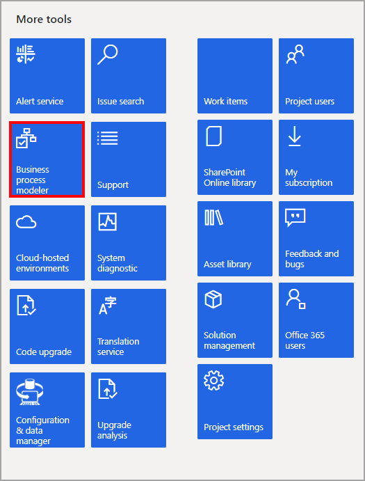

أداة تكوين عمليات الأعمال (BPM) هي أداة LCS لوصف التدرج الهرمي للعمليات التجارية ومهام المستخدم. يتيح LCS أيضاً لشركاء Microsoft وعملائها كتابة وتوزيع مكتبات BPM عبر مشاريع LCS عن طريق مكتبة الأصول.

### إنشاء مكتبة BPM

يمكنك استعراض مكتبة BPM، والتي تمثل مكتبة عالمية أو مكتبة شركة. ومع ذلك، قبل أن تتمكن من تحرير مكتبة BPM والعمل معها، يجب أن تكون جزءاً من LCS لمشروعك. تظهر المكتبات التي يتم توزيعها بواسطة Microsoft ضمن **مكتبات عمومية**، بينما تظهر المكتبات التي يتم نشرها بواسطة مؤسستك ضمن **مكتبات الشركات**.

لاحظ أن ترجمة BPM غير مدعومة. إذا قمت بالتحرير في عميل BPM بأي لغة أخرى غير الإنجليزية الأمريكية، فلن تظهر التغييرات إلا عند عرض BPM باللغة التي تم إجراء التغييرات بها. لعرض أي تغييرات تم إجراؤها باللغة الإنجليزية الأمريكية، يجب عليك المزامنة مع Visual Studio Team Server قبل أن يتم عرض التغييرات.

يمكنك إنشاء مكتبة BPM بعدة طرق.

لإنشاء مكتبة، يجب تسجيل الدخول إلى LCS، وحدد تجانب **أداة تكوين عمليات الأعمال**، ثم إنشاء مكتبة جديدة. يمكن أيضاً إنشاء المكتبة باستخدام وظيفة الاستيراد في Microsoft Excel.

