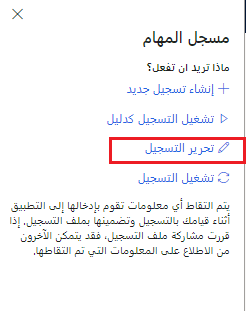

بعد إنشاء مكتبة BPM، ستحتاج إلى استخدام مسجل المهام لإنشاء حالات الاختبار ومن ثمَّ تحميل الحالات إلى مكتبة BPM.
هناك طرق عديدة للقيام بذلك.

إذا كنت تستخدم مكتبة BPM تحتوي بالفعل على جميع تسجيلات المهام الضرورية (حالات الاختبار) المرفقة، يمكنك تخطي هذه الخطوة. بخلاف ذلك، اتبع التعليمات اللاحقة لإنشاء تسجيلات مهام جديدة.

لتمكين التشغيل الفعال لاختباراتك باستخدام أدوات التشغيل التلقائي، تأكد من أن جميع تسجيلات المهام الخاصة بك تبدأ على لوحة المعلومات الرئيسية لتطبيقات التمويل والعمليات.

بالنسبة للعمليات الشاملة التي يقوم بها أكثر من مستخدم واحد، نوصي بتقسيم تسجيلات المهام الخاصة بك إلى مهام خاصة بالمستخدم.
يؤدي هذا إلى تبسيط صيانة حالات الاختبار ويسمح لك بتشغيل حالات الاختبار في سياق أدوار الأمان، وهي أفضل ممارسة.

شاهد هذا الفيديو للحصول على عرض توضيحي لكيفية استخدام مسجل المهام لإنشاء حالة اختبار لأداة Regression suite automation tool‏ (RSAT). 
 
 > [!VIDEO https://www.microsoft.com/videoplayer/embed/RE4uM5U]

### إنشاء وحفظ تسجيل مهام جديد

1.  انتقل إلى **الإعدادات > مسجل المهام**.

    

2.  حدد **إنشاء تسجيل**.

    

3.  أدخل اسماً للتسجيل ثم حدد **بدء**.

    

4.  عند اكتمال التسجيل، في جزء مسجل المهام، حدد **إيقاف**.

5.  لحفظ تسجيل المهمة إلى مكتبة BPM المرفقة، حدد **حفظ إلى Lifecycle Services**.

    

6.  حدد المكتبة التي تريد حفظ التسجيل فيها، ثم حدد **موافق**. يؤدي هذا تلقائياً إلى حفظ التسجيل في Lifecycle Services. إذا كانت لديك مكتبة أعمال بالفعل، فحدد ذلك في علامة التبويب **إدارة النظام > الإعداد > معلمات النظام > تعليمات**.

7.  إذا كنت تريد أيضاً حفظ التسجيل في جهاز الكمبيوتر الخاص بك، فحدد **حفظ في هذا الكمبيوتر**. ملحق ملف التسجيل هو AXTR.

### تحميل ملف AXTR على BPM

إذا قمت بحفظ التسجيلات الخاصة بك (ملفات AXTR) في جهاز الكمبيوتر الخاص بك، فاتبع الخطوات التالية لتحميلها على BPM.

1.  في Lifecycle Services، في مشروعك، في صفحة **مكتبات عمليات الأعمال** ، حدد المكتبة التي سيتم تحميل تسجيل المهمة إليها.

2.  في الجزء الأيسر، حدد **تحميل**.

3.  حدد **استعراض** للعثور على الملف المراد تحميله وتحديده، ثُم حدد **تحميل**.

### تنزيل تسجيل المهام
يمكنك تنزيل تسجيل مهام (ملف AXTR) تم تحميله إلى عملية BPM.

1. في Lifecycle Services، في مشروعك، في صفحة **مكتبات عمليات الأعمال**، حدد المكتبة لتنزيل تسجيل المهام.
2. حدد عملية تم تحميل تسجيل مهام إليها.
3. في الجزء **نظرة عامة**، حدد **تنزيل** لحفظ تسجيل المهام (AXTR).

### حفظ تسجيل المهام الموجود في BPM

1.  لإرفاق تسجيل مهام موجود، سجّل الدخول إلى العميل.

2.  انتقل إلى **الإعدادات > مسجل المهام**.

3.  حدد **تحرير التسجيل** وأرفق الملف إما من خلال الحفظ مباشرة إلى Lifecycle Services أو تنزيل AXTR، ثم التحميل إلى BPM.

    

### إرشادات تسجيل حالات الاختبار

اتبع هذه الإرشادات عند كتابة حالات الاختبار الخاصة بك وتسجيلها، خاصة إذا كنت تخطط لأتمتة تشغيل اختبار. تنطبق العملية والأدوات الموضحة في هذه المقالة على اختبارات قبول عمليات الأعمال؛ حيث لا يُقصد منها أن تحل محل اختبار المكونات والوحدات التي يمتلكها المطورون عادةً.

-   اكتب عدداً محدوداً من حالات الاختبار التي، عند دمجها، تغطي العمليات الشاملة.

-   ركّز على عمليات الأعمال التي تم تخصيصها.

-   يجب أن تغطي حالة الاختبار الفردية (التسجيل) مهمة عمل واحدة أو مهمتين فقط، يتم إجراؤها عادةً بواسطة شخص واحد. ويؤدي هذا إلى تبسيط صيانة تسجيل المهام. لا تقم بضم عملية تجارية كاملة من البداية إلى النهاية، مثل عملية الشراء إلى الدفع أو من الأمر إلى التحصيل، في تسجيل مهمة واحدة كبيرة. 
    -   على سبيل المثال، بدلاً من وجود **طلب عرض الأسعار > أمر الشراء > إيصال استلام المنتجات > فاتورة المورد > دفع المورد** كحالة اختبار واحدة، قم بتقسيم العملية إلى ثلاث أو أربع حالات اختبار. ستكون لديك الفرصة لدمج هذه الاختبارات في مجموعة اختبار مرتبة لاحقاً.

-   يجب أن تحتوي حالة الاختبار على تحقق من الصحة واحد على الأقل. حاول التحقق من صحة الحقول بالغة الأهمية التي تغطي تأثير الحقول الأخرى. 
    -   على سبيل المثال، يغطي التحقق من صحة الإجماليات في أوامر الشراء أو المبيعات سعر الوحدة/الكمية/الخصم/الضريبة.

-   تجنب طباعة تقرير في حالة اختبار. إذا احتاجت حالة اختبار إلى طباعة تقرير، فيجب تحديده على الشاشة.

-   يجب أن تكون أكثر من 80 في المئة من حالات الاختبار للمعاملات أو المستندات المصدر. يجب أن تقتصر البيانات الرئيسية على ما يصل إلى 20 في المئة من حالات الاختبار فقط.