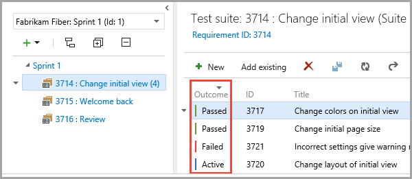

لإجراء اختبارات قبول المستخدم، ستحتاج إلى إنشاء خطة اختبار ومجموعة اختبارات في Azure DevOps. وسيسمح لك هذا بإجراء مجموعة منظمة من حالات الاختبار وإدارة النتائج والاستقصاء عنها وتعقبها بسهولة.

1. سجِّل الدخول إلى Azure DevOps وحدد المشروع وخطة الاختبار التي تود اتباعها لإجراء الاختبار.

2. في شريط الأدوات، حدد **الاختبار> خطط الاختبارات**.

3. في الجزء الأيسر، حدد القائمة المنسدلة بجوار علامة زائد الخضراء **+** ثم حدد **مجموعة ثابتة**.

4. أدخل اسماً للمجموعة.

5. حدد **إضافة الحالي** وقم بالاستعلام عن العلامة **LCS: حالات الاختبار**.

6. حدد **إجراء > إضافة حالات اختبار**.

7. حدد حالة الاختبار لعرض التفاصيل وملف XML المرفق.

أنشئ مجموعات اختبارات متنوعة ضمن خطة الاختبار نفسها ثم استخدم الاستعلامات المخصصة لإضافة حالات اختبار معينة إلى مجموعة الاختبارات. يمكن أن تنتمي حالة الاختبار إلى أكثر من مجموعة اختبارات واحدة.

### إجراء حالات الاختبارات اليدوية

إذا كان لديك مجموعة اختبارات، فستكون جاهزاً لاستخدامها في اختبار الانحدار بعد إجراء تحديثات في تطبيقات التمويل والعمليات في بيئة اختبار معزولة أو بيئة اختبار. يمكنك تشغيل حالات الاختبار في مجموعة اختبارات يدوياً. بدلاً من ذلك، يمكنك تشغيل تسجيلات المهام التي تعد جزءاً من مجموعة الاختبارات واستخدام Azure DevOps لتوضيح حالات الاختبار على أنها "تم الاجتياز" أو "تم الرسوب".

كما يوفر Azure DevOps أداة، تسمى "Test Runner"، لإدارة عمليات تشغيل حالات الاختبارات اليدوية. للحصول علي مزيد من المعلومات حول استخدام أداة "Test Runner"، راجع [تشغيل الاختبارات اليدوية](/azure/devops/test/run-manual-tests?azure-portal=true).

نوصيك بالاستفادة من Azure DevOps لأنه يوفر مجموعة ثرية من ميزات الإدارة التي ليست للاختبار فقط ولكن لإدارة النتائج وتخفيف المخاطر أيضاً .

### إجراء حالات الاختبارات اليدوية

يوفر النظام الأساسي Dynamics 365 Unified Operations للمطورين أدوات لكتابة حالات اختبار استناداً إلى تسجيلات المهام واستخدام Azure DevOps لإدارة التشغيل التلقائي لحالات الاختبارات هذه.

ويمكن للمطورين استخدام إمكانات البناء وأتمتة الاختبارات لبيئات البناء والاختبارات. لمزيد من المعلومات، راجع [الصفحة الرئيسية "التسليم المستمر"](/dynamics365/fin-ops-core/dev-itpro/dev-tools/continuous-delivery-home-page/?azure-portal=true).

تعمل Regression Suite Automation Tool (RSAT) على خفض الوقت والتكلفة لاختبارات قبول المستخدم (UAT) بشكلٍ ملحوظ. كما تتيح RSAT لمستخدمي الطاقة الوظيفية تسجيل مهام العمل باستخدام "مسجل المهام" ثم تحويل التسجيلات إلى مجموعة من الاختبارات المؤتمتة دون الحاجة إلى كتابة كود مصدر. تعد RSAT متكاملة تماماً مع Microsoft Azure DevOps لتنفيذ الاختبارات وإعداد التقارير والتحقق. يتم إلغاء إقران معلمات الاختبارات من خطوات الاختبارات وتخزينها في ملفات بتنسيق Microsoft Excel.

تنزيل الأداة ودليل المستخدم من [تطبيقات التمويل والعمليات، Regression Suite Automation Tool](https://www.microsoft.com/download/details.aspx?id=57357).

لمعرفة كيفية إنشاء خطة اختبار في Azure DevOps لاستخدامها مع الأداة "RSAT"، شاهد هذا الفيديو.
 > [!VIDEO https://www.microsoft.com/videoplayer/embed/RE4vx0I]

لمعرفة كيفية استخدام الأداة "RSAT"، شاهد هذا الفيديو:
 > [!VIDEO https://www.microsoft.com/videoplayer/embed/RE4vl8Z]

### تدعم الأداة "RSAT" التنفيذ المتوازي

بإمكان المستخدم تشغيل مثيلات متعددة من الأداة "RSAT" في البيئة نفسها، وهذه هي إحدى المزايا التي توفرها الأداة "RSAT". ويسمح هذا الأمر بتوفير الوقت والمال نظراً لعدم الحاجة إلى بيئات متعددة لتشغيل البرامج النصية للاختبار، ولكن بدلاً من ذلك يمكن تنفيذها بشكل متوازٍ. قد يتضمن مثال عن هذه الممارسة مستخدماً واحداً يقوم بتشغيل عدد كبير نسبياً من حالات الاختبار في الوقت نفسه، بدلاً من أن يضطر إلى تشغيلها بشكل متسلسل. سيتمكن مستخدم آخر أيضاً من العمل من نفس البيئة وتشغيل حالات اختبار منفصلة، لزيادة موارد البيئة إلى الحد الأقصى. 

ثمة خيار يسمح بتكوين عدد المثيلات المتزامنة التي يمكن للبيئة معالجتها بشكل متزامن. بإمكان الخيار تحسين استخدام موارد البيئة.

يمكن أيضاً استخدام هذه الميزة عند تنفيذ الاختبارات من تدفقات Azure DevOps، عن طريق تشغيل تدفقات متعددة مجدولة للعمل في الوقت نفسه. وبهذه الطريقة، يمكن تنفيذ عدة عمليات اختبار بالتوازي في بيئة واحدة للمساعدة في معالجة جميع الاختبارات بشكل أسرع.

### التحقق من عمليات تشغيل الاختبارات

عند اكتمال التشغيل المؤتمت، في شريط أدوات Azure DevOps، حدد **اختبار > عمليات التشغيل** (أو **خطط الاختبارات > عمليات التشغيل**) للتحقق من تشغيل الاختبار. حدد تشغيل الاختبار المطلوب للتحقق من حالات فشل حالات الاختبار وأخطائها.

يمكنك أيضاً الانتقال إلى مجموعة الاختبارات في Azure DevOps للاطلاع على أحدث النتائج المقترنة مع حالات الاختبار لديك.

لمزيد من المعلومات حول الاختبارات وإدارتها في Azure DevOps، راجع مستندات [Azure DevOps](/azure/devops/?azure-portal=true).
