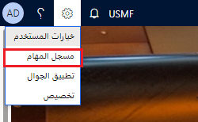

بعد إنشاء مكتبة أداة تكوين عمليات الأعمال (BPM)، ستحتاج إلى استخدام مسجل المهام لإنشاء حالات الاختبار ومن ثمَّ قم بتحميل الحالات إلى مكتبة BPM.

بعد ذلك، ستحتاج إلى إنشاء خطة اختبار ومجموعة اختبارات في Azure DevOps. وسيسمح لك هذا بإجراء مجموعة منظمة من حالات الاختبار وإدارة النتائج والاستقصاء عنها وتعقبها بسهولة.

### قبل البدء

للحصول على أقصى استفادة من هذا التدريب، نوصيك بأن يكون متوفر لديك بيانات العينة القياسية المتوفرة في تطبيقات Finance and Operations والتي يتم تثبيتها باستخدام Lifecycle Services (LCS).

### إنشاء مكتبة BPM

1.  في Lifecycle Service (LCS)، انتقل إلى مشروعك. في الإطارات المتجانبة الموجودة على اليمين، حدد **أداة تكوين عمليات الأعمال**. 
1.  في صفحة **مكتبات عمليات الأعمال**، حدد **مكتبة جديدة**.
1.  أدخل اسماً. وكمثال على ذلك، يمكنك إدخال **التدريب الأول** كاسم للمكتبة الجديدة، ثم حدد **إنشاء**. 

### إضافة عملية جديدة

1.  في مكتبة BPM، حدد **التدريب الأول**.
1.  قم بتمييز العملية **عملية الأعمال الأساسية النموذجية** ثم حدد **إضافة عملية**. 
1.  يمكنك تحديد إضافة العملية كتابعة أو فرعية لعقدة العملية المحددة. وبهذه الطريقة، يمكنك إنشاء تدرج هرمي دلالي لعمليات الأعمال. حدد **كتابعة**.

### تحرير خصائص العملية

1.  في مكتبة BPM، حدد عقدة العملية لتحرير **عملية أعمال جديدة**.
1.  في الجزء الأيمن، في علامة التبويب **نظرة عامة**، حدد وضع **التحرير**.
1.  أدخل اسماً ووصفاً لعقدة العملية.
    -   **الاسم**: إنشاء أمر مبيعات
    -   **الوصف**: هذه العملية توثّق إنشاء أمر المبيعات.
1.  بشكلٍ اختياري، حدد المجالات والبلدان أو المناطق التي تنطبق عليها العملية. يمكنك كذلك إضافة كلمات أساسية وارتباطات. تمكنك الكلمات الأساسية من تحديد الفئات أو عمليات دفق العمل أو بيانات تعريف أخرى. تتيح لك الارتباطات (عناوين URL) الرجوع إلى المواقع الخارجية أو الوثائق.
1.  عند الانتهاء من تحرير الخصائص، حدد **حفظ**.

### نسخ مكتبة

قد تحتاج إلى نسخ مكتبة، لأحد التباينات مثلاً. توضح هذه المهمة كيفية تنفيذ ذلك.

1.  افتح صفحة  **مكتبات عمليات الأعمال** عبر الإطار المتجانب **‏‫أداة تكوين عمليات الأعمال‬** في صفحة المشروع في LCS.

1.  في الإطار المتجانب **التدريب الأول**، باعتبارها المكتبة التي تود نسخها، حدد زر علامة الحذف (...) ثم حدد **نسخ**. 

1.  أدخل اسماً للمكتبة **التدريب الثاني** ثم حدد **إنشاء**. 

### إضافة عملية تابعة جديدة

1.  في مكتبة **التدريب الثاني**، حدد العملية الموجودة **إنشاء أمر مبيعات**. يمكنك تنفيذ ذلك عن طريق تحديد علامة الإقحام الموجودة بجوار **عملية الأعمال الأساسية النموذجية** وتمييز سطر **إنشاء أمر المبيعات**.
1.  حدد **إضافة عملية**. يمكنك تحديد إضافة العملية كتابعة أو فرعية لعقدة العملية المحددة. وبهذه الطريقة، يمكنك إنشاء تدرج هرمي دلالي لعمليات الأعمال. حدد **كتابعة**.

### تحرير خصائص العملية

1.  في الجزء الأيمن، في علامة التبويب **نظرة عامة**، حدد وضع **التحرير**.
1.  أدخل اسماً ووصفاً لعقدة العملية.
    -   **الاسم**: إنشاء سطر مبيعات
    -   **الوصف**: تعمل هذه العملية على إنشاء سطر لأمر المبيعات الأصلي.
1.  عند الانتهاء من تحرير الخصائص، حدد **حفظ**.

### تسجيل حالات الاختبار والحفظ في مكتبة BPM

1.  افتح عميل تطبيقات Finance and Operations وقم بتسجيل الدخول.

1.  حدد الشركة التي تود استخدامها في أثناء التسجيل، في هذه الحالة تكون الشركة **USMF‎**.

1.  انتقل إلى **الإعدادات > مسجل المهام**.

    > 

1.  حدد **إنشاء تسجيل جديد**.

1.  أدخل اسماً للتسجيل: **إنشاء أمر مبيعات**، ثم حدد **بدء**. يبدأ التسجيل لحظة تحديدك **بدء**.
    
1.    انتقل إلى **الوحدات > الحسابات المدينة > الأوامر > جميع أوامر المبيعات**.
1. انقر على **جديد**
1.  أدخل **US-001** في حقل **العميل**.
1.  حدد **موافق**.
1.  في سطر أمر المبيعات، أدخل **A0001** في حقل **الصنف**.
1.  في حقل **الموقع**، أدخل *1*.
1.  السماح بتعيين القيم المتبقية إلى الإعداد الافتراضي.
1.  حدد **حفظ** وإغلاق باستخدام زر **X**.
 
1.  عند اكتمال المهمة، في جزء مسجل المهام، حدد **إيقاف**.

1.  لحفظ تسجيل المهمة إلى مكتبة BPM المرفقة، حدد **حفظ إلى Lifecycle Services**.

    -   إذا لم تكن متصلاً بـ Lifecycle Services بعد، فقد حان الوقت الآن للاتصال. حدد زر **انقر هنا للاتصال بـ Lifecycle Services**.
    -   يجب أن يتم توجيهك إلى علامة تبويب "مستعرض" التي توضح تنفيذك الناجح. يمكنك إغلاق علامة التبويب.
    -   قم بالرجوع إلى شاشة Finance and Operations وحدد **موافق**.
1.  حدد المكتبة التي تود حفظ التسجيل فيها، والتي سيكون اسمها **التدريب الثاني** والعملية **إنشاء أمر مبيعات** ثم حدد **موافق**.

### طريقة بديلة – قم بالحفظ محلياً، ثم قم بتحميلها

1.  وبدلاً من ذلك، يمكنك تحديد **حفظ إلى هذا الكمبيوتر الشخصي**.أكمل عملية حفظ ملف .axtr.

1. افتح أو ارجع إلى LCS، في مشروعك، في صفحة **مكتبات عمليات الأعمال**، حدد المكتبة التي سيتم تحميل تسجيل المهمة إليها.
1.  حدد موقع العملية وحددها (**إنشاء أمر مبيعات** ضمن **التدريب الثاني**) لتحميل تسجيل المهمة إليها.
1.  في الجزء الأيمن، حدد **تحميل**.
1.  حدد **استعراض** للعثور على ملف .axtr وتحديده، ثُم حدد **تحميل**.