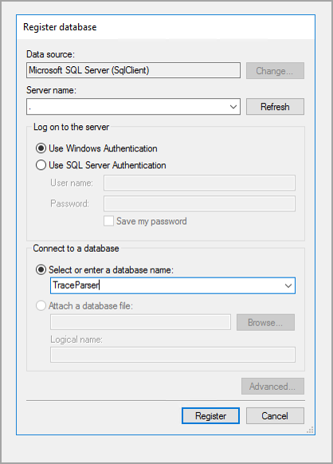

باستخدام محلل التتبع، يمكنك استهلاك عمليات التتبع وتحليل الأداء في توزيع تطبيقات التمويل والعمليات. يضمن ذلك أن يكون لديك فكرة عما يحدث حالياً في بيئاتك الموزعة ويساعد على ضمان أن مستخدمي الأعمال لديهم وقت الاستجابة الذي يحتاجونه لعملياتهم اليومية.

تستكشف هذه الوحدة كيفية استخدام محلل التتبع لتحديد أي مشكلات حالية يتم توزيعها في بيئات تطبيقات التمويل والعمليات.
 
## كيفية استخدام محلل التتبع 

يتوفر محلل التتبع في مجلد **PerfSDK** في عمليات توزيع بيئة التطوير الخاصة بك. عند تحديد موقع الأداة وتثبيتها في بيئة التطوير الخاصة بك، يمكنك إنشاء آثار عن طريق تنفيذ الإجراءات التي تريد تحليلها.

لالتقاط تتبع، يجب عليك أولاً التأكد من أنك قد أكملت قائمة المهام التي تحتاج إلى تحليلها لتجنب وجود بيانات التعريف والمهام الأخرى المضمنة في التتبع الخاص بك. يجب عليك أيضاً إضافة دور مستخدم تتبع النظام إلى المستخدم الذي يحتاج إلى إكمال التتبع. في واجهة مستخدم التمويل والعمليات، انتقل إلى **إدارة النظام > المستخدمين > المستخدمين**. ومن هناك، يمكنك تحديد المستخدم وتحديد **تعيين الأدوار** في علامة التبويب السريعة **أدوار المستخدم**.

بعد إضافة دور مستخدم تتبع النظام، يمكن للمستخدم المعين التقاط التتبع. في شريط التنقل أعلى يمين الشاشة، حدد رمز علامة الاستفهام. في القائمة المنسدلة التي تظهر، حدد **تتبع**. عندما تظهر الشاشة الجديدة، قم بتسمية التتبع الذي ستقوم بالتقاطه وحدد **بدء التتبع**. نفذ جميع الإجراءات التي تحتاج إلى التقاطها وتحليلها قبل تحديد **إيقاف التتبع**.

عند إيقاف التتبع، يمكنك تحديد **تنزيل التتبع**، والذي سيخزن التتبع الذي تم التقاطه على جهازك المحلي، حيث يمكنك تحليله باستخدام إصدار سطح المكتب من محلل التتبع؛ ومع ذلك، لا يمكن تحميله لاحقاً. إذا اخترت **تحميل التتبع**، فسيقوم محلل التتبع بتخزين التتبع في السحابة لتنزيله في وقت مختلف، ولكن سيتم حذفه تلقائياً بعد سبعة أيام. بدلاً من ذلك، يمكن حذف التتبع يدوياً من صفحة **عمليات التتبع الملتقطة**.

> [!TIP]
> إذا استغرق تسلسل الأحداث الخاصة بك للتتبع أكثر من بضع دقائق، فإننا نوصيك بأخذ آثار متعددة وأصغر لتقليل مخاطر فقدان البيانات إذا أصبح التتبع كبيراً جداً بحيث يتعذر تحليله في الوقت المناسب.

## تشخيص المشكلات وتحليل الأداء باستخدام محلل التتبع 

باستخدام محلل التتبع، يمكنك تحديد مشكلات الأداء. قد تتضمن بعض مشكلات الأداء هذه طرق X++ طويلة الأمد أو استعلامات SQL المستهلكة للوقت أو اتصال خادم العميل. 

يمكن فتح التتبع الذي تم التقاطه لتشخيص المشكلات وتحليل أداء المهام بطرق متعددة. الخطوة التالية بعد تنزيل ملف التتبع هي فتح محلل التتبع في بيئة المطور أو VHD. إذا لم يتم تثبيت الأداة في بيئتك، فستكون في C:\Program Files (x86)\MicrosoftDynamicsAX\Microsoft.Dynamics.AX.Tracing.TraceParser.exe

في محلل التتبع، يمكنك تنزيل واستيراد الأحداث التي تم التقاطها مسبقاً. للقيام بذلك، حدد زر **تنزيل واستيراد** في محلل التتبع لاستيراد ملف ETL.

لعرض التتبعات وتحليلها، حدد علامة التبويب **الجدول الزمني** لرؤية طريقة عرض الجدول الزمني. يمكنك استخدام القائمة المنسدلة **تحديد تجميع** لتجميع المحتوى الذي يستند إلى مجموعة متنوعة من الفئات وأنواع الأحداث، مثل معرف العميل واسم المستخدم واسم الجلسة وما إلى ذلك. ستعرض التجميعات الطوابع الزمنية لكل حدث، وإجمالي عدد الأحداث، وأدنى مستوى للحدث في التجميع. يمكنك أيضاً مشاهدة قائمة بجميع الأحداث في طريقة عرض متسلسلة أو غير متسلسلة. انتقل إلى شبكة **الخاصية** لحدث محدد لرؤية مخطط جدول زمني لجميع الأحداث المحددة وأحداث التصفية وملاحظات تحليل جلسة العمل. في طريقة عرض **شجرة الاتصال**، ضمن علامة التبويب **شجرة الاتصال**، ستجد شجرة الاتصال لجميع طرق X++ للأحداث التي تم التقاطها. بالإضافة إلى ذلك، في علامة التبويب **X++** توجد قائمة بجميع طرق X++، ويمكنك فرزها حسب الحقول مثل المدد الشاملة/الحصرية أو RPC أو اتصالات قاعدة البيانات.

## السيناريو:

يواجه مستخدمو شركة Contoso ‏USA مشكلات في الأداء عندما يحاولون ترحيل دفتر يوميات دفع. الوقت الذي يستغرقه دفتر اليومية للترحيل أطول بكثير مما ينبغي. بصفتك مطوراً لدى شركة Contoso ‏USA، قد تم تكليفك بتشخيص سبب استغراق ترحيل دفاتر اليومية وقتاً طويلاً. 

اتبع هذه الخطوات لفحص مشكلات الأداء:

1.  قم بتسجيل الدخول إلى تطبيقات التمويل والعمليات وابدأ عملية تتبع من قائمة **التعليمات والدعم**. 
2.  قم بتسمية التتبع.
3.  حدد **بدء**. 
4.  نفذ عملية الأعمال التي تقوم بتشخيصها. في هذه الحالة، ستقوم بترحيل دفتر يومية دفع. 
5.  أوقف التتبع.
6.  قم بتنزيل التتبع. من المهم أن تضع في اعتبارك أنه عند تنزيل التتبع، سيتم حذفه. 
7.  حدد **تحميل التتبع**. يجب أن تتلقى رسالة في مركز الإجراءات تفيد بأنه تم تحميل التتبع. 
9.  العودة إلى قائمة **التتبع** الرئيسية
10. حدد **عمليات التتبع الملتقطة**. سيتم فتح صفحة عمليات التتبع الملتقطة بالتتبع الذي التقطته للتو. 
12. يمكنك الآن تشغيل محلل التتبع واستيراد التتبع والتحليل.

قبل أن تتمكن من تحليل التتبع، تحتاج إلى تنزيل محلل التتبع. لتنزيل تطبيق محلل التتبع، اتبع الخطوات التالية:

1.  في الجهاز الظاهري للمطور الخاص بك، افتح مستكشف الملفات. 
2.  ابحث عن ملف exe. لمحلل التتبع. في معظم مربعات المستوى 1، يمكن العثور على التنزيل في E:\AppRing3\10.0.8.10012\retail\Services\PerfSDK\Scripts.
3.  عند تنزيل محلل التتبع، قم بتشغيله. 
4.  قم بتسجيل قاعده البيانات. للقيام بذلك، حدد اسم الخادم، ثم قم بتسمية قاعده البيانات. راجع المثال التالي:

    

5.  حدد **تسجيل**. 
6.  حدد **نعم** عند سؤالك عما إذا كنت ترغب في إنشاء قاعدة البيانات. 
