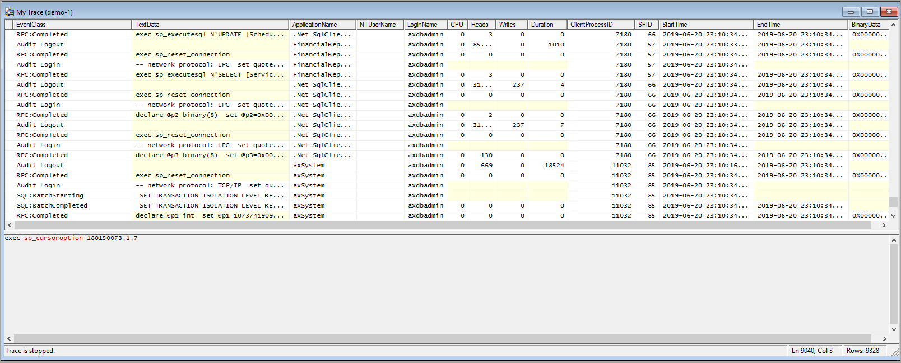

هناك أداة أخرى يمكن للمطورين استخدامها لاختبار الأداء وتشخيص مشكلات الأداء وهي SQL Profiler. يمكنك الوصول إلى أداة Profiler من خلال SQL Server Management Studio. يمكنك من هنا استغلال إمكانيات التتبع من جانب الخادم لأداة SQL Server Profiler لتصدير تعريف تتبع يمكنك استخدامه لإنشاء مجموعة تستخدم نوع مُجمع Generic SQL Trace. 
> [!NOTE]
> ولا يمكن استخدام هذه الأداة إلا على مثيلات الطبقة 1 من Dynamics 365

هناك العديد من الأسباب التي تجعلك ترغب في استخدام أداة SQL Profiler. على سبيل المثال، قد تحتاج إلى رؤية جميع الاستعلامات طويلة المدى على نظام خادم SQL، وليس فقط الاستعلامات طويلة المدى في تطبيقات Finance and Operations. 

للوصول إلى SQL Profiler واستخدامه، اتبع الخطوات التالية:

1.  في SQL Server Management Studio، افتح **SQL Server Profiler** من قائمة **أدوات**. 
2.  الاتصال بقاعدة البيانات. 
3.  في نوافذ **خصائص التتبع**، قم بتسمية التتبع. 
4.  عندما تحدد كل الخصائص، حدد **تشغيل**. 
5.  أثناء تشغيل تتبع SQL Profile، يمكنك تنفيذ العملية أو العمليات التي تهمك. على سبيل المثال، قد يعاني المستخدمون من البطء عند إضافة البيانات إلى SalesTable. وفي هذه الحالة، ستطلب من المستخدم أداء المهمة أثناء تشغيل التتبع. 
6.  عند اكتمال العملية، أوقف التتبع من خلال تحديد زر **إيقاف** في القائمة. 
7.  يمكنك الآن تحليل التتبع بمراجعة نتائج التتبع. تُظهر لقطة الشاشة التالية كيف يبدو التتبع عند إيقافه.  
    

    
