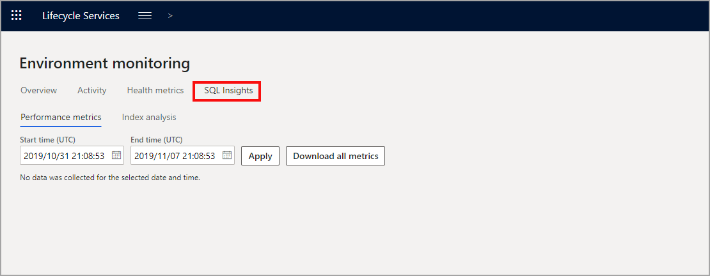

يتم عرض أدوات أداء SQL في LCS من خلال الصفحة **مراقبة البيئة** في علامة التبويب **رؤى SQL**. ضمن علامة التبويب هذه، يمكنك عرض **مقاييس الأداء**، و **تحليل الفهرس**، و **العرض المباشر**، و **الاستعلامات**، و **الإجراءات** لبيئة معينة.

-   **مقاييس الأداء** - تعرض لك الاستعلامات الأكثر تكلفة التي تم تشغيلها في النظام خلال فترة محددة بناءً على المدة بالمللي ثانية، والإدخال/الإخراج المنطقي، وعدد مرات التنفيذ، ووقت CPU بالمللي ثانية، ووقت الانتظار. يتم جمع البيانات مرة واحدة يومياً وتخزينها لمدة 30 يوماً. في علامة التبويب **العبارة** ضمن **مقاييس الأداء**، يمكنك عرض الاستعلام وتنزيل خطة تشغيل الاستعلام.
-   **تحليل الفهرس** - يعرض معلومات الجدول والفهرس المجمعة من عمليات مسح المستخدم والمطالب والتحديثات وعدد الصفوف. يمكنك عرض اتجاه الفهرس الذي اخترته ومقاييس الجدول الإضافية.
-   **العرض المباشر** - يعرض لك DTU الحالي وعبارات التشغيل والحظر.
-   **الاستعلامات** - تعرض قائمة من الاستعلامات المحددة مسبقاً والمستخدمة لاسترداد المقاييس على أساس الطلب. يتم تشغيل معظم الاستعلامات بشكل متزامن لضمان إرجاع النتائج على الفور. إذا كنت تواجه مشكلات في الأداء، فقد يتسبب تشغيل الاستعلام في حدوث خطأ انتهاء المهلة. إذا حدث ذلك، فحدد الخيار لإيقاف تشغيل **استخدام الاستعلام السريع** وإعادة تشغيل الاستعلام.
-   **الإجراءات** - تعرض قائمة بالإجراءات المحددة مسبقاً التي يجب استخدامها للحد من المشكلات في بيئات الاختبار المعزولة وبيئات التشغيل. تتضمن هذه الإجراءات إضافة فهرس أو إسقاطه، وتحديث الإحصائيات على جدول، وإعادة بناء الفهارس، وإنهاء عبارة حظر، وغيرها. يمكنك عرض سجل البيئة بناءً على الإجراء الذي تم تنفيذه.
 
 
## أداة استكشاف الأخطاء وإصلاحها المتقدمة مع رؤى SQL  

بالنسبة لأداة استكشاف الأخطاء وإصلاحها المتقدمة، يمكنك عرض سجلات المعلومات الأولية.
قبل تصدير السجلات، يمكنك استخدام الاستعلامات المحددة مسبقاً للحصول على السجلات الأولية لإحدى المشكلات للمساعدة في التشخيص والمراقبة. تتضمن الأنواع المختلفة من الاستعلامات المحددة مسبقاً الاستعلامات البطيئة وإخفاقات الوصول والأعطال ومشكلات إعداد التقارير المالية.

بالإضافة إلى السجلات الأولية، تُتيح أداة SQL المتقدمة لاستكشاف الأخطاء وإصلاحها تحليل الأداء. تشبه هذه الأدوات أداة DynPerf المستخدمة في Microsoft Dynamics AX 2012. للحصول على مزيد من المعلومات حول هذا الأمر، تحقق من الارتباطات المرجعية في وحدة الملخص بهذه الوحدة النمطية.
